# Envoy Dev Container (experimental)

This directory contains some experimental tools for Envoy Development in [VSCode Remote - Containers](https://code.visualstudio.com/docs/remote/containers).

## How to use

Open with VSCode with the Container extension installed. Follow the [official guide](https://code.visualstudio.com/docs/remote/containers) to open this
repository directly from GitHub or from checked-out source tree.

After opening, run the `Refresh Compilation Database` task to generate compilation database to navigate in source code.
This will run partial build of Envoy and may take a while depends on the machine performance.
This task is needed to run everytime after:
- Changing a BUILD file that add/remove files from a target, changes dependencies
- Changing API proto files

There are additional tools for VS Code located in [`tools/vscode`](../tools/vscode) directory.

## Advanced Usages

### Using Remote Build Execution

Write the following content to `devcontainer.env` and rebuild the container. The key will be persisted in the container's `~/.bazelrc`.

```
GCP_SERVICE_ACCOUNT_KEY=<base64 encoded service account key>
BAZEL_REMOTE_INSTANCE=<RBE Instance>
BAZEL_REMOTE_CACHE=grpcs://remotebuildexecution.googleapis.com
BAZEL_BUILD_EXTRA_OPTIONS=--config=remote-ci --config=remote --jobs=<Number of jobs>
```

By default the `--config=remote` implies [`--remote_download_toplevel`](https://docs.bazel.build/versions/master/command-line-reference.html#flag--remote_download_toplevel),
change this to `minimal` or `all` depending on where you're running the container by adding them to `BAZEL_BUILD_EXTRA_OPTIONS`.

### Disk performance

Docker for Mac/Windows is known to have disk performance issue, this makes formatting all files in the container very slow.
[Update the mount consistency to 'delegated'](https://code.visualstudio.com/docs/remote/containers-advanced#_update-the-mount-consistency-to-delegated-for-macos) is recommended.

## Detailed Setup Guide for Local Development

This section provides an exhaustive walkthrough for setting up Envoy source code locally for development and debugging. This guide has been tested on both Apple M1 Max and Intel Core i9 machines running macOS Sequoia (version 15.5).

For developers who are not C++ experts or are more familiar with CMake/Make build systems, Envoy's Bazel-based build system and dev container support makes local development much more accessible.

### Prerequisites

- macOS Sequoia (version 15.5) or compatible system
- VSCode or Cursor IDE
- Docker Desktop with sufficient resources
- Dev Containers extension

### Step-by-Step Setup Process

#### 1. Repository Setup

1. Clone the Envoy repository from GitHub or create a fork:
   ```bash
   git clone https://github.com/envoyproxy/envoy.git
   # OR
   git clone https://github.com/YOUR_USERNAME/envoy.git
   ```

2. Open the downloaded folder in VSCode or Cursor

3. The IDE will detect the `.devcontainer` folder and prompt to reopen in Dev Container mode. Accept this prompt.

   You should see a blue label at the bottom-left of the window indicating "Container" or "Dev Container" status, confirming you're running in container mode.

   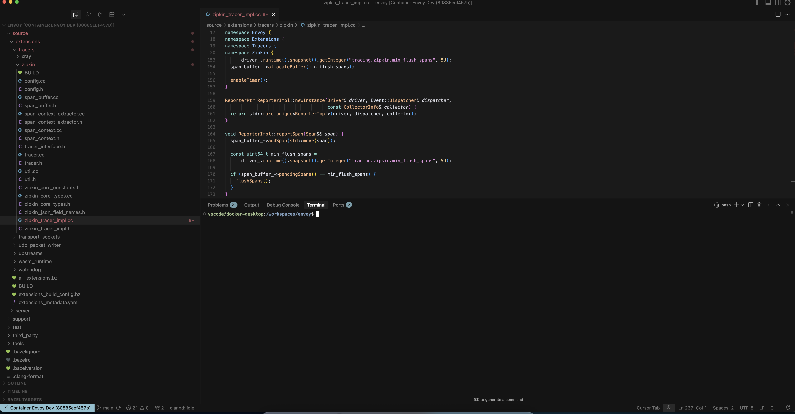

#### 2. Initialize Development Environment

1. Once in dev container mode, open a new terminal (**Terminal** → **New Terminal**)

2. Run the compilation database refresh script:
   ```bash
   ci/do_ci.sh refresh_compdb
   ```

   This script refreshes the compilation database and generates dependencies for code completion, including protobuf generated codes and external dependencies. This process may take 30-60 minutes depending on your machine performance.

   > **Note**: Re-run this script whenever you change proto definitions or modify bazel structure to maintain proper code completion.

#### 3. Troubleshooting Build Issues

If you encounter "no space left on device" errors during the compilation process, you'll need to adjust Docker Desktop settings:

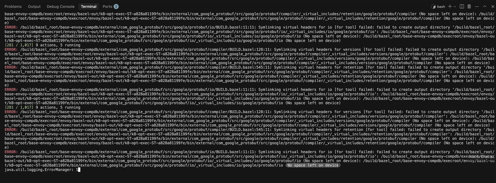

**Resolution Steps:**

1. Open Docker Desktop
2. Navigate to **Settings** → **Resources**
3. Increase **Memory Limit** to at least 8GB (recommended: 16GB+)
4. Increase **Disk usage limit** to at least 100GB

   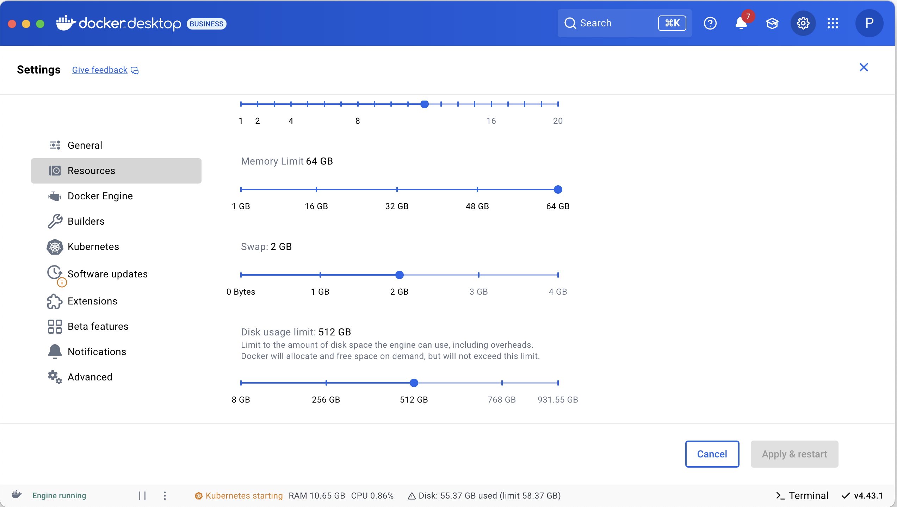

5. If settings are grayed out, perform a factory reset:
   - Go to **Troubleshoot** → **Reset to factory defaults**
   - Restart Docker Desktop
   - Reconfigure the resource limits
   - Click **Apply and restart**

**Successful Build Verification:**

Look for a completion message similar to (the total actions might vary):
```
Build completed successfully, 11415 total actions
```

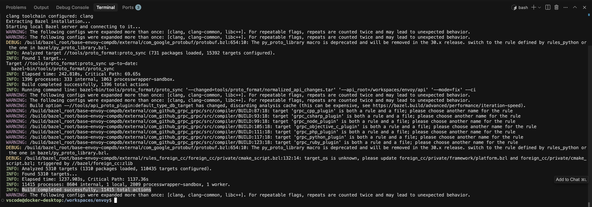

#### 4. Debug Configuration Setup

##### Create Envoy Configuration File

Before generating debug configuration, create an `envoy.yaml` file in the repository root (you can choose any name of your liking).This is a standard envoy configuration, you should be able to change it according to your need. Here's a sample configuration for debugging OpenTelemetry tracing:

```yaml
admin:
  address:
    socket_address:
      protocol: TCP
      address: 0.0.0.0
      port_value: 9902

static_resources:
  listeners:
  - name: listener_0
    address:
      socket_address:
        protocol: TCP
        address: 0.0.0.0
        port_value: 10000
    filter_chains:
    - filters:
      - name: envoy.filters.network.http_connection_manager
        typed_config:
          "@type": type.googleapis.com/envoy.extensions.filters.network.http_connection_manager.v3.HttpConnectionManager
          stat_prefix: ingress_http
          # Enable tracing
          tracing:
            provider:
              name: envoy.tracers.opentelemetry
              typed_config:
                "@type": type.googleapis.com/envoy.config.trace.v3.OpenTelemetryConfig
                grpc_service:
                  envoy_grpc:
                    cluster_name: opentelemetry_collector
                  timeout: 100s
                service_name: envoy-proxy
            random_sampling:
              value: 100
          access_log:
          - name: envoy.access_loggers.stdout
            typed_config:
              "@type": type.googleapis.com/envoy.extensions.access_loggers.stream.v3.StdoutAccessLog
          http_filters:
          - name: envoy.filters.http.router
            typed_config:
              "@type": type.googleapis.com/envoy.extensions.filters.http.router.v3.Router
          route_config:
            name: local_route
            virtual_hosts:
            - name: local_service
              domains: ["*"]
              routes:
              - match:
                  prefix: "/"
                route:
                  host_rewrite_literal: www.envoyproxy.io
                  cluster: service_envoyproxy_io

  clusters:
  - name: service_envoyproxy_io
    type: LOGICAL_DNS
    # Comment out the following line to test on v6 networks
    dns_lookup_family: V4_ONLY
    lb_policy: ROUND_ROBIN
    load_assignment:
      cluster_name: service_envoyproxy_io
      endpoints:
      - lb_endpoints:
        - endpoint:
            address:
              socket_address:
                address: www.envoyproxy.io
                port_value: 443
    transport_socket:
      name: envoy.transport_sockets.tls
      typed_config:
        "@type": type.googleapis.com/envoy.extensions.transport_sockets.tls.v3.UpstreamTlsContext
        sni: www.envoyproxy.io

  # OpenTelemetry Collector cluster
  - name: opentelemetry_collector
    type: STRICT_DNS
    dns_lookup_family: V4_ONLY
    lb_policy: ROUND_ROBIN
    typed_extension_protocol_options:
      envoy.extensions.upstreams.http.v3.HttpProtocolOptions:
        "@type": type.googleapis.com/envoy.extensions.upstreams.http.v3.HttpProtocolOptions
        explicit_http_config:
          http2_protocol_options: {}
    load_assignment:
      cluster_name: opentelemetry_collector
      endpoints:
      - lb_endpoints:
        - endpoint:
            address:
              socket_address:
                address: localhost
                port_value: 5002
```

##### Generate Debug Configuration

Run the debug configuration generator:

```bash
tools/vscode/generate_debug_config.py //source/exe:envoy-static --args "-c envoy.yaml"
```
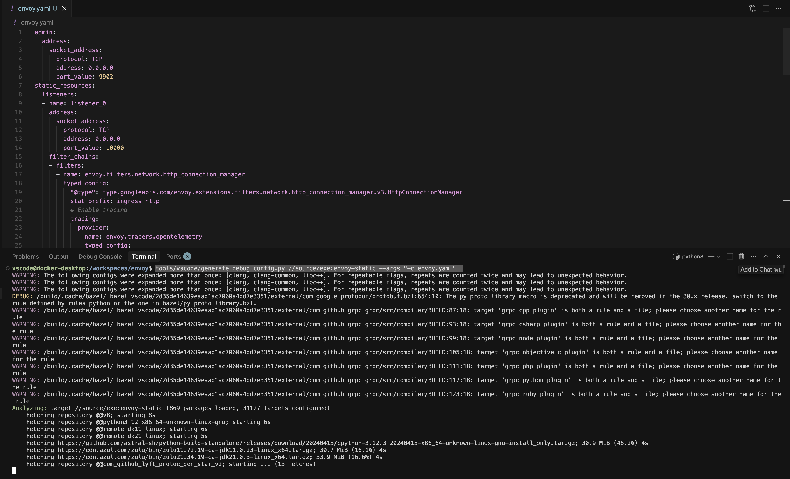

> **Important**: This command may take over an hour to complete. You'll need to re-run this script whenever you make code changes.

There are two types of debuggers envoy community recommends to use, GDB (GNU Debugger) , a widely used and powerful debugger for various languages, including C++ and  LLDB,  the LLVM project's debugger, often used with Clang-compiled code (Clang is one of the many compilers for C++).

Now click F5 to start debugging, this should have generated the `launch.json` as shown below. The generated `launch.json` will use GDB by default.

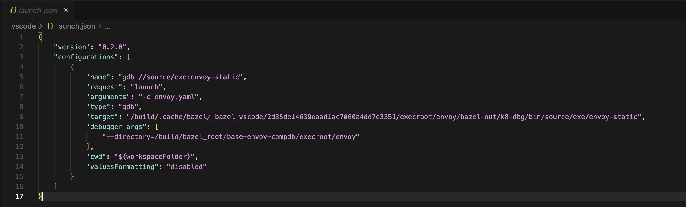

However, if you encounter an error with GDB (which can happen with some Mac Machines), try using the LLDB debugger as shown in the next section.

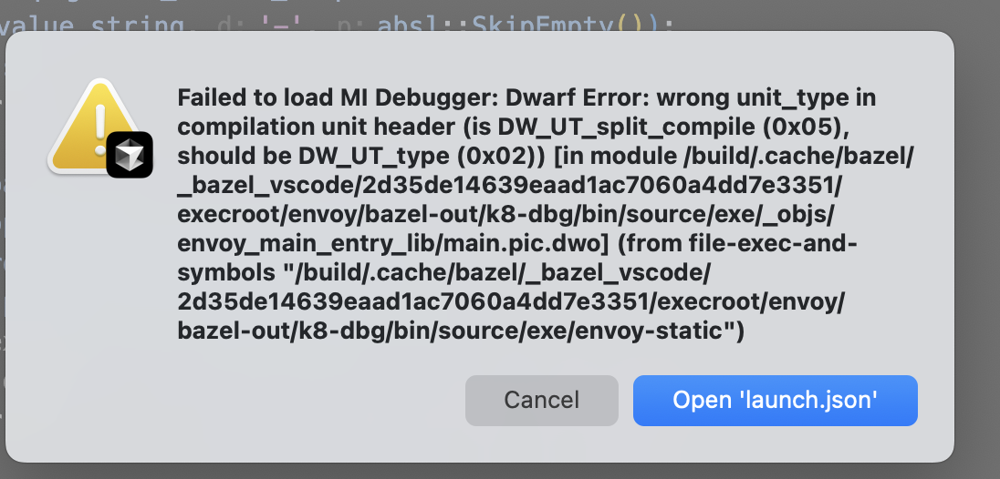

##### Configure LLDB Debugger (Recommended for macOS)

For better compatibility on macOS, modify the generated `launch.json` to use LLDB:

1. Open `launch.json` (Cmd+P → type "launch.json")

   

2. Replace the GDB configuration with LLDB:

```json
{
    "version": "0.2.0",
    "configurations": [
      {
        "name": "LLDB //source/exe:envoy-static",
        "type": "lldb",
        "request": "launch",
        "program": "/build/.cache/bazel/_bazel_vscode/2d35de14639eaad1ac7060a4dd7e3351/execroot/envoy/bazel-out/k8-dbg/bin/source/exe/envoy-static",
        "args": ["-c", "envoy.yaml"],
        "cwd": "${workspaceFolder}",
        "stopOnEntry": false,
        "sourceMap": {
          "/proc/self/cwd": "${workspaceFolder}"
        }
      }
    ]
}
```

> **Note**: Update the `program` path with the actual hash from your generated GDB configuration. Ensure the CodeLLDB extension is installed in your dev container.

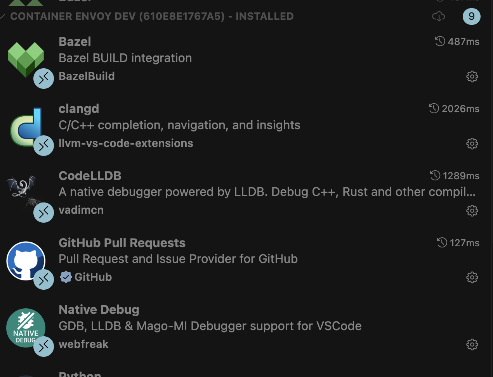

#### 5. Setting Up Breakpoints

##### Main Entry Point

Add a breakpoint in the main function located at `source/exe/main.cc`:

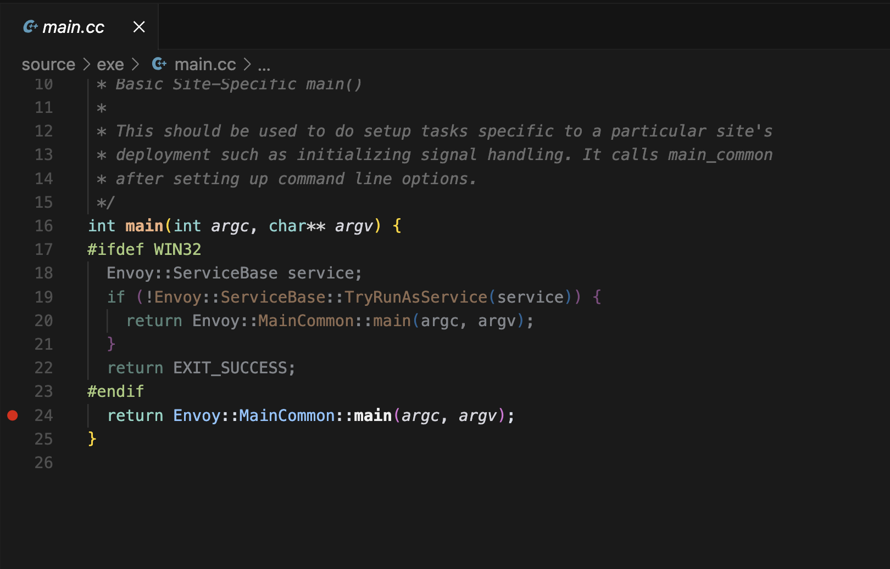

##### Custom Debugging Points

You can add additional debug points, For example, for tracing debugging, add breakpoints in specific areas like `source/extensions/tracers/opentelemetry/opentelemetry_tracer_impl.cc`:

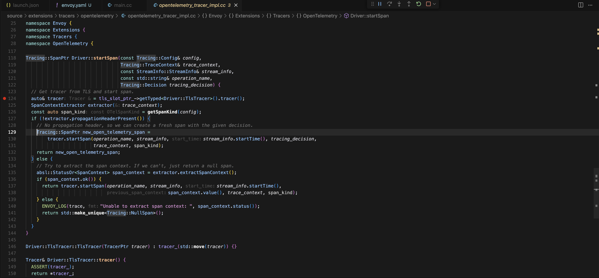

#### 6. Starting Debug Session

1. Start debugging by pressing **F5** or going to **Run** → **Start Debugging**

2. Allow 1-2 minutes for the debugger to attach to the process (Envoy is a large codebase)

3. Most of the Envoy source code is located in the `source` folder at the root of the repository.The breakpoint in `source/exe/main.cc` should activate

   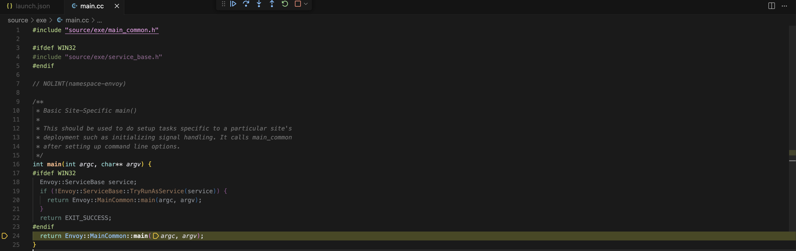

4. Continue execution (**Run** → **Continue**) to see Envoy start up and begin emitting logs

#### 7. Verifying Setup

Once Envoy starts successfully, verify the setup by accessing. The ports are based on the configuration we have used earlier:

- **Admin Interface**: http://localhost:9902

  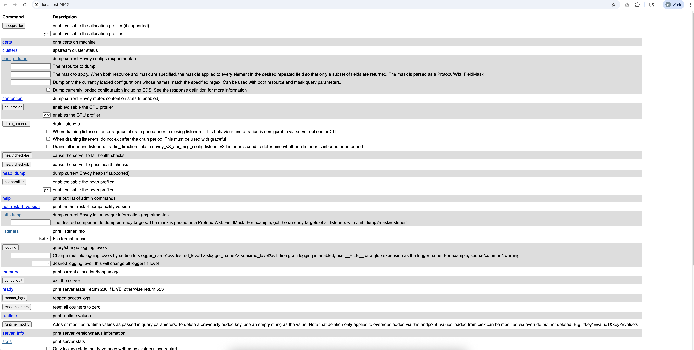

- **Proxy Endpoint**: Try reaching to the URL http://localhost:10000 and you should be redirected to envoyproxy.io based on the configuration file we gave above.

  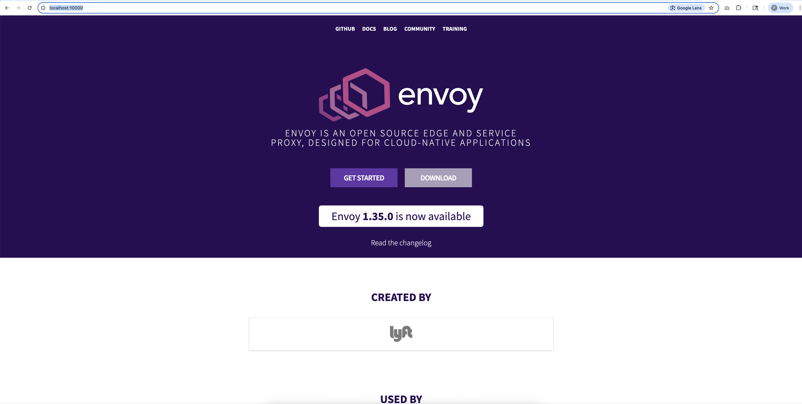

- **Admin Endpoints**:
Try accessing different admin endpoints from your local machine.
  - Clusters: http://localhost:9902/clusters
  - Config Dump: http://localhost:9902/config_dump
  - Stats: http://localhost:9902/stats

  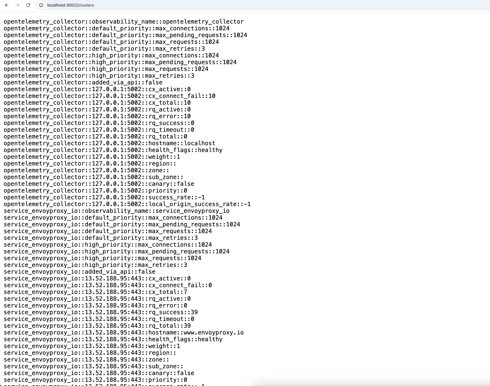
  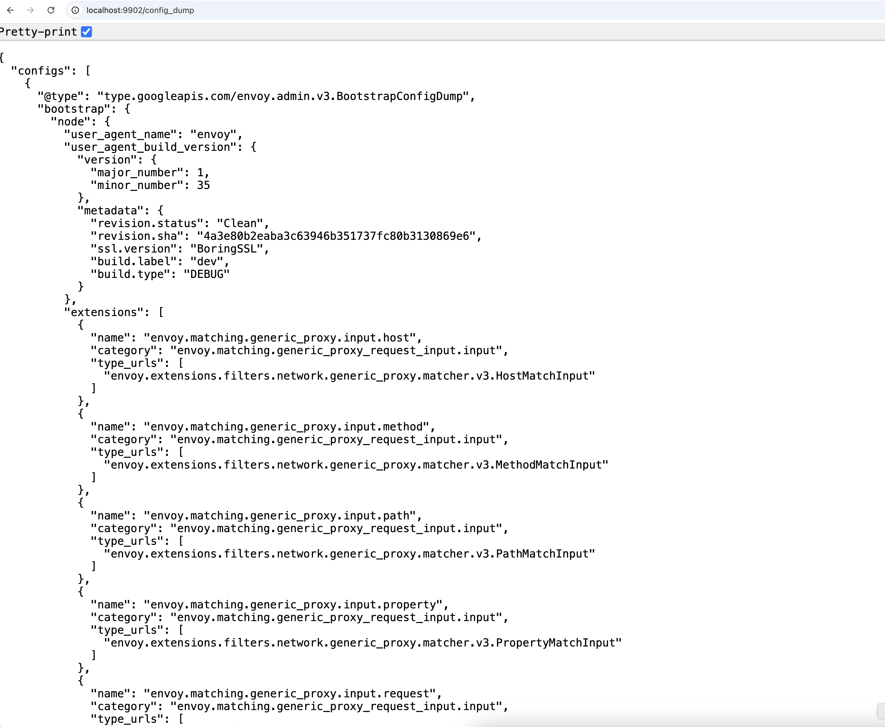
  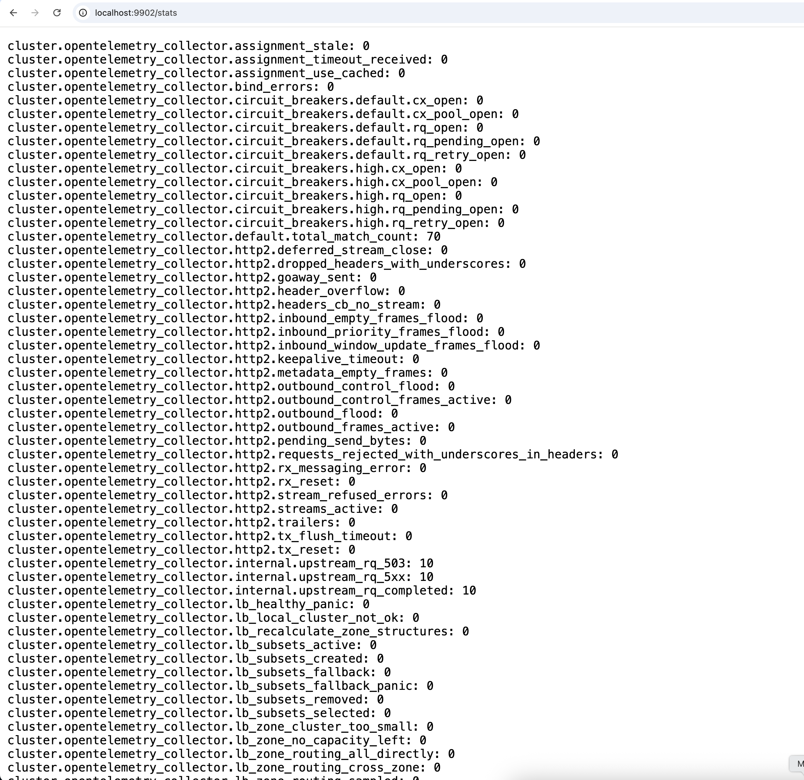

