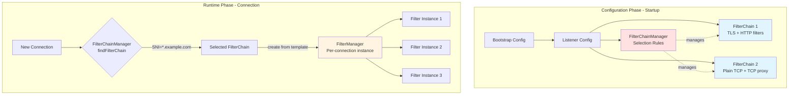
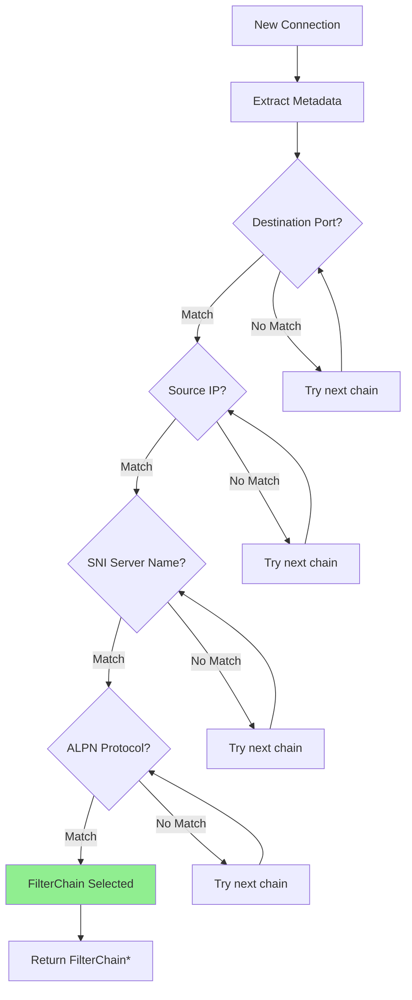
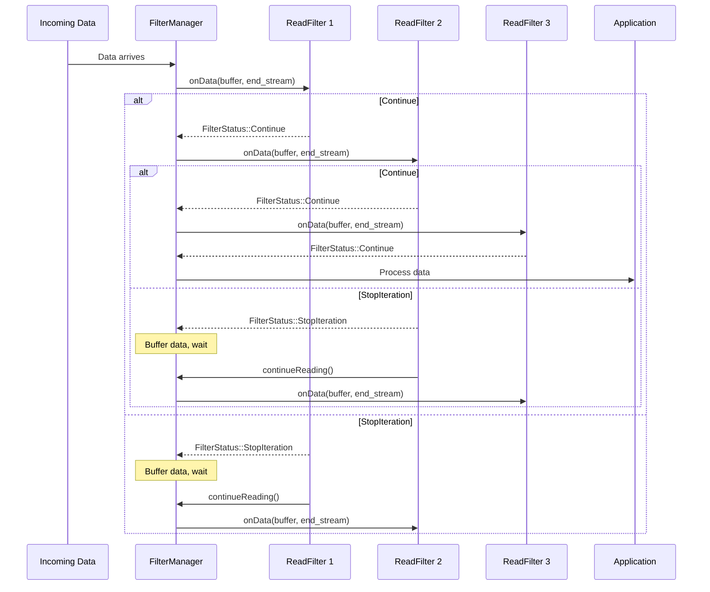
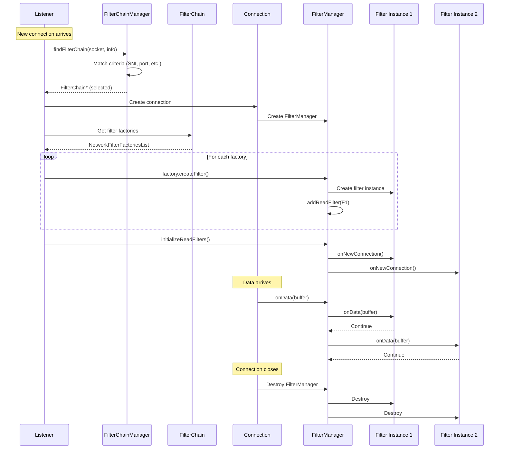

# FilterChain vs FilterChainManager vs FilterManager

## Quick Summary

These three classes serve **completely different purposes** in Envoy's connection processing:

| Class | Purpose | Scope | Lifetime |
|-------|---------|-------|----------|
| **FilterChain** | **Configuration** - Defines which filters, transport socket, and settings to use | Listener-level | Long-lived (configuration) |
| **FilterChainManager** | **Selection** - Chooses which FilterChain to use for a new connection | Listener-level | Long-lived (configuration) |
| **FilterManager** | **Execution** - Manages and executes filter instances on an active connection | Per-connection | Connection lifetime |

---

## Visual Overview



---

## 1. FilterChain - Configuration Object

**File:** `envoy/network/filter.h` (lines 619-658)

### What It Is

A **FilterChain** is a **static configuration object** that describes:
- What network filters to use
- What transport socket to use (TLS, plain TCP, etc.)
- Timeouts and other settings
- Metadata and name

Think of it as a **recipe** or **template** for processing connections.

### Definition

```cpp
class FilterChain {
  public:
    // Transport socket configuration (TLS, etc.)
    virtual const DownstreamTransportSocketFactory&
        transportSocketFactory() const PURE;

    // Timeout for transport socket establishment
    virtual std::chrono::milliseconds
        transportSocketConnectTimeout() const PURE;

    // List of filter factories to create filter instances
    virtual const NetworkFilterFactoriesList&
        networkFilterFactories() const PURE;

    // Filter chain name for identification
    virtual absl::string_view name() const PURE;

    // Whether added via dynamic API (FCDS)
    virtual bool addedViaApi() const PURE;

    // Metadata about this filter chain
    virtual const FilterChainInfoSharedPtr& filterChainInfo() const PURE;
};
```

### Key Characteristics

- **Immutable** - Once created, doesn't change
- **Shared** - Multiple connections can use the same FilterChain
- **Configuration-time** - Created when config is loaded
- **Stateless** - Contains no per-connection state

### Example Configuration

```yaml
listeners:
  - name: main_listener
    filter_chains:
      # FilterChain 1 - HTTPS
      - filter_chain_match:
          server_names: ["*.example.com"]
          transport_protocol: "tls"
        transport_socket:
          name: tls
          typed_config:
            # TLS configuration
        filters:
          - name: envoy.filters.network.http_connection_manager
            # HTTP filter config

      # FilterChain 2 - Plain TCP
      - filter_chain_match:
          destination_port: 8080
        filters:
          - name: envoy.filters.network.tcp_proxy
            # TCP proxy config
```

Each `filter_chains` entry becomes a **FilterChain** object.

### Usage in Code

```cpp
// FilterChain is selected, now use it
const FilterChain* chain = ...; // from FilterChainManager

// Get the transport socket factory
auto& transport_factory = chain->transportSocketFactory();

// Get the filter factories
const auto& filter_factories = chain->networkFilterFactories();

// Create filter instances from factories
for (const auto& factory : filter_factories) {
    factory->createFilterChain(filter_manager);
}
```

---

## 2. FilterChainManager - Selection Engine

**File:** `envoy/network/filter.h` (lines 673-686)

### What It Is

The **FilterChainManager** is responsible for **selecting** which FilterChain to use for a new connection based on connection metadata.

Think of it as a **router** or **dispatcher** that matches connections to filter chains.

### Definition

```cpp
class FilterChainManager {
  public:
    /**
     * Find filter chain matching metadata from the new connection.
     * @param socket supplies connection metadata (IP, port, SNI, ALPN, etc.)
     * @param info supplies dynamic metadata from listener filters
     * @return const FilterChain* matching filter chain, or nullptr if no match
     */
    virtual const FilterChain* findFilterChain(
        const ConnectionSocket& socket,
        const StreamInfo::StreamInfo& info) const PURE;
};
```

### Key Characteristics

- **Stateless** - No per-connection state
- **Long-lived** - Lives for the duration of the listener
- **Selection logic** - Implements matching rules
- **Read-only** - Just selects, doesn't modify

### Selection Criteria

The FilterChainManager matches based on:



**Match Fields:**
- **Destination port** - Port the connection is made to
- **Source IP/CIDR** - Client IP address
- **Server names (SNI)** - TLS Server Name Indication
- **ALPN protocols** - Application-Layer Protocol Negotiation
- **Transport protocol** - TLS, raw TCP, etc.
- **Direct source address** - For original destination restoration

### Example Selection Flow

```cpp
// New connection arrives
ConnectionSocket& socket = ...;
StreamInfo::StreamInfo& info = ...;

// FilterChainManager selects appropriate chain
const FilterChain* selected_chain =
    filter_chain_manager.findFilterChain(socket, info);

if (selected_chain == nullptr) {
    // No matching filter chain - reject connection
    connection.close();
} else {
    // Create connection with selected chain
    createConnection(selected_chain);
}
```

### Configuration Example

```yaml
filter_chains:
  # Chain 1: HTTPS traffic to example.com
  - filter_chain_match:
      server_names: ["example.com", "*.example.com"]
      transport_protocol: "tls"
    # ... filters ...

  # Chain 2: HTTP/2 traffic
  - filter_chain_match:
      application_protocols: ["h2"]
    # ... filters ...

  # Chain 3: Default for port 8080
  - filter_chain_match:
      destination_port: 8080
    # ... filters ...

  # Chain 4: Fallback (no match criteria)
  - filters:
      # ... default filters ...
```

The FilterChainManager evaluates these in order and returns the first match.

---

## 3. FilterManager - Runtime Execution Engine

**File:** `envoy/network/filter.h` (lines 296-336)

### What It Is

The **FilterManager** is a **per-connection** instance that:
- **Owns** the actual filter instances
- **Executes** filters in the correct order
- **Manages** filter chain iteration (Continue/StopIteration)
- **Handles** callbacks between filters

Think of it as the **execution engine** that runs the filters for one specific connection.

### Definition

```cpp
class FilterManager {
  public:
    // Add write filter (LIFO order - last added called first)
    virtual void addWriteFilter(WriteFilterSharedPtr filter) PURE;

    // Add bidirectional filter
    virtual void addFilter(FilterSharedPtr filter) PURE;

    // Add read filter (FIFO order - first added called first)
    virtual void addReadFilter(ReadFilterSharedPtr filter) PURE;

    // Remove a read filter
    virtual void removeReadFilter(ReadFilterSharedPtr filter) PURE;

    // Initialize all read filters (call onNewConnection)
    virtual bool initializeReadFilters() PURE;

    // Add access log handler
    virtual void addAccessLogHandler(
        AccessLog::InstanceSharedPtr handler) PURE;
};
```

### Key Characteristics

- **Stateful** - Tracks filter iteration state, buffers, etc.
- **Per-connection** - One FilterManager per active connection
- **Short-lived** - Lives only for the connection lifetime
- **Execution engine** - Actually invokes filter methods

### Filter Execution Flow



### Per-Connection State

```cpp
class FilterManagerImpl : public FilterManager {
private:
    // List of read filter instances
    std::list<ReadFilterSharedPtr> read_filters_;

    // List of write filter instances
    std::list<WriteFilterSharedPtr> write_filters_;

    // Current position in filter chain
    std::list<ReadFilterSharedPtr>::iterator current_read_filter_;

    // Buffered data when iteration stopped
    Buffer::OwnedImpl read_buffer_;

    // Whether filter chain iteration is stopped
    bool read_filters_stopped_{false};

    // End stream state
    bool end_stream_{false};
};
```

### Usage Example

```cpp
// Connection is created
Connection& connection = ...;
FilterManager& filter_manager = connection.filterManager();

// Add filters (from FilterChain configuration)
filter_manager.addReadFilter(std::make_shared<RateLimitFilter>());
filter_manager.addReadFilter(std::make_shared<TcpProxyFilter>());
filter_manager.addWriteFilter(std::make_shared<StatsFilter>());

// Initialize filters
filter_manager.initializeReadFilters();

// Data arrives - FilterManager handles execution
// (called internally by connection)
void onReadReady() {
    Buffer::Instance& buffer = connection.readBuffer();
    filter_manager.onRead(buffer, end_stream);
}
```

---

## How They Work Together



### Step-by-Step Flow

1. **Connection Arrives**
   - Listener accepts new socket connection
   - Extracts metadata (IP, port, SNI, etc.)

2. **FilterChain Selection**
   - **FilterChainManager.findFilterChain()** matches criteria
   - Returns **FilterChain** configuration object

3. **Connection Creation**
   - Create **Connection** object
   - Create **FilterManager** for this connection

4. **Filter Instantiation**
   - Use **FilterChain.networkFilterFactories()** to get factories
   - Each factory creates actual **filter instances**
   - **FilterManager** stores these instances

5. **Filter Initialization**
   - **FilterManager.initializeReadFilters()** calls each filter's `onNewConnection()`

6. **Data Processing**
   - Data arrives on connection
   - **FilterManager** invokes filters in order
   - Handles Continue/StopIteration status

7. **Connection Cleanup**
   - Connection closes
   - **FilterManager** destroys filter instances
   - Connection object destroyed

---

## Analogy

To understand the difference, think of a restaurant:

```
FilterChain = Recipe
  - List of ingredients (which filters)
  - Cooking instructions (configuration)
  - Multiple dishes can use the same recipe

FilterChainManager = Menu / Waiter
  - Takes customer's order (connection metadata)
  - Selects appropriate recipe (FilterChain)
  - Based on dietary restrictions, preferences, etc.

FilterManager = Chef
  - Actually cooks the specific dish (executes filters)
  - One chef per order (one FilterManager per connection)
  - Uses the recipe (FilterChain) but does the actual work
  - Short-lived (just for this one dish)
```

Or in software terms:

```
FilterChain = Class Definition
  - Describes what filters and configuration to use
  - Immutable, shared across connections
  - Created at configuration time

FilterChainManager = Factory Method
  - Selects which class to instantiate
  - Based on runtime conditions
  - Returns class definition, not instance

FilterManager = Object Instance
  - Actual running instance with state
  - One per connection
  - Short-lived, stateful
```

---

## Code Comparison

### FilterChain - Configuration

```cpp
// Created from configuration
class FilterChainImpl : public FilterChain {
    // Static configuration
    const DownstreamTransportSocketFactory& transport_factory_;
    const NetworkFilterFactoriesList filter_factories_;
    const std::string name_;
    const FilterChainInfoSharedPtr info_;

    // No per-connection state!
    // Shared across many connections
};
```

### FilterChainManager - Selection

```cpp
// Lives at listener level
class FilterChainManagerImpl : public FilterChainManager {
    // All configured filter chains
    std::vector<FilterChainSharedPtr> filter_chains_;

    const FilterChain* findFilterChain(
        const ConnectionSocket& socket,
        const StreamInfo::StreamInfo& info) const override {

        // Match logic
        for (const auto& chain : filter_chains_) {
            if (matches(chain, socket, info)) {
                return chain.get();  // Return configuration
            }
        }
        return nullptr;
    }

    // No per-connection state!
    // Just selects configuration
};
```

### FilterManager - Execution

```cpp
// One per connection
class FilterManagerImpl : public FilterManager {
    // Actual filter instances
    std::list<ReadFilterSharedPtr> read_filters_;
    std::list<WriteFilterSharedPtr> write_filters_;

    // Per-connection state
    bool read_filters_stopped_{false};
    Buffer::OwnedImpl buffered_data_;

    void onData(Buffer::Instance& data, bool end_stream) {
        // Execute filters
        for (auto& filter : read_filters_) {
            auto status = filter->onData(data, end_stream);
            if (status == FilterStatus::StopIteration) {
                read_filters_stopped_ = true;
                break;
            }
        }
    }

    // Has per-connection state!
    // Actually executes the filters
};
```

---

## Common Confusion Points

### Confusion 1: "FilterChain executes filters"

❌ **WRONG:** FilterChain does NOT execute filters
```cpp
// This is conceptually wrong
FilterChain* chain = ...;
chain->processData(buffer);  // FilterChain has no processData!
```

✅ **CORRECT:** FilterChain is just configuration
```cpp
FilterChain* chain = ...;
auto factories = chain->networkFilterFactories();
// Use factories to create filter instances in FilterManager
```

### Confusion 2: "FilterChainManager manages filter instances"

❌ **WRONG:** FilterChainManager does NOT manage instances
```cpp
// This is wrong
FilterChainManager* manager = ...;
manager->addFilter(filter_instance);  // No such method!
```

✅ **CORRECT:** FilterChainManager selects configuration
```cpp
FilterChainManager* manager = ...;
const FilterChain* selected = manager->findFilterChain(socket, info);
// Now use selected FilterChain to create filters
```

### Confusion 3: "FilterManager selects filters"

❌ **WRONG:** FilterManager does NOT select which filters to use
```cpp
// This is wrong
FilterManager* fm = ...;
auto chain = fm->selectFilterChain(socket);  // No such method!
```

✅ **CORRECT:** FilterManager executes already-selected filters
```cpp
FilterManager* fm = ...;
fm->addReadFilter(filter_instance);  // Add pre-created instance
fm->initializeReadFilters();  // Initialize and execute
```

---

## Summary Table

| Aspect | FilterChain | FilterChainManager | FilterManager |
|--------|-------------|-------------------|---------------|
| **What** | Configuration object | Selection engine | Execution engine |
| **When Created** | Configuration load | Configuration load | Per connection |
| **Lifetime** | Long (config) | Long (config) | Short (connection) |
| **Instances** | One per config entry | One per listener | One per connection |
| **State** | Stateless | Stateless | Stateful |
| **Purpose** | Define what to use | Choose which to use | Run the filters |
| **Key Method** | `networkFilterFactories()` | `findFilterChain()` | `addReadFilter()`, `onData()` |
| **Analogy** | Recipe | Menu/Waiter | Chef |

---

## Real-World Example

```cpp
// 1. CONFIGURATION PHASE - Listener setup
void setupListener() {
    // Create FilterChains (configuration objects)
    auto https_chain = createHttpsFilterChain();  // FilterChain 1
    auto tcp_chain = createTcpFilterChain();      // FilterChain 2

    // Create FilterChainManager (selector)
    auto chain_manager = std::make_unique<FilterChainManagerImpl>();
    chain_manager->addFilterChain(https_chain);
    chain_manager->addFilterChain(tcp_chain);

    listener->setFilterChainManager(std::move(chain_manager));
}

// 2. RUNTIME PHASE - Connection processing
void onNewConnection(ConnectionSocket& socket) {
    // Extract metadata
    auto sni = socket.requestedServerName();
    StreamInfo::StreamInfo& info = socket.streamInfo();

    // SELECT: Use FilterChainManager to choose configuration
    const FilterChain* selected_chain =
        listener->filterChainManager().findFilterChain(socket, info);

    if (!selected_chain) {
        socket.close();  // No matching chain
        return;
    }

    // CREATE: Create connection with FilterManager
    auto connection = createConnection(socket);
    FilterManager& filter_manager = connection->filterManager();

    // INSTANTIATE: Create filter instances from selected chain
    const auto& factories = selected_chain->networkFilterFactories();
    for (const auto& factory : factories) {
        factory->createFilterChain(filter_manager);
    }

    // INITIALIZE: Set up filters
    filter_manager.initializeReadFilters();

    // EXECUTE: FilterManager now handles all data processing
    // (happens automatically as data arrives)
}

// 3. DATA PROCESSING - Automatic
void onDataArrived(Connection& connection, Buffer::Instance& data) {
    // FilterManager automatically invokes filters
    connection.filterManager().onData(data, end_stream);
}
```

---

## Quick Reference

**Need to:**
- ✅ Define what filters to use? → **FilterChain**
- ✅ Select which config for a connection? → **FilterChainManager**
- ✅ Execute filters on a connection? → **FilterManager**

**Want to:**
- ✅ Add a new filter configuration? → Create new **FilterChain**
- ✅ Change matching rules? → Modify **FilterChainManager**
- ✅ Add filter instance at runtime? → Use **FilterManager**

---

*Last Updated: 2026-03-21*
