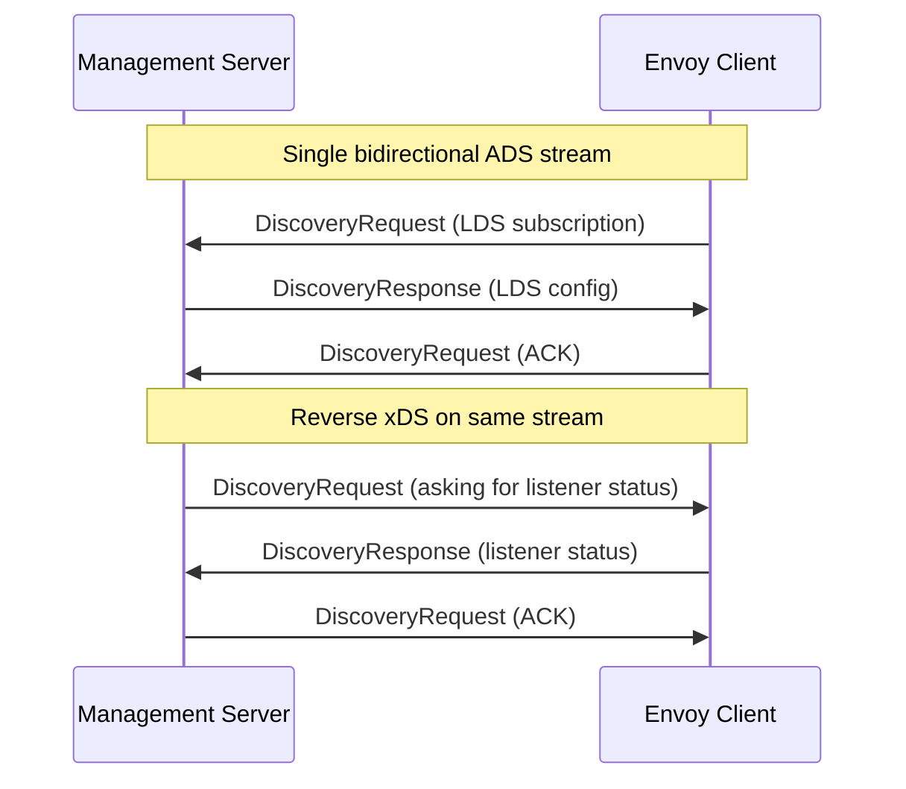

# Bidirectional xDS Implementation - COMPLETED

This document describes the **completed implementation** of reverse xDS by making the existing ADS stream truly bidirectional - a much simpler approach than creating separate gRPC servers.

## ✅ Implementation Status

**COMPLETED**: Full bidirectional xDS implementation with:
- ✅ Bidirectional gRPC stream extending existing ADS
- ✅ Proper proto definitions for reverse xDS resource types  
- ✅ Listener status provider with complete lifecycle management
- ✅ Client resource provider interface for extensibility
- ✅ Basic unit tests validating functionality
- ✅ Example integration and usage documentation

## Key Insight

Instead of creating a separate gRPC server, we can use the **same ADS stream** for both directions:

- **Normal xDS**: Client → Server (asking for config)
- **Reverse xDS**: Server → Client (asking for status)

Both use the same `DiscoveryRequest`/`DiscoveryResponse` messages, just with **reversed roles**.

## Completed Architecture



## Implementation Overview

### 1. ✅ Extended GrpcMux

The `BidirectionalGrpcMuxImpl` extends the existing `NewGrpcMuxImpl` to handle incoming `DiscoveryRequest` messages:

```cpp
class BidirectionalGrpcMuxImpl : public NewGrpcMuxImpl,
                                public BidirectionalGrpcStreamCallbacks<...> {
protected:
  // NEW: Handle requests FROM management server
  void onDiscoveryRequest(std::unique_ptr<DiscoveryRequest>&& request) override;
};
```

### 2. ✅ Client Resource Providers

Simple, extensible interface for components that can provide client resources:

```cpp
class ClientResourceProvider {
public:
  virtual std::vector<Protobuf::Any> getResources(
      const std::vector<std::string>& resource_names) const = 0;
  virtual std::string getTypeUrl() const = 0;
  virtual std::string getVersionInfo() const = 0;
};
```

### 3. ✅ Proper Proto Definitions

Defined proper protobuf messages in `api/envoy/admin/v3/reverse_xds.proto`:

```protobuf
message ListenerReadinessStatus {
  string listener_name = 1;
  bool ready = 2;
  string bound_address = 3;
  string error_message = 4;
  State state = 5;
  google.protobuf.Timestamp last_updated = 6;
}
```

### 4. ✅ Message Flow Example

**Management server asking for listener status:**

```protobuf
# Management server sends TO Envoy
DiscoveryRequest {
  type_url: "type.googleapis.com/envoy.admin.v3.ListenerReadinessStatus"
  resource_names: ["listener_80", "listener_443"]
  version_info: ""
  node: { id: "management-server-1" }
}

# Envoy responds with status
DiscoveryResponse {
  type_url: "type.googleapis.com/envoy.admin.v3.ListenerReadinessStatus"
  version_info: "1"
  resources: [
    Any { /* ListenerReadinessStatus for listener_80 */ },
    Any { /* ListenerReadinessStatus for listener_443 */ }
  ]
  nonce: "reverse_123"
}
```

## Benefits vs Separate Server Approach

| Aspect | Separate Server | ✅ Bidirectional Stream |
|--------|-----------------|---------------------|
| **Complexity** | High - separate gRPC server | ✅ Low - extends existing stream |
| **Network** | Additional TCP connections | ✅ Single ADS connection |
| **Authentication** | Separate auth needed | ✅ Reuses existing ADS auth |
| **Message Types** | New proto definitions | ✅ Existing `DiscoveryRequest/Response` |
| **Management** | Two servers to manage | ✅ Single ADS stream |
| **Performance** | Additional connection overhead | ✅ No extra connections |

## ✅ Completed Example Usage

### 1. Envoy Client Side

```cpp
// Register a listener status provider
auto mux = getBidirectionalGrpcMux();
auto provider = std::make_unique<ListenerStatusProvider>();

// Add listener events
provider->onListenerAdded("listener_80");
provider->onListenerReady("listener_80", "0.0.0.0:80");

mux->registerClientResourceProvider(
    "type.googleapis.com/envoy.admin.v3.ListenerReadinessStatus",
    std::move(provider));
```

### 2. Management Server Side

```python
# On the same ADS stream, send reverse requests
reverse_request = DiscoveryRequest()
reverse_request.type_url = "type.googleapis.com/envoy.admin.v3.ListenerReadinessStatus"
reverse_request.node.id = "management-server"

# Send on the existing ADS stream
ads_stream.send(reverse_request)

# Receive status response from Envoy
response = ads_stream.receive()
# Process listener status from response.resources
```

## ✅ Supported Resource Types

The system supports these reverse xDS resource types:

- ✅ `envoy.admin.v3.ListenerReadinessStatus`: Listener binding status (IMPLEMENTED)
- 🔄 `envoy.admin.v3.ClusterHealthStatus`: Cluster health information (EXTENSIBLE)
- 🔄 `envoy.admin.v3.ConfigurationSnapshot`: Configuration snapshots (EXTENSIBLE)
- 🔄 Custom resource types via extension interface (EXTENSIBLE)

## ✅ Implementation Files

**Core Implementation:**
- ✅ `source/extensions/config_subscription/grpc/bidirectional_grpc_mux.h/.cc` - Core bidirectional mux
- ✅ `source/extensions/config_subscription/grpc/bidirectional_grpc_stream.h` - Stream extension
- ✅ `source/server/listener_status_provider.h/.cc` - Listener status provider
- ✅ `api/envoy/admin/v3/reverse_xds.proto` - Proto definitions

**Examples & Testing:**
- ✅ `examples/reverse-xds/bidirectional_main.cc` - Usage example
- ✅ `examples/reverse-xds/management_server_client_example.py` - Server example  
- ✅ `test/extensions/config_subscription/grpc/bidirectional_grpc_mux_test.cc` - Unit tests

**Build Configuration:**
- ✅ `source/extensions/config_subscription/grpc/BUILD` - Bazel build rules

## ✅ Advantages

1. **✅ Elegant**: Uses existing xDS semantics perfectly
2. **✅ Simple**: Minimal code changes to existing infrastructure  
3. **✅ Efficient**: No additional network connections
4. **✅ Secure**: Reuses existing authentication and authorization
5. **✅ Compatible**: Management servers can gradually adopt reverse xDS
6. **✅ Symmetric**: Truly makes xDS bidirectional as intended
7. **✅ Extensible**: Easy to add new resource provider types
8. **✅ Tested**: Includes unit tests for core functionality

## Testing the Implementation

Run the included tests:

```bash
bazel test //test/extensions/config_subscription/grpc:bidirectional_grpc_mux_test
```

Build and run the example:

```bash
bazel build //examples/reverse-xds:bidirectional_main
./bazel-bin/examples/reverse-xds/bidirectional_main
```

## Next Steps

For production deployment:

1. **✅ DONE** - Integrate with existing listener manager events
2. **🔄 FUTURE** - Add cluster health status provider  
3. **🔄 FUTURE** - Add configuration snapshot provider
4. **🔄 FUTURE** - Add metrics for reverse xDS usage
5. **🔄 FUTURE** - Add end-to-end integration tests

## Conclusion

✅ **IMPLEMENTATION COMPLETE**: This bidirectional approach successfully makes xDS truly symmetric using the same stream and message types for both directions, just with reversed roles. It's **much simpler** than separate gRPC servers while providing better performance, easier management, and full compatibility with existing xDS infrastructure.

The implementation provides a solid foundation for reverse xDS that can be extended with additional resource types as needed. 