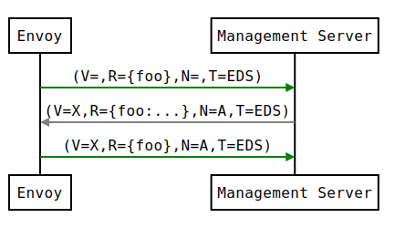
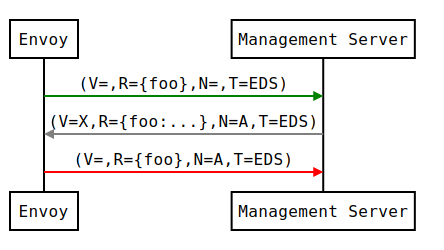
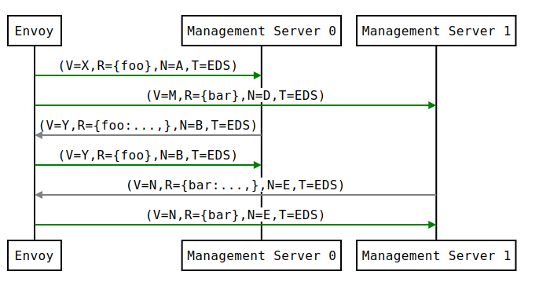
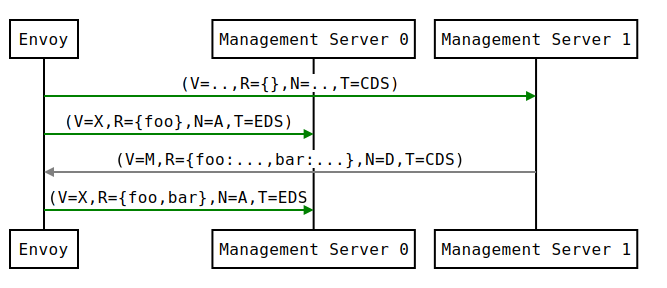
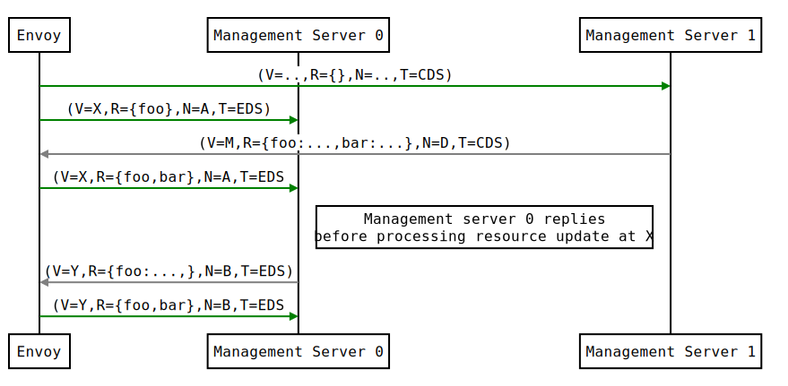
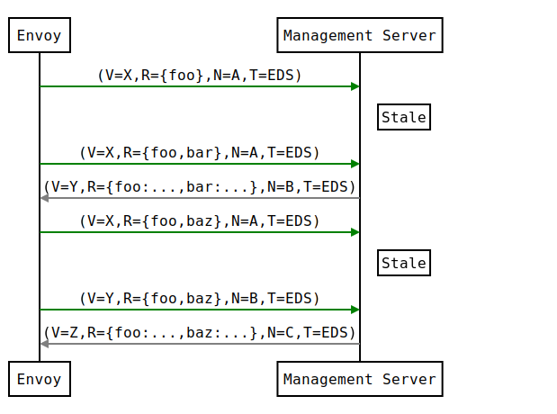
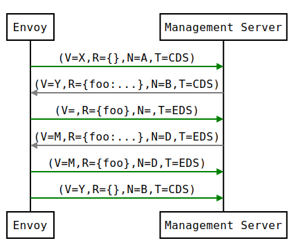
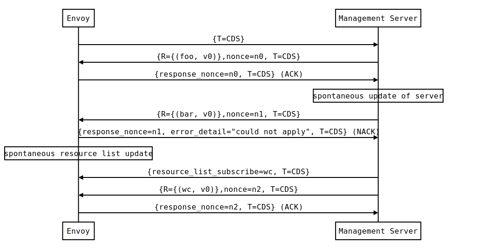
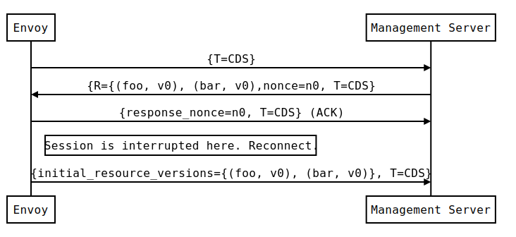

# xDS REST and gRPC protocol

Envoy discovers its various dynamic resources via the filesystem or by querying
one or more management servers. Collectively, these discovery services and their
corresponding APIs are referred to as _xDS_. Resources are requested via
_subscriptions_, by specifying a filesystem path to watch, initiating gRPC
streams or polling a REST-JSON URL. The latter two methods involve sending
requests with a
[`DiscoveryRequest`](https://www.envoyproxy.io/docs/envoy/latest/api-v2/api/v2/discovery.proto#discoveryrequest)
proto payload. Resources are delivered in a
[`DiscoveryResponse`](https://www.envoyproxy.io/docs/envoy/latest/api-v2/api/v2/discovery.proto#discoveryresponse)
proto payload in all methods. We discuss each type of subscription below.

## Filesystem subscriptions

The simplest approach to delivering dynamic configuration is to place it at a
well known path specified in the
[`ConfigSource`](https://www.envoyproxy.io/docs/envoy/latest/api-v2/api/v2/core/config_source.proto#core-configsource).
Envoy will use `inotify` (`kqueue` on macOS) to monitor the file for changes
and parse the `DiscoveryResponse` proto in the file on update. Binary
protobufs, JSON, YAML and proto text are supported formats for the
`DiscoveryResponse`.

There is no mechanism available for filesystem subscriptions to ACK/NACK updates
beyond stats counters and logs. The last valid configuration for an xDS API will
continue to apply if an configuration update rejection occurs.

## Streaming gRPC subscriptions

### Singleton resource type discovery

A gRPC
[`ApiConfigSource`](https://www.envoyproxy.io/docs/envoy/latest/api-v2/api/v2/core/config_source.proto#core-apiconfigsource)
can be specified independently for each xDS API, pointing at an upstream
cluster corresponding to a management server. This will initiate an independent
bidirectional gRPC stream for each xDS resource type, potentially to distinct
management servers. API delivery is eventually consistent. See
[ADS](#aggregated-discovery-service) below for situations in which explicit
control of sequencing is required.

#### Type URLs

Each xDS API is concerned with resources of a given type. There is a 1:1
correspondence between an xDS API and a resource type. That is:

* [LDS: `envoy.api.v2.Listener`](envoy/api/v2/lds.proto)
* [RDS: `envoy.api.v2.RouteConfiguration`](envoy/api/v2/rds.proto)
* [CDS: `envoy.api.v2.Cluster`](envoy/api/v2/cds.proto)
* [EDS: `envoy.api.v2.ClusterLoadAssignment`](envoy/api/v2/eds.proto)
* [SDS: `envoy.api.v2.Auth.Secret`](envoy/api/v2/auth/cert.proto)

The concept of [_type
URLs_](https://developers.google.com/protocol-buffers/docs/proto3#any) appears
below, and takes the form `type.googleapis.com/<resource type>`, e.g.
`type.googleapis.com/envoy.api.v2.Cluster` for CDS. In various requests from
Envoy and responses by the management server, the resource type URL is stated.

#### ACK/NACK and versioning

Each stream begins with a `DiscoveryRequest` from Envoy, specifying the list of
resources to subscribe to, the type URL corresponding to the subscribed
resources, the node identifier and an empty `version_info`. An example EDS request
might be:

```yaml
version_info:
node: { id: envoy }
resource_names:
- foo
- bar
type_url: type.googleapis.com/envoy.api.v2.ClusterLoadAssignment
response_nonce:
```

The management server may reply either immediately or when the requested
resources are available with a `DiscoveryResponse`, e.g.:

```yaml
version_info: X
resources:
- foo ClusterLoadAssignment proto encoding
- bar ClusterLoadAssignment proto encoding
type_url: type.googleapis.com/envoy.api.v2.ClusterLoadAssignment
nonce: A
```

After processing the `DiscoveryResponse`, Envoy will send a new request on the
stream, specifying the last version successfully applied and the nonce provided
by the management server. If the update was successfully applied, the
`version_info` will be __X__, as indicated in the sequence diagram:



In this sequence diagram, and below, the following format is used to abbreviate
messages:
* `DiscoveryRequest`: (V=`version_info`,R=`resource_names`,N=`response_nonce`,T=`type_url`)
* `DiscoveryResponse`: (V=`version_info`,R=`resources`,N=`nonce`,T=`type_url`)

The version provides Envoy and the management server a shared notion of the
currently applied configuration, as well as a mechanism to ACK/NACK
configuration updates. If Envoy had instead rejected configuration update __X__,
it would reply with
[`error_detail`](https://www.envoyproxy.io/docs/envoy/latest/api-v2/api/v2/discovery.proto#envoy-api-field-discoveryrequest-error-detail)
populated and its previous version, which in this case was the empty
initial version. The error_detail has more details around the exact error message
populated in the message field:



Later, an API update may succeed at a new version __Y__:


Each stream has its own notion of versioning, there is no shared versioning
across resource types. When ADS is not used, even each resource of a given
resource type may have a
distinct version, since the Envoy API allows distinct EDS/RDS resources to point
at different `ConfigSource`s.

#### When to send an update

The management server should only send updates to the Envoy client when the
resources in the `DiscoveryResponse` have changed. Envoy replies to any
`DiscoveryResponse` with a `DiscoveryRequest` containing the ACK/NACK
immediately after it has been either accepted or rejected. If the management
server provides the same set of resources rather than waiting for a change to
occur, it will cause Envoy and the management server to spin and have a severe
performance impact.

Within a stream, new `DiscoveryRequest`s supersede any prior `DiscoveryRequest`s
having the same resource type. This means that the management server only needs
to respond to the latest `DiscoveryRequest` on each stream for any given resource
type.

#### Resource hints

The `resource_names` specified in the `DiscoveryRequest` are a hint. Some
resource types, e.g. `Cluster`s and `Listener`s will specify an empty
`resource_names` list, since Envoy is interested in learning about all the
`Cluster`s (CDS) and `Listener`s (LDS) that the management server(s) know about
corresponding to its node identification. Other resource types, e.g.
`RouteConfiguration`s (RDS) and `ClusterLoadAssignment`s (EDS), follow from
earlier CDS/LDS updates and Envoy is able to explicitly enumerate these
resources.

LDS/CDS resource hints will always be empty and it is expected that the
management server will provide the complete state of the LDS/CDS resources in
each response. An absent `Listener` or `Cluster` will be deleted.

For EDS/RDS, the management server does not need to supply every requested
resource and may also supply additional, unrequested resources. `resource_names`
is only a hint. Envoy will silently ignore any superfluous resources. When a
requested resource is missing in a RDS or EDS update, Envoy will retain the last
known value for this resource except in the case where the `Cluster` or `Listener`
is being warmed. See [Resource warming](#resource-warming) section below on the expectations
during warming. The management server may be able to infer all
the required EDS/RDS resources from the `node` identification in the
`DiscoveryRequest`, in which case this hint may be discarded. An empty EDS/RDS
`DiscoveryResponse` is effectively a nop from the perspective of the respective
resources in the Envoy.

When a `Listener` or `Cluster` is deleted, its corresponding EDS and RDS
resources are also deleted inside the Envoy instance. In order for EDS resources
to be known or tracked by Envoy, there must exist an applied `Cluster`
definition (e.g. sourced via CDS). A similar relationship exists between RDS and
`Listeners` (e.g. sourced via LDS).

For EDS/RDS, Envoy may either generate a distinct stream for each resource of a
given type (e.g. if each `ConfigSource` has its own distinct upstream cluster
for a management server), or may combine together multiple resource requests for
a given resource type when they are destined for the same management server.
While this is left to implementation specifics, management servers should be capable
of handling one or more `resource_names` for a given resource type in each
request. Both sequence diagrams below are valid for fetching two EDS resources
`{foo, bar}`:




#### Resource updates

As discussed above, Envoy may update the list of `resource_names` it presents to
the management server in each `DiscoveryRequest` that ACK/NACKs a specific
`DiscoveryResponse`. In addition, Envoy may later issue additional
`DiscoveryRequest`s at a given `version_info` to update the management server
with new resource hints. For example, if Envoy is at EDS version __X__ and knows
only about cluster `foo`, but then receives a CDS update and learns about `bar`
in addition, it may issue an additional `DiscoveryRequest` for __X__ with
`{foo,bar}` as `resource_names`.



There is a race condition that may arise here; if after a resource hint update
is issued by Envoy at __X__, but before the management server processes the
update it replies with a new version __Y__, the resource hint update may be
interpreted as a rejection of __Y__ by presenting an __X__ `version_info`. To
avoid this, the management server provides a `nonce` that Envoy uses to indicate
the specific `DiscoveryResponse` each `DiscoveryRequest` corresponds to:



The management server should not send a `DiscoveryResponse` for any
`DiscoveryRequest` that has a stale nonce. A nonce becomes stale following a
newer nonce being presented to Envoy in a `DiscoveryResponse`. A management
server does not need to send an update until it determines a new version is
available. Earlier requests at a version then also become stale. It may process
multiple `DiscoveryRequests` at a version until a new version is ready.



An implication of the above resource update sequencing is that Envoy does not
expect a `DiscoveryResponse` for every `DiscoveryRequest` it issues.

### Resource warming

[`Clusters`](https://www.envoyproxy.io/docs/envoy/latest/intro/arch_overview/cluster_manager.html#cluster-warming)
and [`Listeners`](https://www.envoyproxy.io/docs/envoy/latest/configuration/listeners/lds#config-listeners-lds)
go through  `warming` before they can serve requests. This process happens both during
[`Envoy initialization`](https://www.envoyproxy.io/docs/envoy/latest/intro/arch_overview/init.html#initialization)
and when the `Cluster` or `Listener` is updated. Warming of `Cluster` is completed only when a
`ClusterLoadAssignment` response is supplied by management server. Similarly, warming of `Listener`
is completed only when a `RouteConfiguration` is supplied by management server if the listener
refers to an RDS configuration. Management server is expected to provide the EDS/RDS updates during
warming. If management server does not provide EDS/RDS responses, Envoy will not initialize
itself during the initialization phase and the updates sent via CDS/LDS will not take effect until
EDS/RDS responses are supplied.

#### Eventual consistency considerations

Since Envoy's xDS APIs are eventually consistent, traffic may drop briefly
during updates. For example, if only cluster __X__ is known via CDS/EDS,
a `RouteConfiguration` references cluster __X__
and is then adjusted to cluster __Y__ just before the CDS/EDS update
providing __Y__, traffic will be blackholed until __Y__ is known about by the
Envoy instance.

For some applications, a temporary drop of traffic is acceptable, retries at the
client or by other Envoy sidecars will hide this drop. For other scenarios where
drop can't be tolerated, traffic drop could have been avoided by providing a
CDS/EDS update with both __X__ and __Y__, then the RDS update repointing from
__X__ to __Y__ and then a CDS/EDS update dropping __X__.

In general, to avoid traffic drop, sequencing of updates should follow a
`make before break` model, wherein
* CDS updates (if any) must always be pushed first.
* EDS updates (if any) must arrive after CDS updates for the respective clusters.
* LDS updates must arrive after corresponding CDS/EDS updates.
* RDS updates related to the newly added listeners must arrive in the end.
* Stale CDS clusters and related EDS endpoints (ones no longer being
  referenced) can then be removed.

xDS updates can be pushed independently if no new clusters/routes/listeners
are added or if it's acceptable to temporarily drop traffic during
updates. Note that in case of LDS updates, the listeners will be warmed
before they receive traffic, i.e. the dependent routes are fetched through
RDS if configured. Clusters are warmed when adding/removing/updating
clusters. On the other hand, routes are not warmed, i.e., the management
plane must ensure that clusters referenced by a route are in place, before
pushing the updates for a route.

### Aggregated Discovery Services (ADS)

It's challenging to provide the above guarantees on sequencing to avoid traffic
drop when management servers are distributed. ADS allow a single management
server, via a single gRPC stream, to deliver all API updates. This provides the
ability to carefully sequence updates to avoid traffic drop. With ADS, a single
stream is used with multiple independent `DiscoveryRequest`/`DiscoveryResponse`
sequences multiplexed via the type URL. For any given type URL, the above
sequencing of `DiscoveryRequest` and `DiscoveryResponse` messages applies. An
example update sequence might look like:



A single ADS stream is available per Envoy instance.

An example minimal `bootstrap.yaml` fragment for ADS configuration is:

```yaml
node:
  id: <node identifier>
dynamic_resources:
  cds_config: {ads: {}}
  lds_config: {ads: {}}
  ads_config:
    api_type: GRPC
    grpc_services:
      envoy_grpc:
        cluster_name: ads_cluster
static_resources:
  clusters:
  - name: ads_cluster
    connect_timeout: { seconds: 5 }
    type: STATIC
    hosts:
    - socket_address:
        address: <ADS management server IP address>
        port_value: <ADS management server port>
    lb_policy: ROUND_ROBIN
    http2_protocol_options: {}
    upstream_connection_options:
      # configure a TCP keep-alive to detect and reconnect to the admin
      # server in the event of a TCP socket disconnection
      tcp_keepalive:
        ...
admin:
  ...

```

### Incremental xDS

Incremental xDS is a separate xDS endpoint that:

  * Allows the protocol to communicate on the wire in terms of resource/resource
    name deltas ("Delta xDS"). This supports the goal of scalability of xDS
    resources. Rather than deliver all 100k clusters when a single cluster is
    modified, the management server only needs to deliver the single cluster
    that changed.
  * Allows the Envoy to on-demand / lazily request additional resources. For
    example, requesting a cluster only when a request for that cluster arrives.

An Incremental xDS session is always in the context of a gRPC bidirectional
stream. This allows the xDS server to keep track of the state of xDS clients
connected to it. There is no REST version of Incremental xDS yet.

In the delta xDS wire protocol, the nonce field is required and used to pair a
[`DeltaDiscoveryResponse`](https://www.envoyproxy.io/docs/envoy/latest/api-v2/api/v2/discovery.proto#deltadiscoveryresponse)
to a [`DeltaDiscoveryRequest`](https://www.envoyproxy.io/docs/envoy/latest/api-v2/api/v2/discovery.proto#deltadiscoveryrequest)
ACK or NACK.
Optionally, a response message level system_version_info is present for
debugging purposes only.

`DeltaDiscoveryRequest` can be sent in 3 situations:
  1. Initial message in a xDS bidirectional gRPC stream.
  2. As an ACK or NACK response to a previous `DeltaDiscoveryResponse`.
     In this case the `response_nonce` is set to the nonce value in the Response.
     ACK or NACK is determined by the absence or presence of `error_detail`.
  3. Spontaneous `DeltaDiscoveryRequest` from the client.
     This can be done to dynamically add or remove elements from the tracked
     `resource_names` set. In this case `response_nonce` must be omitted.

In this first example the client connects and receives a first update that it
ACKs. The second update fails and the client NACKs the update. Later the xDS
client spontaneously requests the "wc" resource.



On reconnect the Incremental xDS client may tell the server of its known
resources to avoid resending them over the network.



#### Resource names
Resources are identified by a resource name or an alias. Aliases of a resource, if present, can be
identified by the alias field in the resource of a `DeltaDiscoveryResponse`. The resource name will
be returned in the name field in the resource of a `DeltaDiscoveryResponse`.

#### Subscribing to Resources
Envoy can send either an alias or the name of a resource in the `resource_names_subscribe` field of
a `DeltaDiscoveryRequest` in order to subscribe to a resource. Envoy should check both the names and
aliases of resources in order to determine whether the entity in question has been subscribed to.

#### Unsubscribing from Resources
Envoy will keep track of a per resource reference count internally. This count will keep track of the
total number of aliases/resource names that are currently subscribed to. When the reference count
reaches zero, Envoy will send a `DeltaDiscoveryRequest` containing the resource name of the resource
to unsubscribe from in the `resource_names_unsubscribe` field. When Envoy unsubscribes from a resource,
it should check for both the resource name and all aliases and appropriately update all resources
that reference either.

## REST-JSON polling subscriptions

Synchronous (long) polling via REST endpoints is also available for the xDS
singleton APIs. The above sequencing of messages is similar, except no
persistent stream is maintained to the management server. It is expected that
there is only a single outstanding request at any point in time, and as a result
the response nonce is optional in REST-JSON. The [JSON canonical transform of
proto3](https://developers.google.com/protocol-buffers/docs/proto3#json) is used
to encode `DiscoveryRequest` and `DiscoveryResponse` messages. ADS is not
available for REST-JSON polling.

When the poll period is set to a small value, with the intention of long
polling, then there is also a requirement to avoid sending a `DiscoveryResponse`
[unless a change to the underlying resources has
occurred](#when-to-send-an-update).
