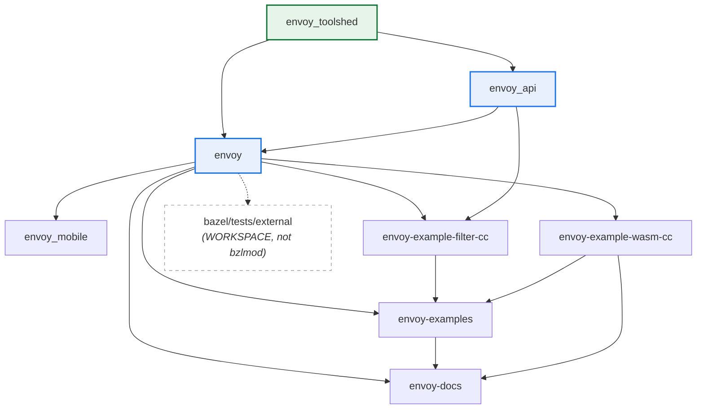

## Envoy's published bzlmod graph

```mermaid
graph TD
    toolshed["envoy_toolshed"]
    api["envoy_api"]
    envoy["envoy"]
    mobile["envoy_mobile"]
    docs["envoy-docs"]
    examples["envoy-examples"]
    filter_cc["envoy-example-filter-cc"]
    wasm_cc["envoy-example-wasm-cc"]
    ext_test["bazel/tests/external<br/><i>(WORKSPACE, not bzlmod)</i>"]

    toolshed --> api
    toolshed --> envoy
    api --> envoy

    envoy --> mobile
    envoy --> docs
    envoy --> examples
    envoy --> filter_cc
    envoy --> wasm_cc
    envoy -.-> ext_test

    api --> filter_cc

    examples --> docs
    wasm_cc --> docs

    filter_cc --> examples
    wasm_cc --> examples

    classDef root fill:#e6f4ea,stroke:#137333,stroke-width:2px
    classDef core fill:#e8f0fe,stroke:#1a73e8,stroke-width:2px
    classDef ws fill:#fff,stroke:#999,stroke-dasharray: 5 5
    class toolshed root
    class envoy,api core
    class ext_test ws
```
