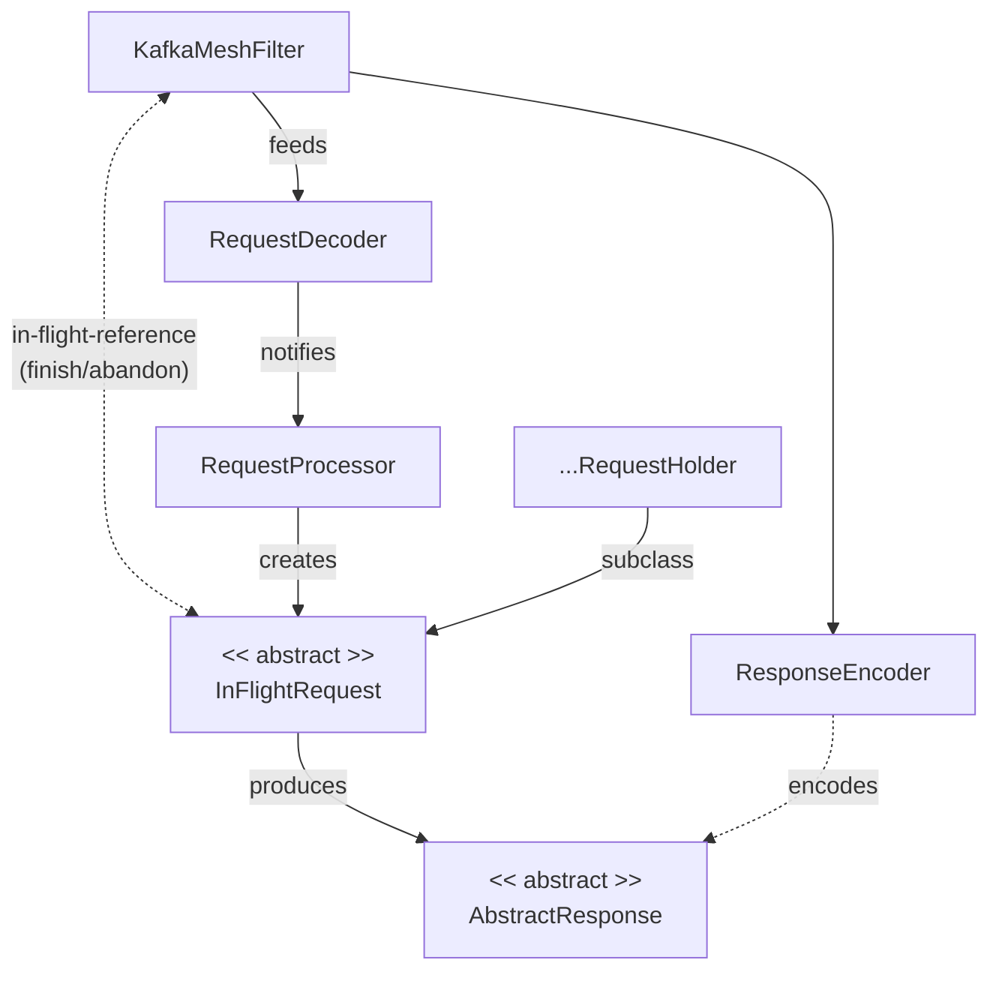
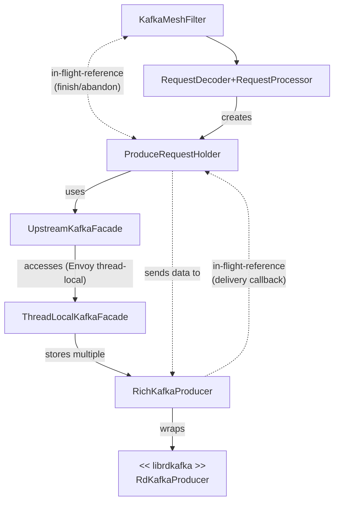
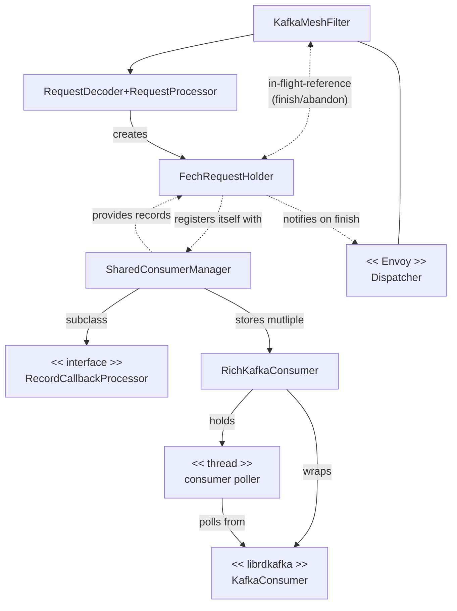

# Command handlers

These simple diagrams show what are the main classes involved in providing Kafka-mesh filter functionality.

Disclaimer: these are not UML diagrams in any shape or form.

## Basics

Raw data is processed by `RequestDecoder`, which notifies `RequestProcessor` on successful parse.
`RequestProcessor` then creates `InFlightRequest` instances that can be processed.

When an `InFlightRequest` is finally processed, it can generate an answer (`AbstractResponse`)
that is later serialized by `ResponseEncoder`.

## Produce

Produce request (`ProduceRequestHolder`) uses `UpstreamKafkaFacade` to get `RichKafkaProducer` instances that
correspond to its topics.
When the deliveries have finished (successfully or not - the upstream could have rejected the records because
of its own reasons), `RichKafkaProducer` notifies the `ProduceRequestHolder` that it has finished.
The request can then notify its parent (`KafkaMeshFilter`) that the response can be sent downstream.

## Fetch

Fetch request (`FechRequestHolder`) registers itself with `SharedConsumerManager` to be notified when records matching
its interests appear.
`SharedConsumerManager` maintains multiple `RichKafkaConsumer` instances (what means keeps the Kafka consumer state)
that are responsible for polling records from upstream Kafka clusters.
Each `RichKafkaConsumer` is effectively a librdkafka `KafkaConsumer` and its poller thread.
When `FechRequestHolder` is finished with its processing (whether through record delivery or timeout), it uses an Envoy
`Dispatcher` to notify the parent filter.

