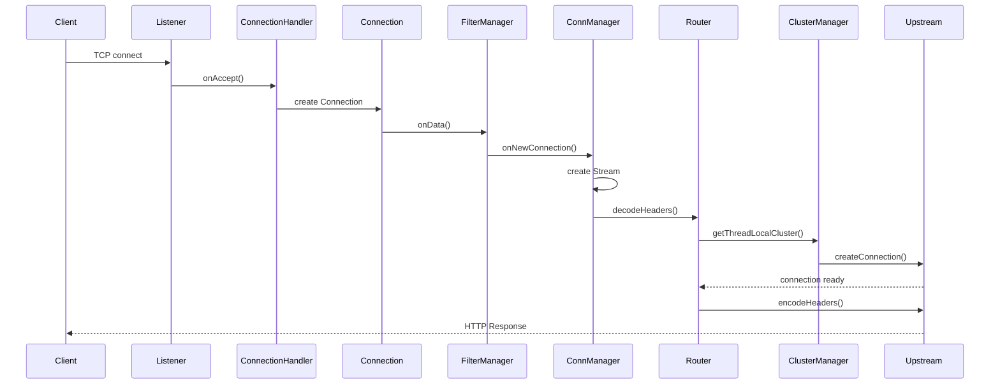
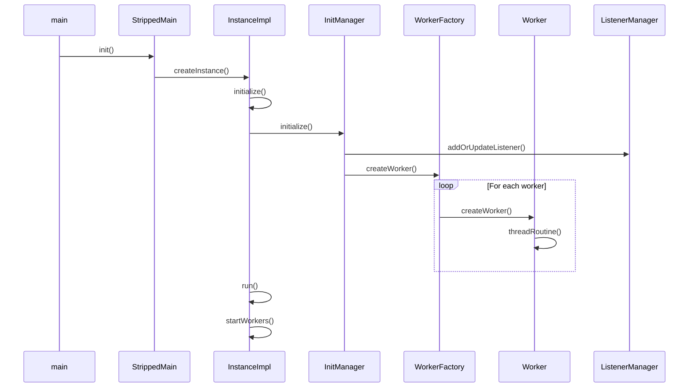
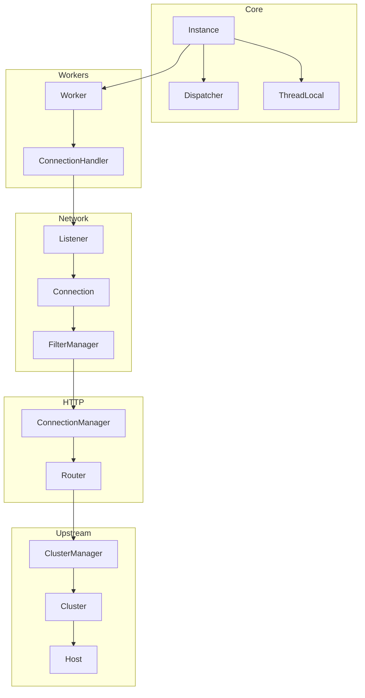
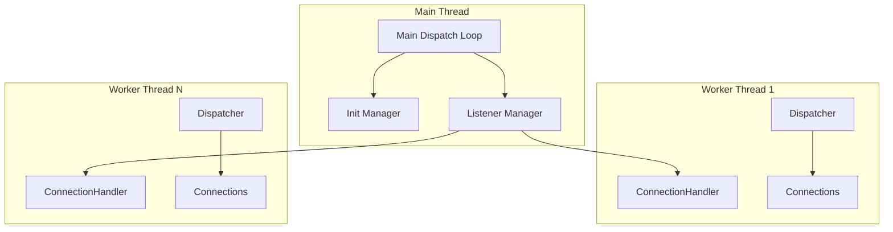

# Envoy Proxy — Architecture Reference

> Comprehensive documentation of Envoy's core C++ architecture, key classes, and request flow.

**Related docs:**
- [Router Architecture](ROUTER_ARCHITECTURE.md) — `source/common/router/` (routing, retries, upstream requests)

---

## 1. System Architecture Block Diagram

```mermaid
flowchart TB
    subgraph Process["Process Layer"]
        Main["main()"]
        StrippedMain["StrippedMainBase"]
        MainCommon["MainCommonBase"]
    end

    subgraph Server["Server Layer"]
        Instance["Instance / InstanceBase"]
        InstanceImpl["InstanceImpl"]
        ConfigValidation["ConfigValidationServer"]
    end

    subgraph Worker["Worker Layer"]
        WorkerFactory["ProdWorkerFactory"]
        Worker["WorkerImpl"]
        ConnectionHandler["ConnectionHandler"]
    end

    subgraph Network["Network Layer"]
        Listener["Listener"]
        Connection["Connection"]
        FilterManager["FilterManager"]
    end

    subgraph HTTP["HTTP Layer"]
        ConnManager["ConnectionManagerImpl"]
        Codec["ServerConnection"]
        Router["Router::Filter"]
    end

    subgraph Upstream["Upstream Layer"]
        ClusterManager["ClusterManager"]
        Cluster["Cluster"]
        Host["Host"]
    end

    subgraph Infra["Infrastructure"]
        Dispatcher["Event::Dispatcher"]
        ThreadLocal["ThreadLocal::Instance"]
        Runtime["Runtime::Loader"]
    end

    Main --> StrippedMain
    StrippedMain --> Instance
    Instance --> WorkerFactory
    WorkerFactory --> Worker
    Worker --> ConnectionHandler
    ConnectionHandler --> Listener
    Listener --> Connection
    Connection --> FilterManager
    FilterManager --> ConnManager
    ConnManager --> Router
    Router --> ClusterManager
    Instance --> Dispatcher
    Instance --> ThreadLocal
    Instance --> Runtime
```

---

## 2. Request Flow Sequence Diagram



---

## 3. Server Startup Sequence Diagram



---

## 4. Key Classes Reference

### 4.1 Server::Instance

**Location:** `envoy/server/instance.h`

**Purpose:** Abstract interface for the running Envoy server. Represents the top-level server process.

| Method | Return | Description |
|--------|--------|-------------|
| `run()` | void | Runs the server main loop |
| `admin()` | OptRef\<Admin\> | Returns HTTP admin endpoint |
| `api()` | Api::Api& | Server API (time, file system, etc.) |
| `clusterManager()` | ClusterManager& | Upstream cluster management |
| `dispatcher()` | Event::Dispatcher& | Main thread event dispatcher |
| `dnsResolver()` | DnsResolverSharedPtr | DNS resolution |
| `drainListeners()` | void | Close listeners, begin drain |
| `drainManager()` | DrainManager& | Drain state management |
| `listenerManager()` | ListenerManager& | Listener lifecycle |
| `initManager()` | Init::Manager& | Initialization targets |
| `sslContextManager()` | Ssl::ContextManager& | TLS/SSL contexts |
| `runtime()` | Runtime::Loader& | Feature flags / runtime config |

---

### 4.2 Server::InstanceBase / InstanceImpl

**Location:** `source/server/server.h`, `source/server/instance_impl.h`

**Purpose:** Concrete server implementation. Stitches together components: dispatcher, workers, cluster manager, listener manager, access log, etc.

| Member | Type | Description |
|--------|------|-------------|
| `dispatcher_` | Event::DispatcherPtr | Main thread event loop |
| `worker_factory_` | WorkerFactory& | Creates worker threads |
| `handler_` | ConnectionHandlerPtr | Connection handler |
| `access_log_manager_` | AccessLogManager | File-based access logs |
| `init_manager_` | Init::Manager& | Init targets |
| `stats_store_` | Stats::StoreRoot& | Stats storage |

| Method | Description |
|--------|-------------|
| `initialize()` | Initialize server with component factory |
| `run()` | Start main dispatch loop, workers |
| `startWorkers()` | Spawn worker threads |
| `terminate()` | Shutdown and cleanup |

---

### 4.3 Network::Connection

**Location:** `envoy/network/connection.h`

**Purpose:** Abstract raw connection. Manages socket I/O, buffers, and connection lifecycle.

| Method | Return | Description |
|--------|--------|-------------|
| `close()` | void | Close connection |
| `readDisable()` | void | Pause reading |
| `readEnable()` | void | Resume reading |
| `write()` | void | Write data to connection |
| `state()` | State | Open / Closing / Closed |
| `addConnectionCallbacks()` | void | Register callbacks |
| `addBytesSentCallback()` | void | Callback on bytes sent |

| Member (via ConnectionStats) | Description |
|-----------------------------|-------------|
| `read_total_` | Bytes read counter |
| `write_total_` | Bytes written counter |

---

### 4.4 Network::ConnectionCallbacks

**Location:** `envoy/network/connection.h`

**Purpose:** Callbacks for connection events.

| Method | Description |
|--------|-------------|
| `onEvent(ConnectionEvent)` | RemoteClose, LocalClose, Connected |
| `onAboveWriteBufferHighWatermark()` | Write buffer full |
| `onBelowWriteBufferLowWatermark()` | Write buffer drained |

---

### 4.5 Network::ConnectionHandler

**Location:** `envoy/network/connection_handler.h`

**Purpose:** Abstract connection handler. Manages listeners and connection lifecycle per worker.

| Method | Return | Description |
|--------|--------|-------------|
| `numConnections()` | uint64_t | Active connection count |
| `incNumConnections()` | void | Increment count |
| `decNumConnections()` | void | Decrement count |
| `addListener()` | void | Add listener config |
| `removeListeners()` | void | Remove listeners by tag |

---

### 4.6 Event::Dispatcher

**Location:** `envoy/event/dispatcher.h`

**Purpose:** Event loop. Runs timers, file events, and posted callbacks.

| Method | Return | Description |
|--------|--------|-------------|
| `post(PostCb)` | void | Post callback to run on event loop |
| `isThreadSafe()` | bool | Check if on dispatcher thread |
| `createTimer()` | TimerPtr | Create timer |
| `createFileEvent()` | FileEventPtr | Create file/socket event |
| `run(RunType)` | void | Run event loop (Block/NonBlock) |

---

### 4.7 Upstream::ClusterManager

**Location:** `envoy/upstream/cluster_manager.h`

**Purpose:** Manages upstream clusters, hosts, and load balancing.

| Method | Return | Description |
|--------|--------|-------------|
| `get()` | ThreadLocalClusterOptRef | Get cluster by name |
| `addOrUpdateCluster()` | void | Add/update cluster |
| `removeCluster()` | void | Remove cluster |
| `addClusterUpdateCallbacks()` | ClusterUpdateCallbacksHandlePtr | Register for cluster changes |
| `getThreadLocalCluster()` | ThreadLocalClusterOptRef | Thread-local cluster access |

---

### 4.8 Server::Worker / WorkerImpl

**Location:** `envoy/server/worker.h`, `source/server/worker_impl.h`

**Purpose:** Worker thread. Owns a dispatcher, connection handler, and runs the event loop.

| Method | Return | Description |
|--------|--------|-------------|
| `addListener()` | void | Add listener to worker |
| `removeListener()` | void | Remove listener |
| `start()` | void | Start worker thread |
| `stop()` | void | Stop worker |
| `numConnections()` | uint64_t | Connection count |

| Member | Type | Description |
|--------|------|-------------|
| `dispatcher_` | Event::DispatcherPtr | Worker event loop |
| `handler_` | ConnectionHandlerPtr | Connection handler |
| `thread_` | Thread::ThreadPtr | Worker thread |

---

### 4.9 Server::ListenerManager

**Location:** `envoy/server/listener_manager.h`

**Purpose:** Manages listener lifecycle and LDS (Listener Discovery Service).

| Method | Return | Description |
|--------|--------|-------------|
| `addOrUpdateListener()` | void | Add/update listener |
| `removeListener()` | void | Remove listener |
| `listeners()` | std::vector\<Listener\> | Active listeners |

---

### 4.10 Init::Manager

**Location:** `envoy/init/manager.h`

**Purpose:** Coordinates initialization of components. All targets must initialize before server starts listening.

| Method | Return | Description |
|--------|--------|-------------|
| `add()` | void | Register Init::Target |
| `initialize()` | void | Initialize all targets |
| `state()` | State | Uninitialized / Initializing / Initialized |

---

### 4.11 ThreadLocal::Instance

**Location:** `envoy/thread_local/thread_local.h`

**Purpose:** Thread-local storage. Each worker has its own slot data.

| Method | Return | Description |
|--------|--------|-------------|
| `allocateSlot()` | SlotPtr | Allocate TLS slot |
| `runOnAllThreads()` | void | Run callback on all workers |
| `runOnAllThreads(UpdateCb, complete_cb)` | void | Run on workers + completion callback |

---

### 4.12 ConnectionManagerImpl (HTTP)

**Location:** `source/common/http/conn_manager_impl.h`

**Purpose:** HTTP connection manager. Decodes HTTP, creates streams, runs filter chain.

| Method | Return | Description |
|--------|--------|-------------|
| `onData()` | FilterStatus | Handle incoming data |
| `onNewConnection()` | FilterStatus | New connection callback |
| `newStream()` | StreamDecoder& | Create new HTTP stream |

| Member | Description |
|--------|-------------|
| `codec_` | ServerConnection (HTTP/1.1, HTTP/2) |
| `streams_` | Active HTTP streams |
| `config_` | ConnectionManagerConfig |

---

## 5. Component Dependency Diagram



---

## 6. Threading Model



---

## 7. Source Paths

| Component | Path |
|-----------|------|
| Server | `source/server/` |
| Main entry | `source/exe/` |
| Network | `source/common/network/`, `envoy/network/` |
| HTTP | `source/common/http/` |
| Upstream | `source/common/upstream/`, `envoy/upstream/` |
| Event | `source/common/event/`, `envoy/event/` |
| Config | `source/common/config/` |

---

## 8. Key Interfaces Summary

| Interface | Purpose |
|-----------|---------|
| `Instance` | Server lifecycle |
| `Connection` | Socket I/O, buffers |
| `ConnectionHandler` | Per-worker connection handling |
| `ConnectionCallbacks` | Connection events |
| `Dispatcher` | Event loop |
| `ClusterManager` | Upstream clusters |
| `ListenerManager` | Listeners |
| `Init::Manager` | Startup ordering |
| `FilterManager` | L4 filter chain |
| `ConnectionManager` | HTTP filter chain |
