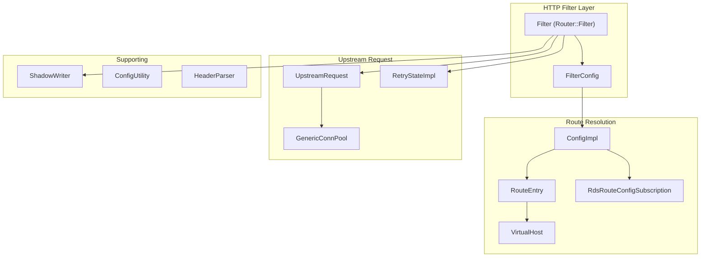
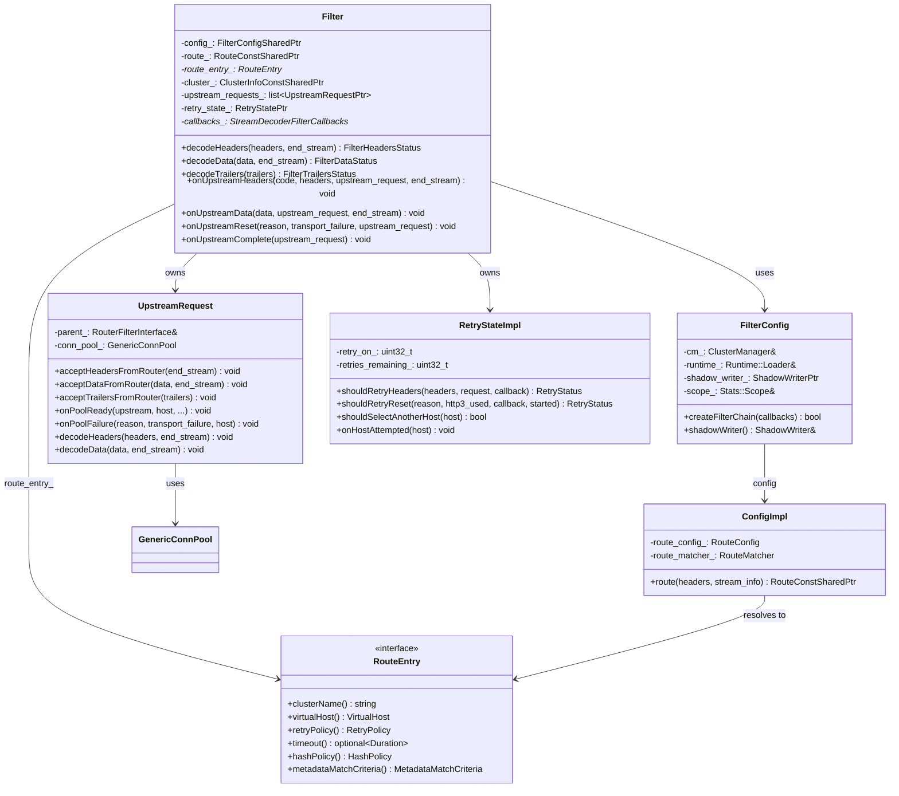
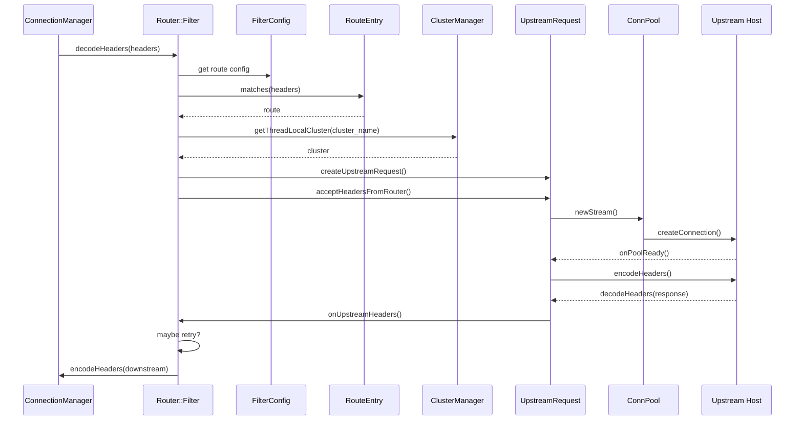
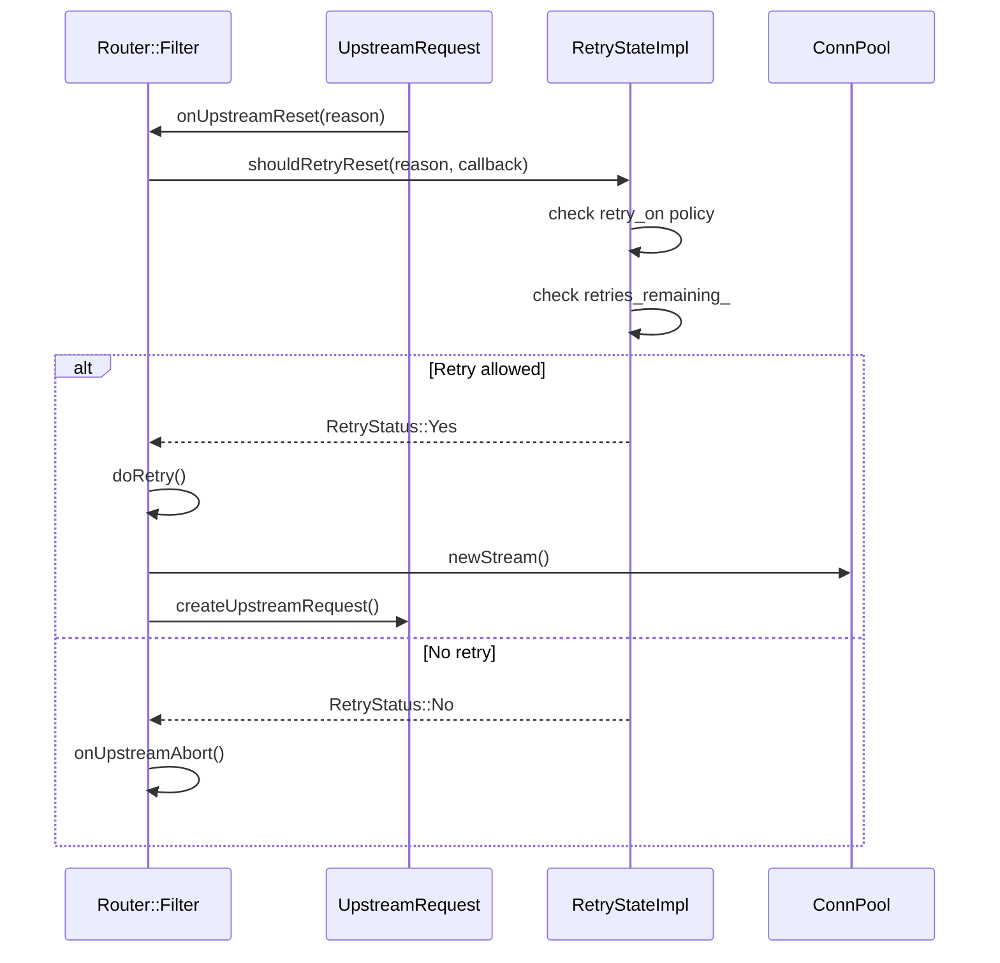
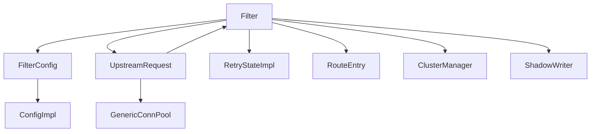

# Envoy Router — Architecture Reference

> Documentation of the `source/common/router/` folder: routing, retries, shadowing, and upstream request handling.

---

## 1. Router Block Diagram



---

## 2. Router Class Diagram (UML)



---

## 3. Router Request Flow Sequence Diagram



---

## 4. Retry Flow Sequence Diagram



---

## 5. Key Classes Reference

### 5.1 Router::Filter

**Location:** `source/common/router/router.h`

**Purpose:** Main HTTP router filter. Routes requests to upstream clusters, manages retries, shadowing, timeouts, and load balancing context.

| Method | Return | Description |
|--------|--------|-------------|
| `decodeHeaders()` | FilterHeadersStatus | Route lookup, cluster selection, start upstream request |
| `decodeData()` | FilterDataStatus | Forward body to upstream |
| `decodeTrailers()` | FilterTrailersStatus | Forward trailers |
| `onUpstreamHeaders()` | void | Handle upstream response headers |
| `onUpstreamData()` | void | Forward response body downstream |
| `onUpstreamReset()` | void | Handle upstream reset, trigger retry if applicable |
| `onUpstreamComplete()` | void | Finalize successful response |
| `onPerTryTimeout()` | void | Per-try timeout, may retry |
| `onGlobalTimeout()` | void | Global timeout, abort |

| Member | Type | Description |
|--------|------|-------------|
| `config_` | FilterConfigSharedPtr | Router config |
| `route_` | RouteConstSharedPtr | Matched route |
| `route_entry_` | RouteEntry* | Route entry (cluster, timeout, retry) |
| `cluster_` | ClusterInfoConstSharedPtr | Target cluster |
| `upstream_requests_` | list\<UpstreamRequestPtr\> | In-flight upstream requests |
| `retry_state_` | RetryStatePtr | Retry policy and state |
| `callbacks_` | StreamDecoderFilterCallbacks* | Downstream filter callbacks |

---

### 5.2 FilterConfig

**Location:** `source/common/router/router.h`

**Purpose:** Router filter configuration. Holds ClusterManager, Runtime, ShadowWriter, stats, and upstream filter factories.

| Member | Type | Description |
|--------|------|-------------|
| `cm_` | ClusterManager& | Upstream cluster manager |
| `runtime_` | Runtime::Loader& | Runtime flags |
| `shadow_writer_` | ShadowWriterPtr | Shadow request writer |
| `scope_` | Stats::Scope& | Stats scope |
| `default_stats_` | FilterStats | Router stats |
| `upstream_http_filter_factories_` | FilterFactoriesList | Upstream filter chain |

| Method | Description |
|--------|-------------|
| `createFilterChain()` | Create upstream filter chain |
| `shadowWriter()` | Access shadow writer |

---

### 5.3 UpstreamRequest

**Location:** `source/common/router/upstream_request.h`

**Purpose:** Represents a single upstream request. Owns connection pool stream, buffers data, forwards request/response, handles flow control.

| Method | Return | Description |
|--------|--------|-------------|
| `acceptHeadersFromRouter()` | void | Receive headers from router, send upstream |
| `acceptDataFromRouter()` | void | Forward body |
| `acceptTrailersFromRouter()` | void | Forward trailers |
| `onPoolReady()` | void | Connection ready, encode request |
| `onPoolFailure()` | void | Pool failure, notify router |
| `decodeHeaders()` | void | Receive response headers from upstream |
| `decodeData()` | void | Receive response body |
| `onResetStream()` | void | Upstream reset |
| `setupPerTryTimeout()` | void | Start per-try timeout timer |

| Member | Type | Description |
|--------|------|-------------|
| `parent_` | RouterFilterInterface& | Router filter |
| `conn_pool_` | GenericConnPool | Connection pool |
| `stream_options_` | StreamOptions | Upstream stream options |

---

### 5.4 RetryStateImpl

**Location:** `source/common/router/retry_state_impl.h`

**Purpose:** Retry policy and state. Decides whether to retry on reset/timeout/headers, host selection, and priority load for retries.

| Method | Return | Description |
|--------|--------|-------------|
| `shouldRetryHeaders()` | RetryStatus | Retry based on response headers |
| `shouldRetryReset()` | RetryStatus | Retry on stream reset |
| `shouldHedgeRetryPerTryTimeout()` | RetryStatus | Hedge on per-try timeout |
| `shouldSelectAnotherHost()` | bool | Exclude host on retry |
| `onHostAttempted()` | void | Notify retry predicates |
| `priorityLoadForRetry()` | HealthyAndDegradedLoad | Priority load for retries |

---

### 5.5 RouteEntry (Interface)

**Location:** `envoy/router/router.h`

**Purpose:** Route entry interface. Provides cluster name, virtual host, retry policy, timeout, hash policy, metadata match.

| Method | Return | Description |
|--------|--------|-------------|
| `clusterName()` | const std::string& | Target cluster |
| `virtualHost()` | const VirtualHost& | Virtual host |
| `retryPolicy()` | const RetryPolicy* | Retry policy |
| `timeout()` | absl::optional\<std::chrono::milliseconds\> | Route timeout |
| `hashPolicy()` | const HashPolicy* | Load balancer hash |
| `metadataMatchCriteria()` | const MetadataMatchCriteria* | Subset LB metadata |

---

### 5.6 ConfigImpl

**Location:** `source/common/router/config_impl.h`

**Purpose:** Route configuration implementation. Holds route config, virtual hosts, and route matcher.

| Method | Return | Description |
|--------|--------|-------------|
| `route()` | RouteConstSharedPtr | Match headers to route |

---

### 5.7 RdsRouteConfigSubscription

**Location:** `source/common/router/rds_impl.h`

**Purpose:** Fetches route config via RDS API and updates config providers.

| Method | Return | Description |
|--------|--------|-------------|
| `routeConfigUpdate()` | RouteConfigUpdatePtr& | Config update receiver |
| `updateOnDemand()` | void | Trigger on-demand update |

---

### 5.8 ShadowWriter

**Location:** `envoy/router/shadow_writer.h`

**Purpose:** Sends shadow (mirror) requests to alternate clusters. Used for traffic mirroring.

| Method | Return | Description |
|--------|--------|-------------|
| `submit()` | OngoingRequest* | Submit shadow request |

---

### 5.9 FilterUtility

**Location:** `source/common/router/router.h`

**Purpose:** Stateless router utilities: header validation, scheme setup, shadow decision, timeout parsing.

| Method | Description |
|--------|-------------|
| `setUpstreamScheme()` | Set :scheme from TLS/headers |
| `shouldShadow()` | Decide if request should be shadowed |
| `finalTimeout()` | Compute global and per-try timeouts |
| `checkHeader()` | Strict header validation |

---

## 6. Router Folder Structure

```
source/common/router/
├── router.h / router.cc           # Filter, FilterConfig, FilterUtility
├── upstream_request.h / .cc      # UpstreamRequest
├── retry_state_impl.h / .cc      # RetryStateImpl
├── config_impl.h / .cc           # ConfigImpl, RouteEntryImplBase, VirtualHost
├── rds_impl.h / .cc              # RdsRouteConfigSubscription
├── shadow_writer_impl.h / .cc    # ShadowWriterImpl
├── config_utility.h / .cc         # ConfigUtility
├── header_parser.h / .cc          # HeaderParser
├── router_ratelimit.h / .cc      # Rate limit integration
├── vhds.h / .cc                  # VHDS (Virtual Host Discovery)
├── scoped_rds.h / .cc            # Scoped RDS
└── ...
```

---

## 7. Router Component Dependency



---

## 8. Related Paths

| Component | Path |
|-----------|------|
| Router filter | `source/common/router/` |
| Router interfaces | `envoy/router/` |
| HTTP connection manager | `source/common/http/conn_manager_impl.*` |
| Upstream clusters | `source/common/upstream/` |
| Connection pools | `source/common/http/conn_pool.*` |
