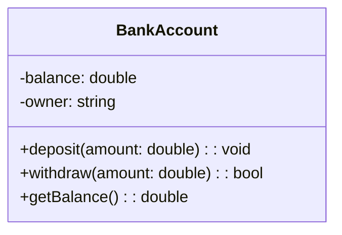
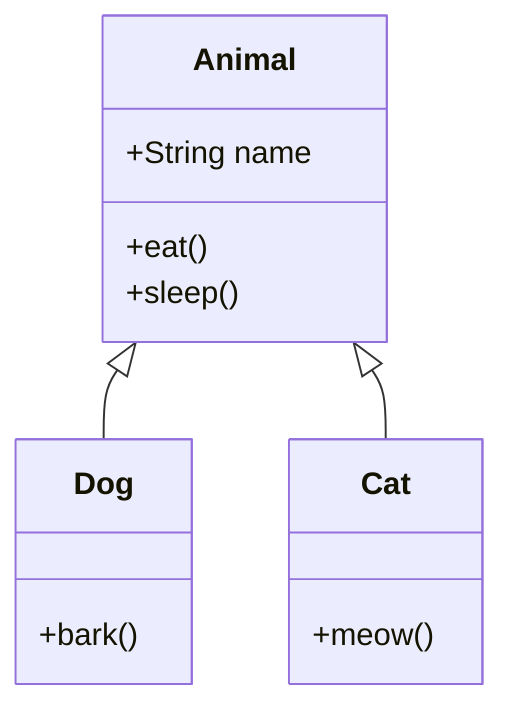
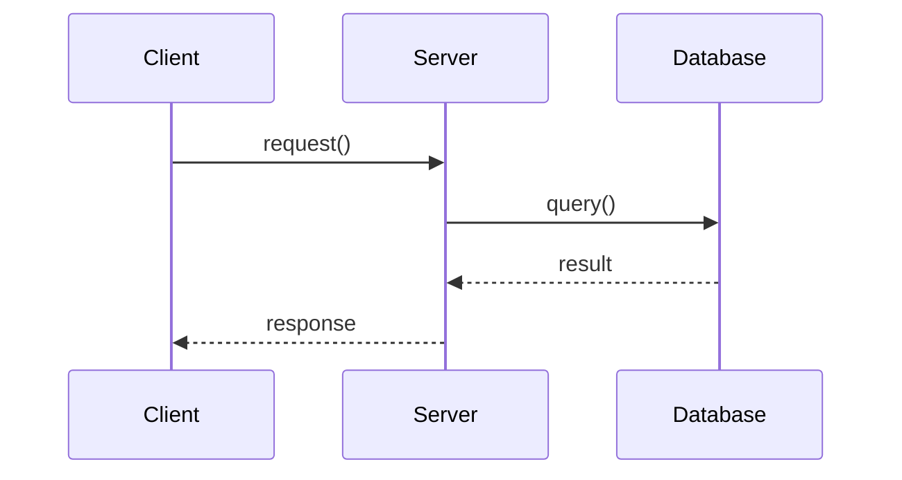
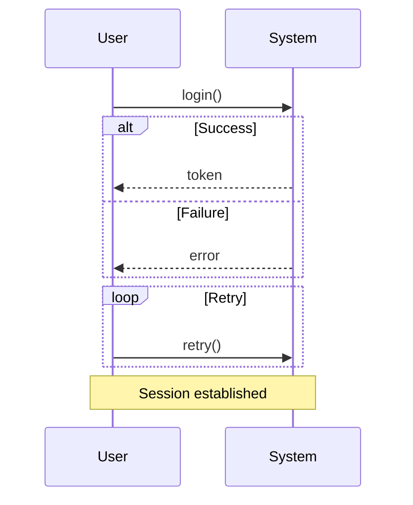
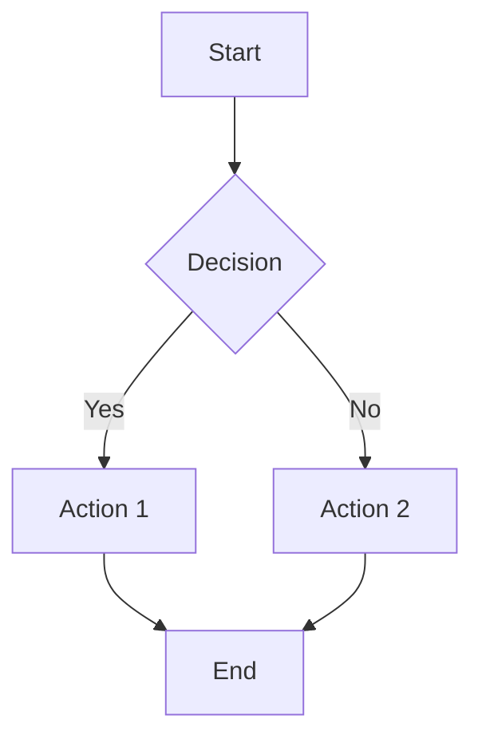
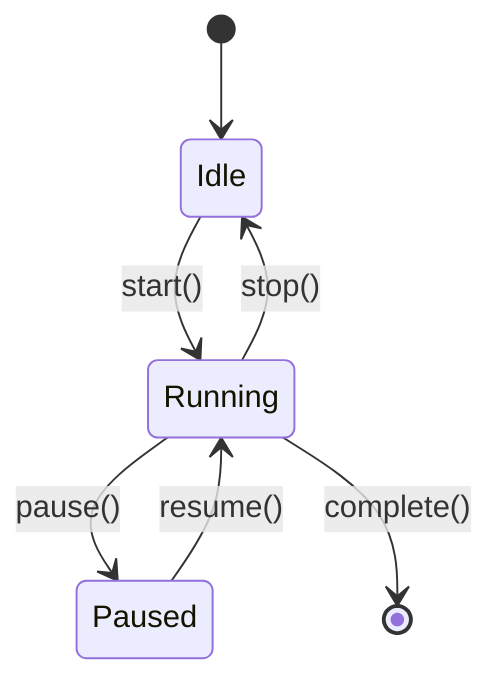

# UML Diagram Basics

> A practical guide to Unified Modeling Language (UML) diagrams for software design and documentation.

---

## 1. What is UML?

**UML (Unified Modeling Language)** is a standardized visual language for modeling software systems. It provides diagrams to describe structure, behavior, and interactions of system components.

---

## 2. Diagram Categories

UML diagrams fall into two main categories:

| Category | Purpose | Examples |
|----------|---------|----------|
| **Structural** | Describe static structure and relationships | Class, Component, Deployment |
| **Behavioral** | Describe dynamic behavior and flow | Sequence, Activity, State Machine |

---

## 3. Class Diagram

Shows classes, their attributes, methods, and relationships.

### 3.1 Basic Syntax (Mermaid)

### 3.2 Visibility

| Symbol | Visibility | Meaning |
|--------|-------------|---------|
| `+` | Public | Accessible everywhere |
| `-` | Private | Accessible only within the class |
| `#` | Protected | Accessible within class and subclasses |
| `~` | Package | Accessible within the same package |

### 3.3 Relationships

| Relationship | Mermaid | Meaning |
|--------------|---------|---------|
| Inheritance | `Child --|> Parent` | Child extends Parent |
| Implementation | `Class ..|> Interface` | Class implements Interface |
| Association | `A --> B` | A uses or references B |
| Composition | `A *-- B` | A contains B; B cannot exist without A |
| Aggregation | `A o-- B` | A contains B; B can exist independently |

### 3.4 Example

---

## 4. Sequence Diagram

Shows interactions between objects over time, in chronological order.

### 4.1 Basic Syntax (Mermaid)

### 4.2 Arrow Types

| Arrow | Mermaid | Meaning |
|-------|---------|---------|
| Solid, solid head | `->>` | Synchronous call |
| Solid, open head | `->` | Asynchronous call |
| Dashed | `-->>` | Return / response |
| Dotted | `-.->>` | Optional or note |

### 4.3 Common Constructs

---

## 5. Activity Diagram

Models workflows, processes, and control flow (similar to flowcharts).

### 5.1 Basic Syntax (Mermaid)

### 5.2 Node Shapes

| Shape | Mermaid | Meaning |
|-------|---------|---------|
| Rectangle | `[Text]` | Action / process |
| Diamond | `{Text}` | Decision / branch |
| Rounded | `([Text])` | Start / end |
| Parallelogram | `[/Text/]` | Input / output |

---

## 6. Component Diagram

Shows how system components are organized and depend on each other.

### 6.1 Basic Concept

- **Component**: A modular, replaceable part of the system
- **Interface**: Contract a component provides or requires
- **Dependency**: One component uses another

---

## 7. State Diagram (State Machine)

Shows the states an object can be in and transitions between them.

### 7.1 Basic Syntax (Mermaid)

---

## 8. Use Case Diagram

Describes system functionality from the user's perspective.

### 8.1 Elements

- **Actor**: User or external system
- **Use Case**: Functionality the system provides
- **Association**: Actor uses a use case
- **Include**: One use case always includes another
- **Extend**: Optional extension of a use case

---

## 9. Best Practices

1. **Keep it simple** — Avoid clutter; focus on the most important elements.
2. **Consistent naming** — Use clear, consistent names for classes, methods, and actors.
3. **One purpose per diagram** — Each diagram should convey one main idea.
4. **Update with code** — Diagrams that drift from the codebase lose value.
5. **Use appropriate detail** — High-level for overviews; detailed for design docs.

---

## 10. Quick Reference

| Diagram | When to Use |
|---------|-------------|
| **Class** | Show data model, OOP structure, relationships |
| **Sequence** | Show request/response flow, API interactions |
| **Activity** | Show algorithms, workflows, business processes |
| **State** | Show lifecycle, status transitions |
| **Component** | Show module structure, deployment |
| **Use Case** | Show system features, user goals |
