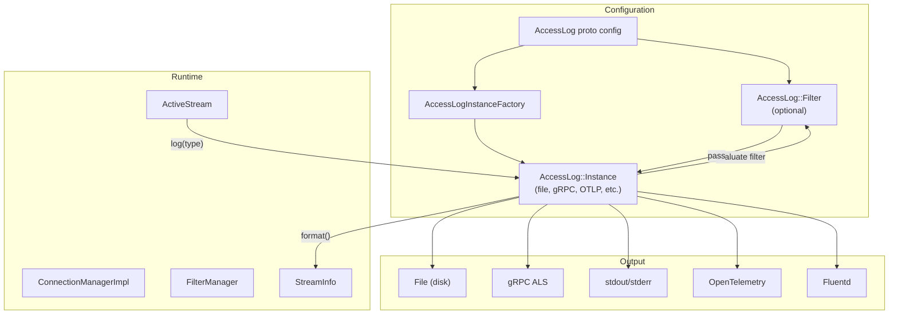
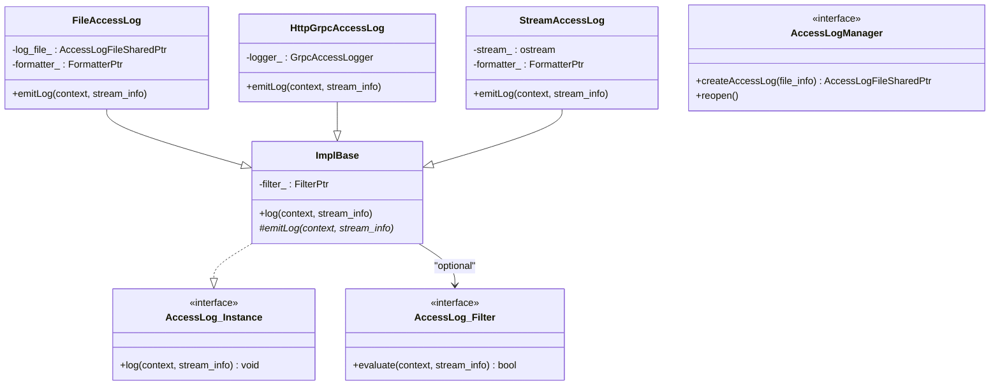
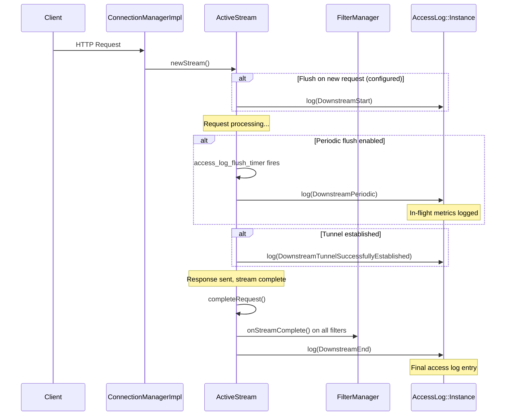
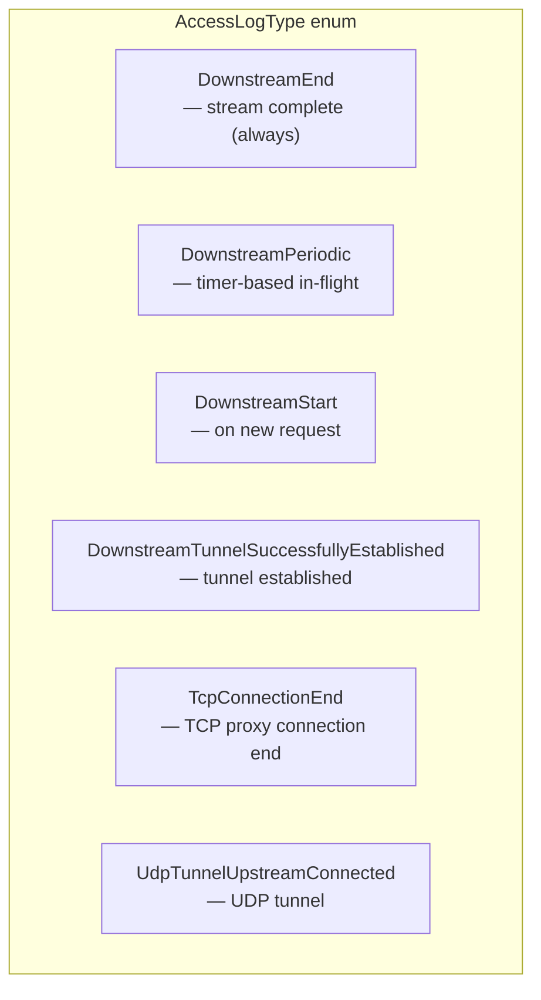
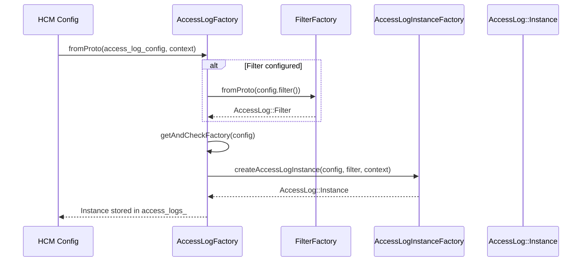
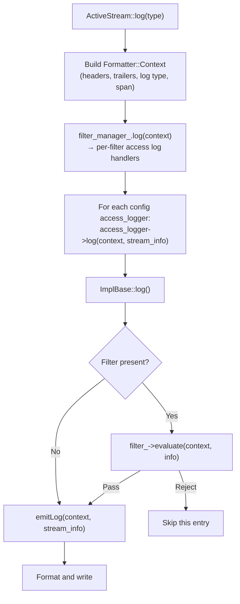
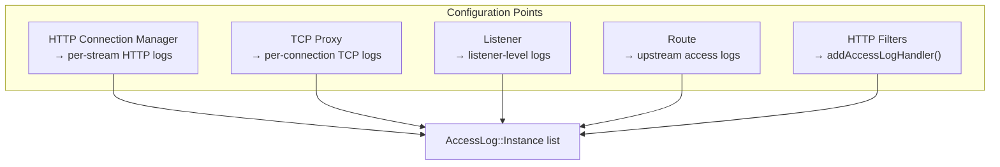

# Part 1: Access Logs — Architecture & Lifecycle

## Overview

Envoy's access log system records information about every request/connection processed. It supports multiple output formats (text, JSON), multiple destinations (file, gRPC, stdout, OpenTelemetry), configurable filters, and periodic flushing during long-lived streams. Access logs use the `StreamInfo` object as their primary data source.

## Access Log Architecture



## Class Hierarchy



## When Access Logs Are Written



### Access Log Types



## Access Log Creation Flow



```
File: source/common/access_log/access_log_impl.cc (line 284)

AccessLogFactory::fromProto():
    1. Parse filter (if present) via FilterFactory::fromProto()
    2. Look up AccessLogInstanceFactory by typed config
    3. factory.createAccessLogInstance(config, filter, context)
    4. Return Instance
```

## Log Execution Flow



## StreamInfo — Data Source for Logs

```mermaid
graph TD
    SI["StreamInfo"]
    
    subgraph "Timing"
        T1["startTime()"]
        T2["requestComplete()"]
        T3["currentDuration()"]
        T4["downstreamTiming()"]
    end
    
    subgraph "Request/Response"
        R1["responseCode()"]
        R2["responseCodeDetails()"]
        R3["responseFlags()\n(NR, UF, UO, RL, etc.)"]
        R4["protocol()\n(HTTP/1.1, HTTP/2)"]
    end
    
    subgraph "Bytes"
        B1["bytesReceived()"]
        B2["bytesSent()"]
        B3["getDownstreamBytesMeter()"]
        B4["getUpstreamBytesMeter()"]
    end
    
    subgraph "Connection"
        C1["downstreamAddressProvider()\n→ remote/local addresses"]
        C2["upstreamInfo()\n→ host, cluster, timing"]
        C3["downstreamSslConnection()"]
    end
    
    subgraph "Metadata"
        M1["dynamicMetadata()"]
        M2["filterState()"]
        M3["routeEntry()"]
    end
    
    SI --> T1 & T2 & T3 & T4
    SI --> R1 & R2 & R3 & R4
    SI --> B1 & B2 & B3 & B4
    SI --> C1 & C2 & C3
    SI --> M1 & M2 & M3
```



## Where Access Logs Are Configured



## Key Source Files

| File | Key Classes | Purpose |
|------|-------------|---------|
| `envoy/access_log/access_log.h` | `Filter`, `Instance`, `AccessLogManager` | Access log interfaces |
| `source/common/access_log/access_log_impl.cc:284` | `AccessLogFactory::fromProto()` | Creates loggers from config |
| `source/common/access_log/access_log_impl.cc:55` | `FilterFactory::fromProto()` | Creates log filters |
| `source/extensions/access_loggers/common/access_log_base.h` | `ImplBase` | Base with filter + emitLog() |
| `source/common/http/conn_manager_impl.cc:833` | `ActiveStream::log()` | HCM log call site |
| `source/common/stream_info/stream_info_impl.h` | `StreamInfoImpl` | Per-request metadata |

---

**Next:** [Part 2 — Formatters, Filters, and gRPC Logs](02-formatters-filters-grpc.md)
