# Part 2: Access Logs — Formatters, Filters, and gRPC Logs

## Formatter / Substitution System

### How Formatting Works

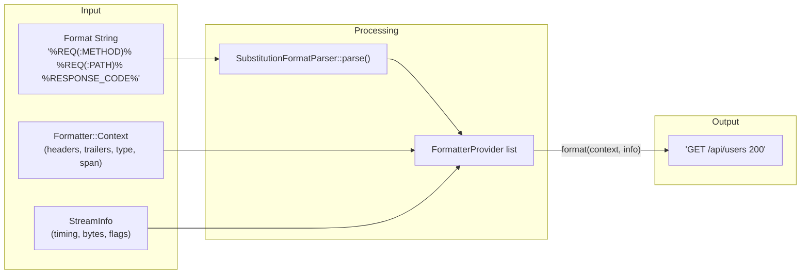

### Formatter Class Hierarchy

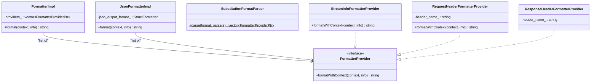

### Format String Parsing

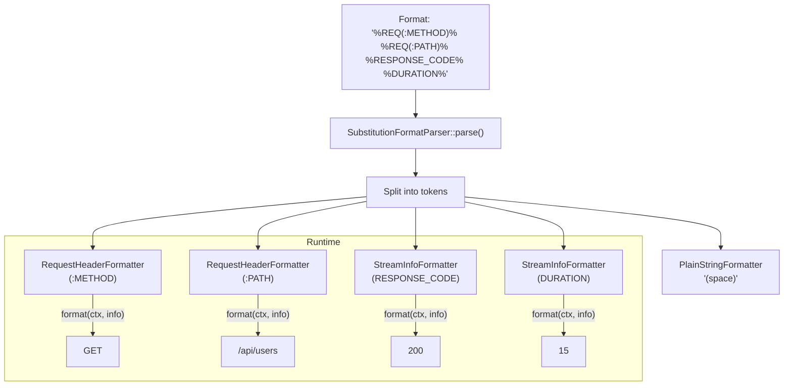

### Common Format Commands

| Command | Provider | Output |
|---------|----------|--------|
| `%REQ(header)%` | `RequestHeaderFormatterProvider` | Request header value |
| `%RESP(header)%` | `ResponseHeaderFormatterProvider` | Response header value |
| `%RESPONSE_CODE%` | `StreamInfoFormatterProvider` | HTTP response code |
| `%RESPONSE_FLAGS%` | `StreamInfoFormatterProvider` | Response flags (NR, UF, etc.) |
| `%DURATION%` | `StreamInfoFormatterProvider` | Request duration (ms) |
| `%BYTES_RECEIVED%` | `StreamInfoFormatterProvider` | Bytes received from downstream |
| `%BYTES_SENT%` | `StreamInfoFormatterProvider` | Bytes sent to downstream |
| `%UPSTREAM_HOST%` | `StreamInfoFormatterProvider` | Upstream host address |
| `%UPSTREAM_CLUSTER%` | `StreamInfoFormatterProvider` | Upstream cluster name |
| `%DOWNSTREAM_REMOTE_ADDRESS%` | `StreamInfoFormatterProvider` | Client IP:port |
| `%START_TIME%` | `StreamInfoFormatterProvider` | Request start time |
| `%PROTOCOL%` | `StreamInfoFormatterProvider` | HTTP protocol version |
| `%DYNAMIC_METADATA(ns:key)%` | `StreamInfoFormatterProvider` | Dynamic metadata value |
| `%FILTER_STATE(key)%` | `StreamInfoFormatterProvider` | Filter state value |

### JSON Formatter

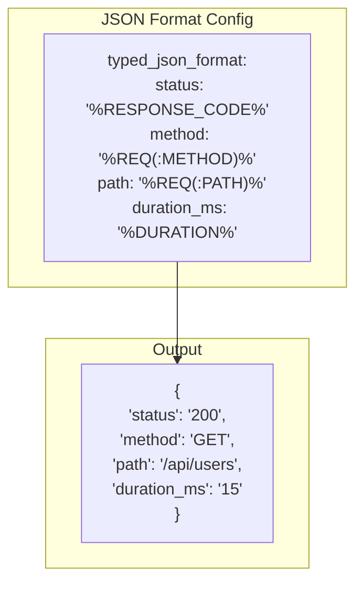

## Access Log Filters

### Filter Hierarchy

```mermaid
classDiagram
    class Filter {
        <<interface>>
        +evaluate(context, stream_info) bool
    }
    class StatusCodeFilter {
        -comparison_ : ComparisonFilter
        +evaluate(context, info) bool
    }
    class DurationFilter {
        -comparison_ : ComparisonFilter
        +evaluate(context, info) bool
    }
    class NotHealthCheckFilter {
        +evaluate(context, info) bool
    }
    class HeaderFilter {
        -header_data_ : HeaderUtility::HeaderData
        +evaluate(context, info) bool
    }
    class ResponseFlagFilter {
        -flags_ : set~ResponseFlag~
        +evaluate(context, info) bool
    }
    class GrpcStatusFilter {
        -statuses_ : set~GrpcStatus~
        +evaluate(context, info) bool
    }
    class AndFilter {
        -filters_ : vector~FilterPtr~
        +evaluate(context, info) bool
    }
    class OrFilter {
        -filters_ : vector~FilterPtr~
        +evaluate(context, info) bool
    }
    class RuntimeFilter {
        -runtime_key_ : string
        -percent_ : FractionalPercent
        +evaluate(context, info) bool
    }
    class LogTypeFilter {
        -types_ : set~AccessLogType~
        +evaluate(context, info) bool
    }

    StatusCodeFilter ..|> Filter
    DurationFilter ..|> Filter
    NotHealthCheckFilter ..|> Filter
    HeaderFilter ..|> Filter
    ResponseFlagFilter ..|> Filter
    GrpcStatusFilter ..|> Filter
    AndFilter ..|> Filter
    OrFilter ..|> Filter
    RuntimeFilter ..|> Filter
    LogTypeFilter ..|> Filter
```

### Filter Evaluation Flow

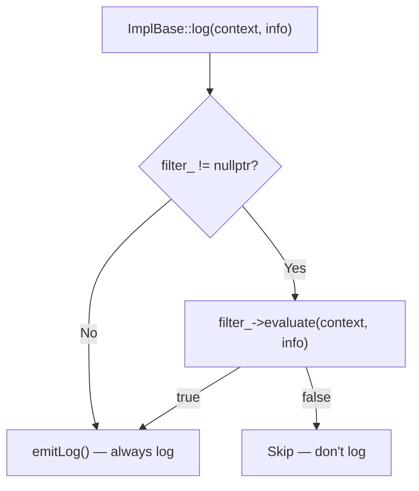

### Composite Filter Example

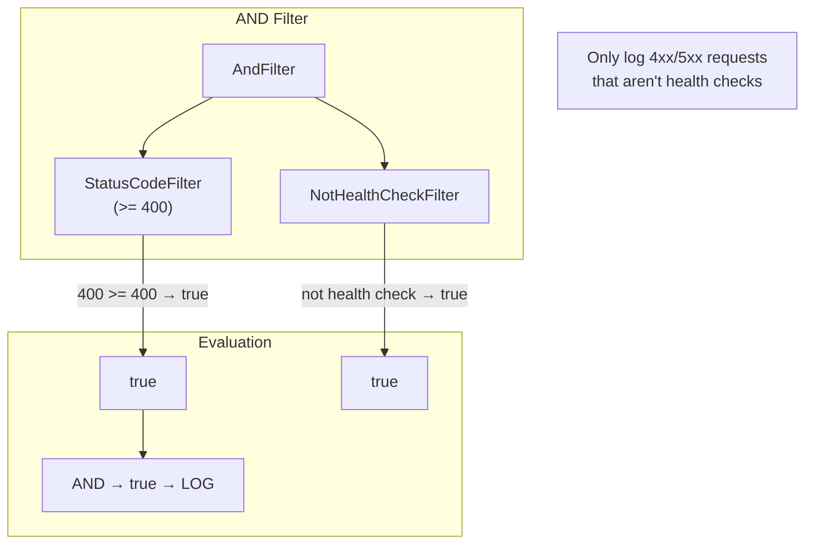

## gRPC Access Logs

### Architecture

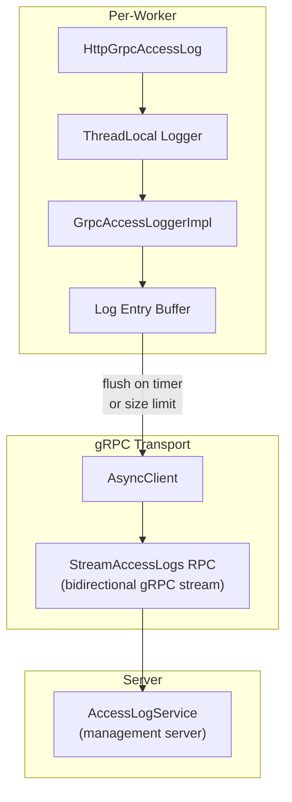

### gRPC Access Log Flow

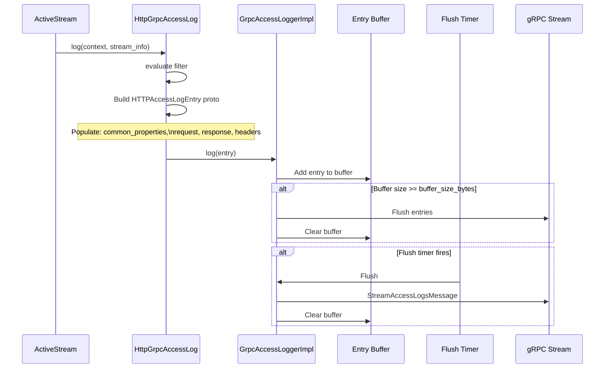

### gRPC Access Log Entry Structure

```mermaid
graph TD
    subgraph "HTTPAccessLogEntry"
        CP["common_properties"]
        REQ["request"]
        RESP["response"]
    end
    
    subgraph "CommonProperties"
        CP --> SampleRate["sample_rate"]
        CP --> DownstreamRemote["downstream_remote_address"]
        CP --> DownstreamLocal["downstream_local_address"]
        CP --> TLSProps["tls_properties"]
        CP --> StartTime["start_time"]
        CP --> Duration["duration"]
        CP --> UpstreamHost["upstream_remote_address"]
        CP --> UpstreamCluster["upstream_cluster"]
        CP --> ResponseFlags["response_flags"]
        CP --> Metadata["metadata"]
        CP --> FilterState["filter_state_objects"]
    end
    
    subgraph "Request"
        REQ --> Method["request_method"]
        REQ --> Scheme["scheme"]
        REQ --> Authority["authority"]
        REQ --> Path["path"]
        REQ --> UserAgent["user_agent"]
        REQ --> RequestHeaders["request_headers"]
        REQ --> RequestBodyBytes["request_body_bytes"]
    end
    
    subgraph "Response"
        RESP --> ResponseCode["response_code"]
        RESP --> ResponseHeaders["response_headers"]
        RESP --> ResponseBodyBytes["response_body_bytes"]
        RESP --> ResponseCodeDetails["response_code_details"]
    end
```

### gRPC Batching Configuration

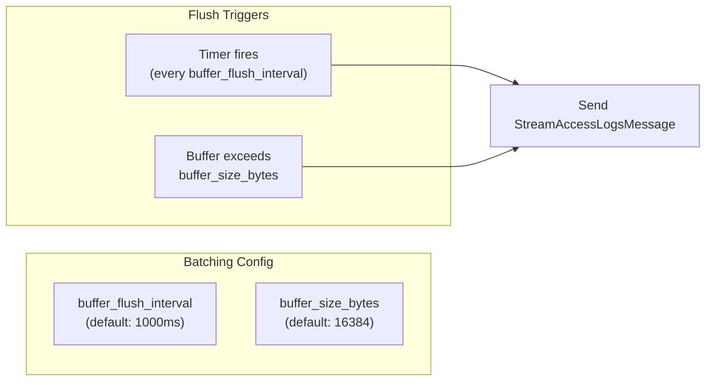

## Access Logger Types

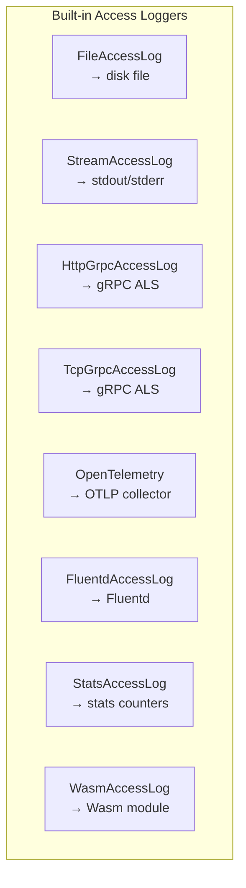

## Key Source Files

| File | Key Classes | Purpose |
|------|-------------|---------|
| `source/common/formatter/substitution_formatter.h` | `FormatterImpl`, `SubstitutionFormatParser` | Format parsing and execution |
| `source/common/formatter/stream_info_formatter.h` | `StreamInfoFormatterProvider` | StreamInfo-based formatters |
| `source/common/formatter/http_specific_formatter.cc` | HTTP-specific formatters | Request/response header formatters |
| `source/common/access_log/access_log_impl.cc:55` | `FilterFactory::fromProto()` | Access log filter creation |
| `source/extensions/access_loggers/grpc/grpc_access_log_impl.h` | `GrpcAccessLoggerImpl`, `GrpcAccessLoggerCacheImpl` | gRPC logger |
| `source/extensions/access_loggers/grpc/http_grpc_access_log_impl.cc` | `HttpGrpcAccessLog` | HTTP gRPC access log |
| `source/extensions/access_loggers/common/grpc_access_logger.h` | Base gRPC logger | Batching, streaming |

---

**Previous:** [Part 1 — Architecture & Lifecycle](01-architecture-lifecycle.md)  
**Next:** [Part 3 — File I/O, Flushing, and Periodic Logs](03-file-io-flushing.md)
