# Part 3: Access Logs — File I/O, Flushing, and Periodic Logs

## File Access Log Architecture

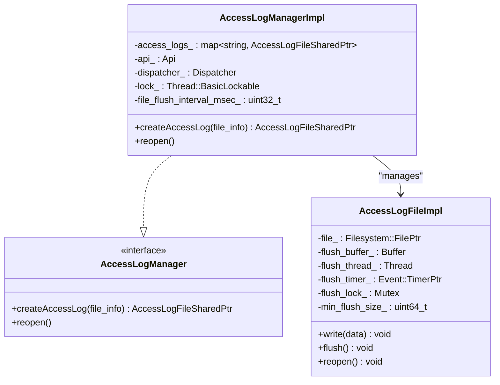

## File Write and Flush Flow

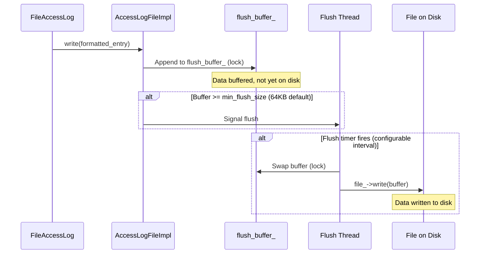

### Write Path Detail

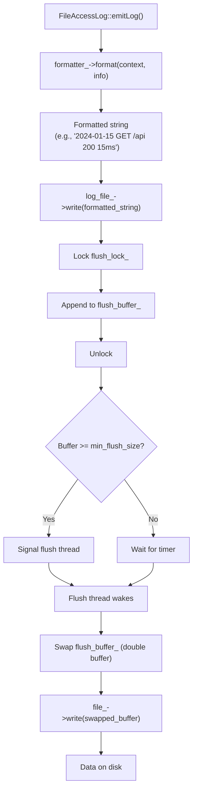

### Double Buffering

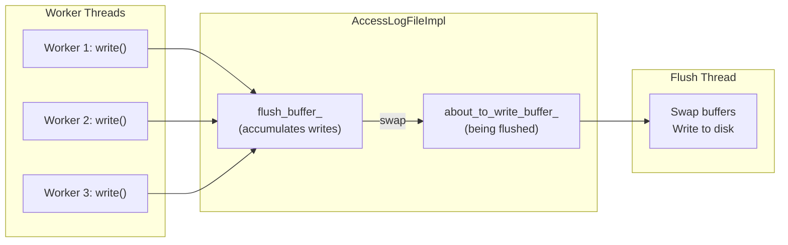

## File Reopen (Log Rotation)

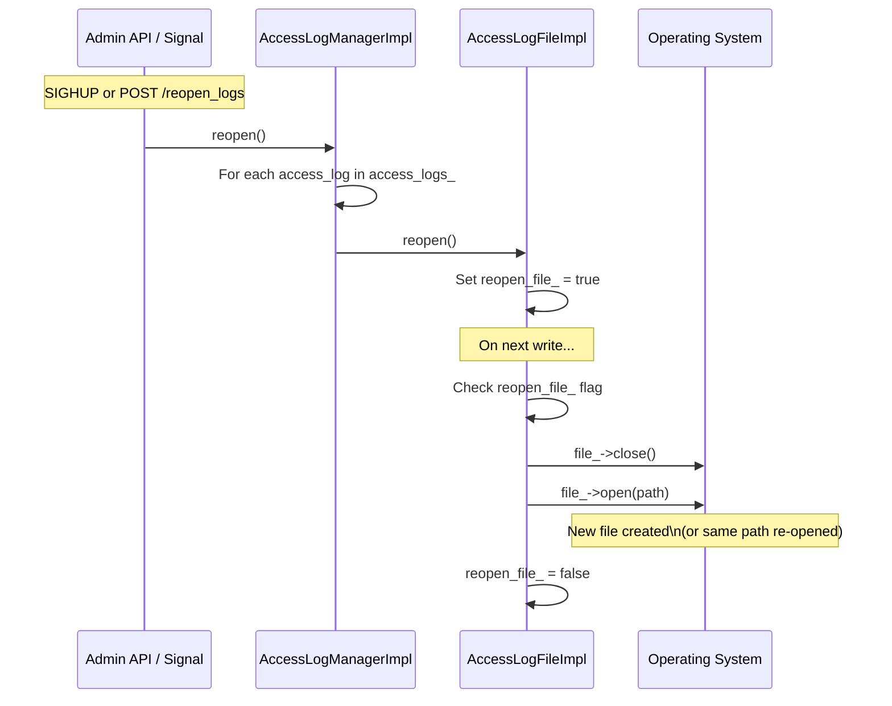

This enables external log rotation tools (logrotate) to rename the current log file and send SIGHUP to Envoy, which reopens the file at the original path.

## Periodic Access Log Flushing

### How It Works

For long-lived streams (WebSocket, gRPC streaming, HTTP CONNECT tunnels), a single end-of-stream access log entry may come too late. Periodic flushing logs intermediate stats.

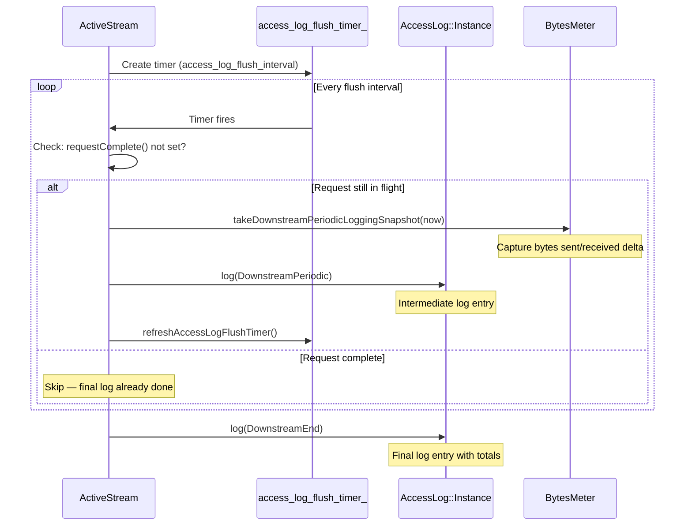

### BytesMeter Snapshots

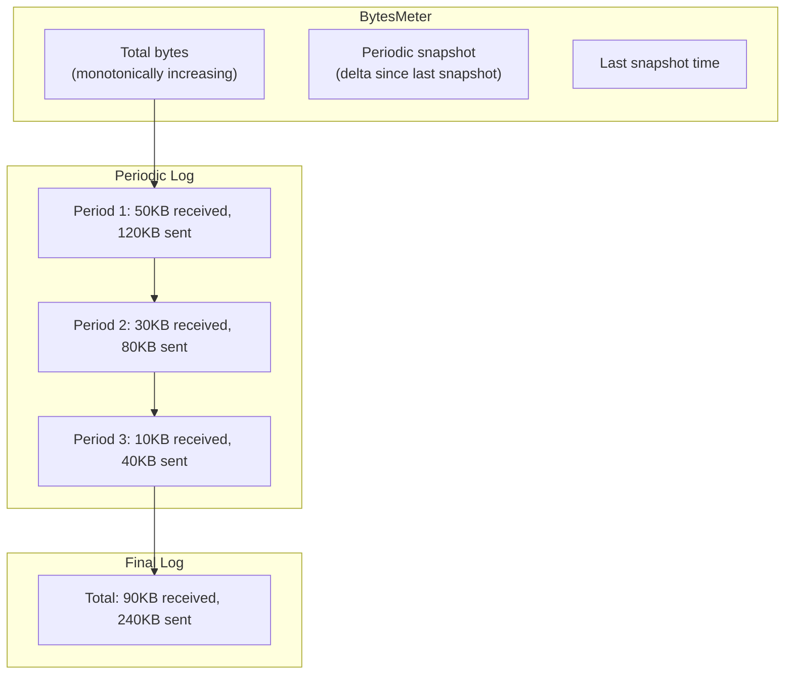

### Configuration

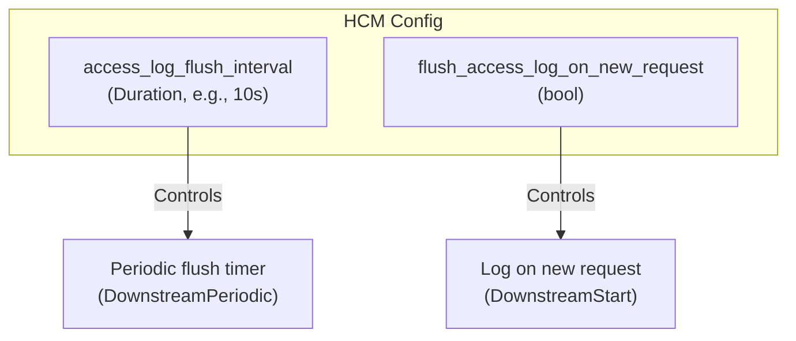

## Log Type Filtering with Periodic Logs

When periodic flushing is enabled, you may want different loggers for different log types:

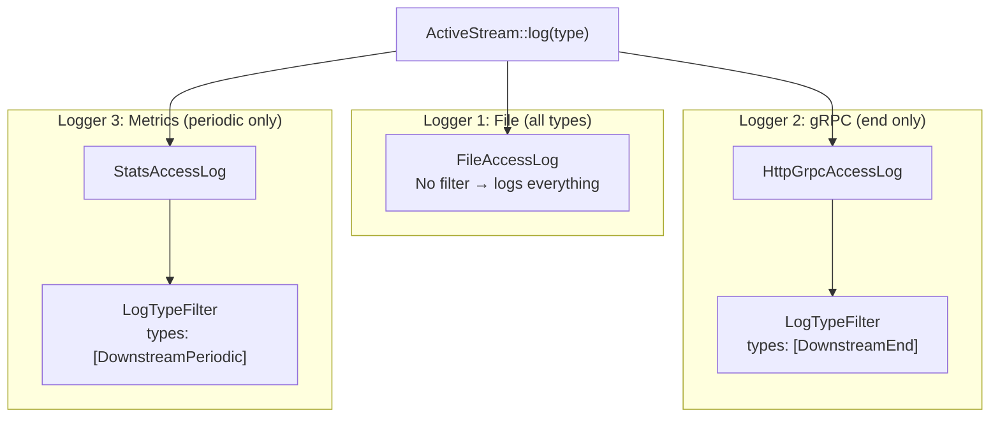

## Access Log Stats

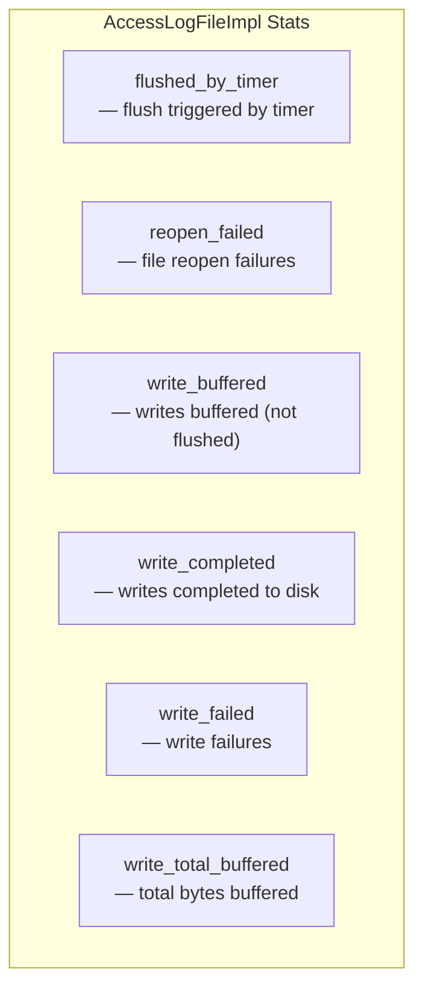

## Complete Access Log Pipeline

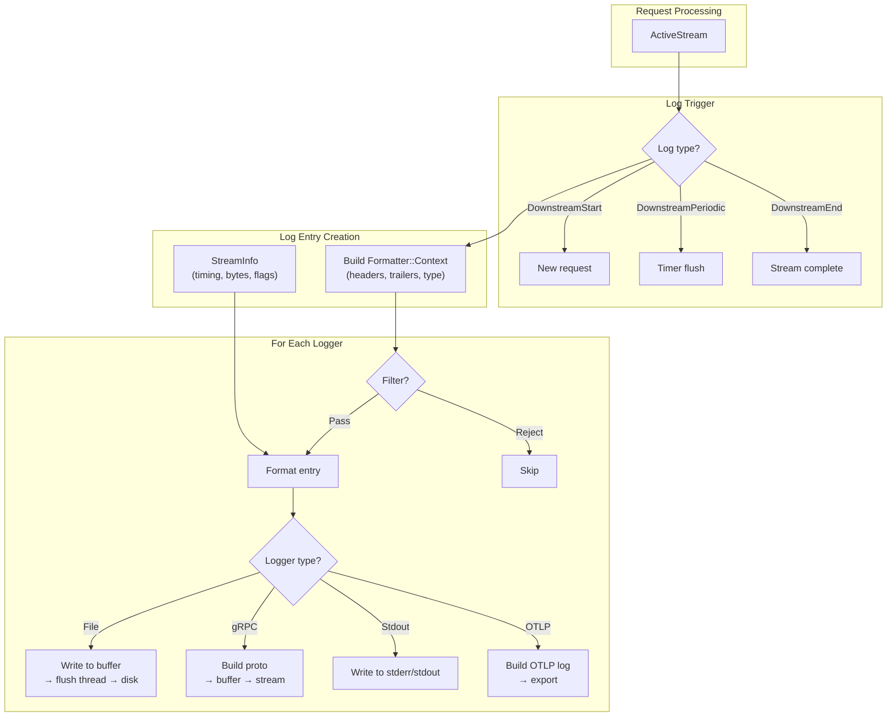

## Key Source Files

| File | Key Classes | Purpose |
|------|-------------|---------|
| `source/common/access_log/access_log_manager_impl.h/cc` | `AccessLogManagerImpl`, `AccessLogFileImpl` | File management, buffered writing |
| `source/extensions/access_loggers/common/file_access_log_impl.h/cc` | `FileAccessLog` | File access log implementation |
| `source/extensions/access_loggers/file/config.cc` | File access log config | Factory for file loggers |
| `source/common/http/conn_manager_impl.cc:812-829` | Periodic flush timer | Timer setup and callback |
| `source/common/http/conn_manager_impl.cc:833` | `ActiveStream::log()` | Main log call site |
| `source/common/formatter/substitution_format_string.h` | `SubstitutionFormatStringUtils` | Format string config parsing |
| `source/common/stream_info/stream_info_impl.h` | `StreamInfoImpl` | Per-request data source |

---

**Previous:** [Part 2 — Formatters, Filters, and gRPC Logs](02-formatters-filters-grpc.md)  
**Back to:** [Part 1 — Architecture & Lifecycle](01-architecture-lifecycle.md)
