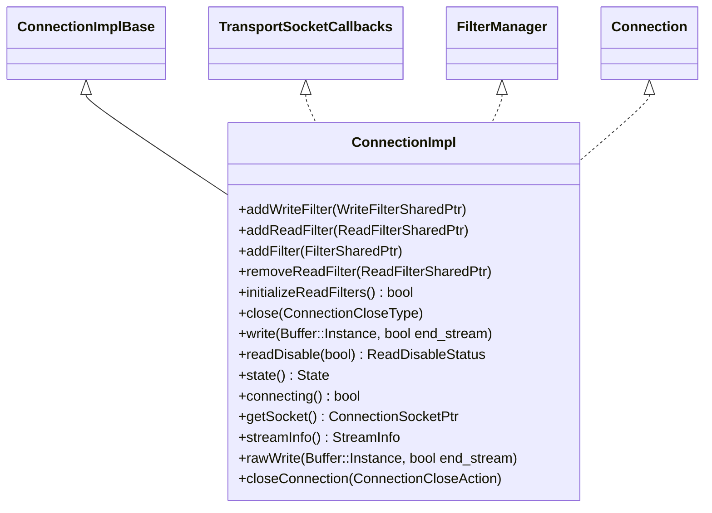

# Part 1: ConnectionImpl

**File:** `source/common/network/connection_impl.h`  
**Namespace:** `Envoy::Network`

## Summary

`ConnectionImpl` is the concrete TCP connection implementation in Envoy. It implements `Connection`, `FilterManager`, and `TransportSocketCallbacks`, owning the socket and transport layer. It bridges raw I/O, the L4 filter chain, and transport sockets (e.g. TLS).

## UML Diagram

## Important Functions

| Function | One-line description |
|----------|----------------------|
| `addReadFilter(ReadFilterSharedPtr)` | Appends a read filter to the chain. |
| `addWriteFilter(WriteFilterSharedPtr)` | Prepends a write filter (LIFO on write). |
| `addFilter(FilterSharedPtr)` | Adds a combined read+write filter. |
| `initializeReadFilters()` | Starts read filter iteration; returns false if chain empty. |
| `close(ConnectionCloseType)` | Closes connection (FlushWrite, NoFlush, Abort, etc.). |
| `write(Buffer::Instance&, bool end_stream)` | Writes data through the filter chain. |
| `readDisable(bool)` | Enables/disables reading from the socket. |
| `rawWrite(Buffer::Instance&, bool end_stream)` | Writes data bypassing filters (used by FilterManager). |
| `closeConnection(ConnectionCloseAction)` | Closes with specific action (local/remote, flush/abort). |
| `getSocket()` | Returns the underlying ConnectionSocket. |
| `streamInfo()` | Returns StreamInfo for this connection. |
| `state()` | Returns connection state (Open, Closing, etc.). |

## Class Relationships

- **Extends:** `ConnectionImplBase` (base for connection + filter manager wiring)
- **Implements:** `Connection`, `FilterManager`, `TransportSocketCallbacks`
- **Owns:** `ConnectionSocket`, `TransportSocket`, `FilterManagerImpl` (via base)
- **Used by:** `ActiveTcpConnection` wraps it; created when a new connection is accepted
