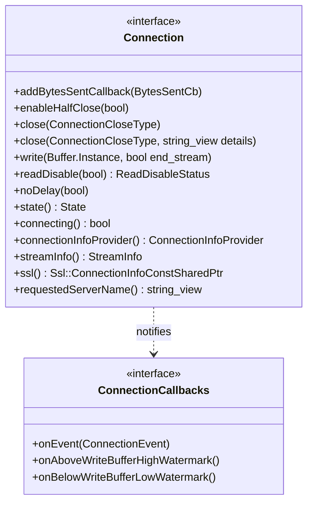

# Part 2: Connection Interface

**File:** `envoy/network/connection.h`  
**Namespace:** `Envoy::Network`

## Summary

`Connection` is the main interface for a network connection. It provides read/write, close, state, and callbacks. `ConnectionCallbacks` is the interface for connection events (close, watermark). These are the core abstractions used by filters and connection handlers.

## UML Diagram

## Important Functions (Connection)

| Function | One-line description |
|----------|----------------------|
| `close(ConnectionCloseType)` | Closes connection; type controls flush/abort behavior. |
| `write(Buffer::Instance&, bool end_stream)` | Sends data; end_stream marks end of write. |
| `readDisable(bool)` | Disables/enables socket reads; returns previous status. |
| `state()` | Returns Open, Closing, Closed. |
| `connectionInfoProvider()` | Provides local/remote address, SSL info. |
| `streamInfo()` | Request-scoped stream metadata. |
| `requestedServerName()` | SNI from TLS handshake. |

## ConnectionCloseType Enum

| Value | Description |
|-------|-------------|
| `FlushWrite` | Flush pending data before closing. |
| `NoFlush` | Close without flushing. |
| `FlushWriteAndDelay` | Flush then delay close. |
| `Abort` | Immediate close, no flush. |
| `AbortReset` | Close with RST. |

## ConnectionCallbacks

| Function | One-line description |
|----------|----------------------|
| `onEvent(ConnectionEvent)` | Called on RemoteClose, LocalClose, Connected. |
| `onAboveWriteBufferHighWatermark()` | Write buffer over high watermark. |
| `onBelowWriteBufferLowWatermark()` | Write buffer under low watermark. |
