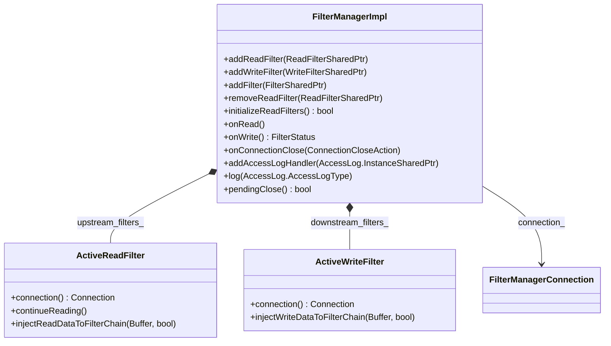

# Part 3: FilterManagerImpl

**File:** `source/common/network/filter_manager_impl.h`  
**Namespace:** `Envoy::Network`

## Summary

`FilterManagerImpl` manages the L4 (TCP) filter chain. It iterates read filters in order on incoming data and write filters in reverse order on outgoing data. It owns `ActiveReadFilter` and `ActiveWriteFilter` wrappers and drives `onRead`/`onWrite` through the chain.

## UML Diagram

## Important Functions

| Function | One-line description |
|----------|----------------------|
| `addReadFilter(ReadFilterSharedPtr)` | Appends read filter; called during filter chain setup. |
| `addWriteFilter(WriteFilterSharedPtr)` | Prepends write filter (LIFO). |
| `initializeReadFilters()` | Calls onNewConnection on all read filters; returns false if empty. |
| `onRead()` | Iterates read filters with incoming data; called from ConnectionImpl. |
| `onWrite()` | Iterates write filters (reverse) for outgoing data. |
| `onConnectionClose(ConnectionCloseAction)` | Propagates close to all filters. |
| `addAccessLogHandler(AccessLog::InstanceSharedPtr)` | Registers access log for connection. |
| `pendingClose()` | True if local or remote close is pending. |

## Internal Structure

- **upstream_filters_** — List of read filters (FIFO for read).
- **downstream_filters_** — List of write filters (LIFO for write).
- **State** — Tracks filter_pending_close_count_, remote_close_pending_, local_close_pending_.
- **ActiveReadFilter** — Wraps ReadFilter, implements ReadFilterCallbacks (continueReading, injectReadDataToFilterChain).
