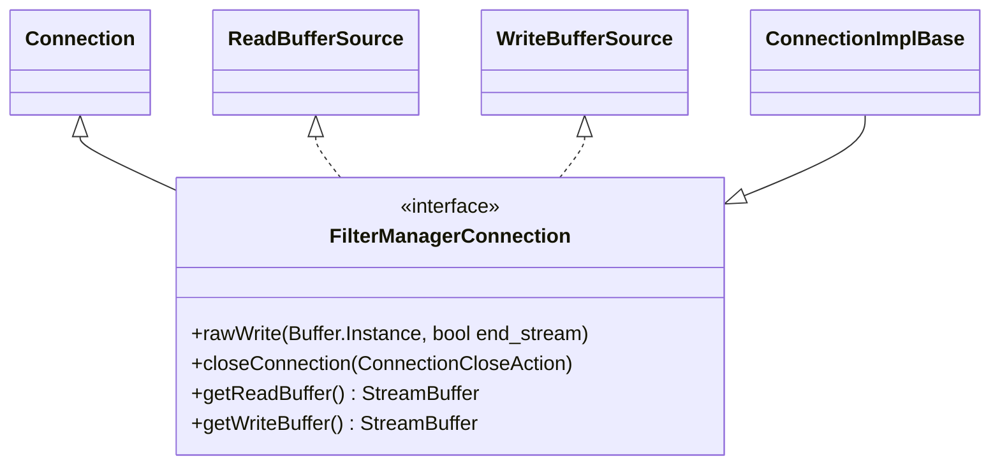

# Part 4: FilterManagerConnection

**File:** `source/common/network/filter_manager_impl.h`  
**Namespace:** `Envoy::Network`

## Summary

`FilterManagerConnection` extends `Connection` with methods for advanced filter-chain control: `rawWrite` (bypass filters) and `closeConnection` (close with specific action). It also implements `ReadBufferSource` and `WriteBufferSource` for buffer access. Used internally by FilterManagerImpl.

## UML Diagram



## Important Functions

| Function | One-line description |
|----------|----------------------|
| `rawWrite(Buffer::Instance&, bool end_stream)` | Writes data directly to transport, bypassing write filters. |
| `closeConnection(ConnectionCloseAction)` | Closes connection with event, close_socket, and close type. |
| `getReadBuffer()` | Returns StreamBuffer for read (ReadBufferSource). |
| `getWriteBuffer()` | Returns StreamBuffer for write (WriteBufferSource). |

## StreamBuffer

```cpp
struct StreamBuffer {
    Buffer::Instance& buffer;
    const bool end_stream;
};
```

## Usage

- FilterManagerImpl calls `rawWrite` when a filter injects data via `injectWriteDataToFilterChain`.
- `closeConnection` is used when filters request connection close with specific semantics.
