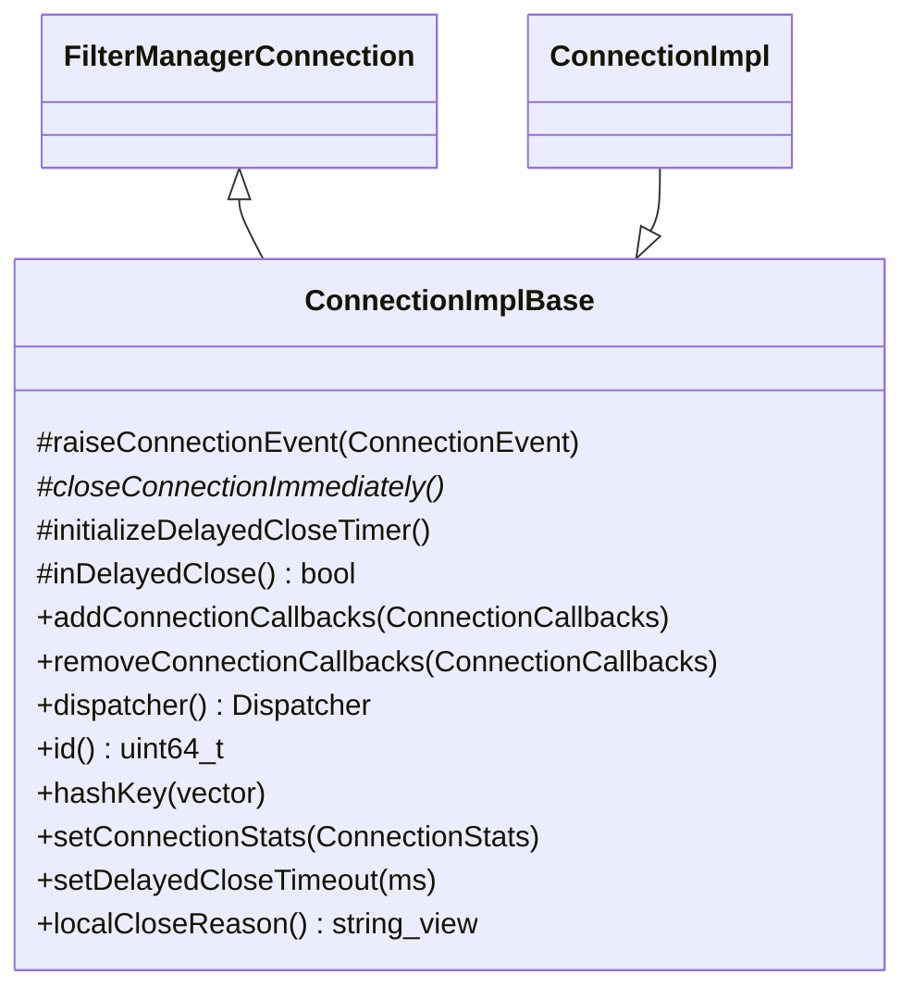

# Part 5: ConnectionImplBase

**File:** `source/common/network/connection_impl_base.h`  
**Namespace:** `Envoy::Network`

## Summary

`ConnectionImplBase` is the base class for connection implementations. It extends `FilterManagerConnection` and provides connection callbacks, delayed close, dispatcher, ID, and scope tracking. ConnectionImpl and other connection types inherit from it.

## UML Diagram

## Important Functions

| Function | One-line description |
|----------|----------------------|
| `addConnectionCallbacks(ConnectionCallbacks&)` | Registers callback for connection events. |
| `removeConnectionCallbacks(ConnectionCallbacks&)` | Unregisters callback. |
| `dispatcher()` | Returns Event::Dispatcher for this connection. |
| `id()` | Returns unique 64-bit connection ID. |
| `hashKey(vector<uint8_t>&)` | Appends connection ID to hash key for load balancing. |
| `setConnectionStats(ConnectionStats)` | Sets read/write buffer stats. |
| `setDelayedCloseTimeout(ms)` | Timeout for delayed close (FlushWriteAndDelay). |
| `raiseConnectionEvent(ConnectionEvent)` | Notifies all callbacks of event. |
| `closeConnectionImmediately()` | Pure virtual; called for immediate close. |

## DelayedCloseState

| Value | Description |
|-------|-------------|
| `None` | No delayed close. |
| `CloseAfterFlush` | Close after flush or inactivity timeout. |
| `CloseAfterFlushAndWait` | Grace period after flush before close. |
