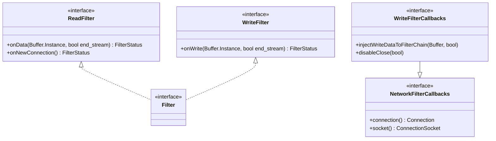

# Part 6: ReadFilter and WriteFilter

**File:** `envoy/network/filter.h`  
**Namespace:** `Envoy::Network`

## Summary

`ReadFilter` and `WriteFilter` are interfaces for L4 (TCP) filters. Read filters process incoming data; write filters process outgoing data. Filters receive `NetworkFilterCallbacks` or `WriteFilterCallbacks` to interact with the filter manager and connection.

## UML Diagram

## ReadFilter

| Function | One-line description |
|----------|----------------------|
| `onData(Buffer::Instance&, bool end_stream)` | Processes read data; Continue or StopIteration. |
| `onNewConnection()` | Called when connection established; can stop iteration. |

## WriteFilter

| Function | One-line description |
|----------|----------------------|
| `onWrite(Buffer::Instance&, bool end_stream)` | Processes write data; Continue or StopIteration. |

## FilterStatus

| Value | Description |
|-------|-------------|
| `Continue` | Proceed to next filter. |
| `StopIteration` | Pause iteration; filter will resume later. |

## WriteFilterCallbacks

| Function | One-line description |
|----------|----------------------|
| `injectWriteDataToFilterChain(Buffer&, bool)` | Injects data to subsequent write filters. |
| `disableClose(bool)` | Delays or resumes connection close. |
