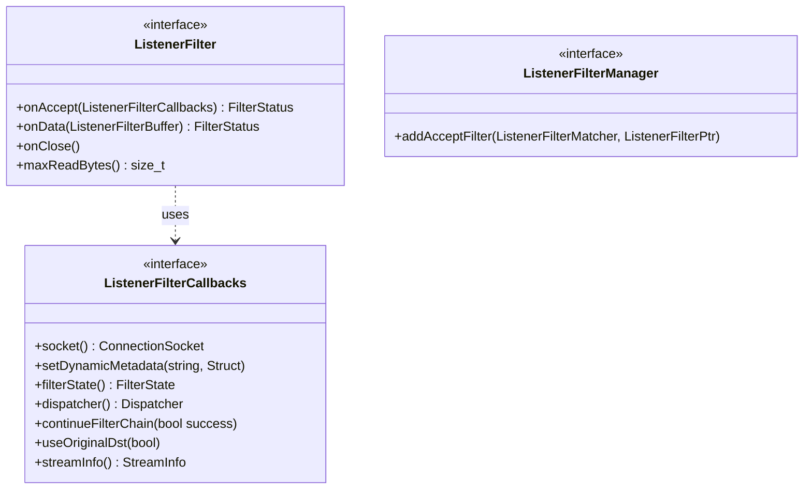

# Part 7: ListenerFilter and ListenerFilterCallbacks

**File:** `envoy/network/filter.h`  
**Namespace:** `Envoy::Network`

## Summary

`ListenerFilter` runs before a Connection is created. It inspects or modifies the accepted socket (e.g. proxy protocol, TLS inspector). `ListenerFilterCallbacks` provides socket access, metadata, filter state, and `continueFilterChain` to resume iteration.

## UML Diagram

## ListenerFilter

| Function | One-line description |
|----------|----------------------|
| `onAccept(ListenerFilterCallbacks&)` | Called on new connection; can stop to wait for data. |
| `onData(ListenerFilterBuffer&)` | Called when data available; used when filter needs to peek. |
| `onClose()` | Called when connection closed while filter had stopped iteration. |
| `maxReadBytes()` | Bytes filter wants to inspect; 0 if no data needed. |

## ListenerFilterCallbacks

| Function | One-line description |
|----------|----------------------|
| `socket()` | Returns ConnectionSocket being accepted. |
| `setDynamicMetadata(name, value)` | Sets metadata for this connection. |
| `filterState()` | Per-connection filter state object. |
| `continueFilterChain(bool success)` | Resumes filter chain; false if connection rejected. |
| `useOriginalDst(bool)` | Overrides use-original-dst for this connection. |
| `streamInfo()` | Connection-level stream info. |
