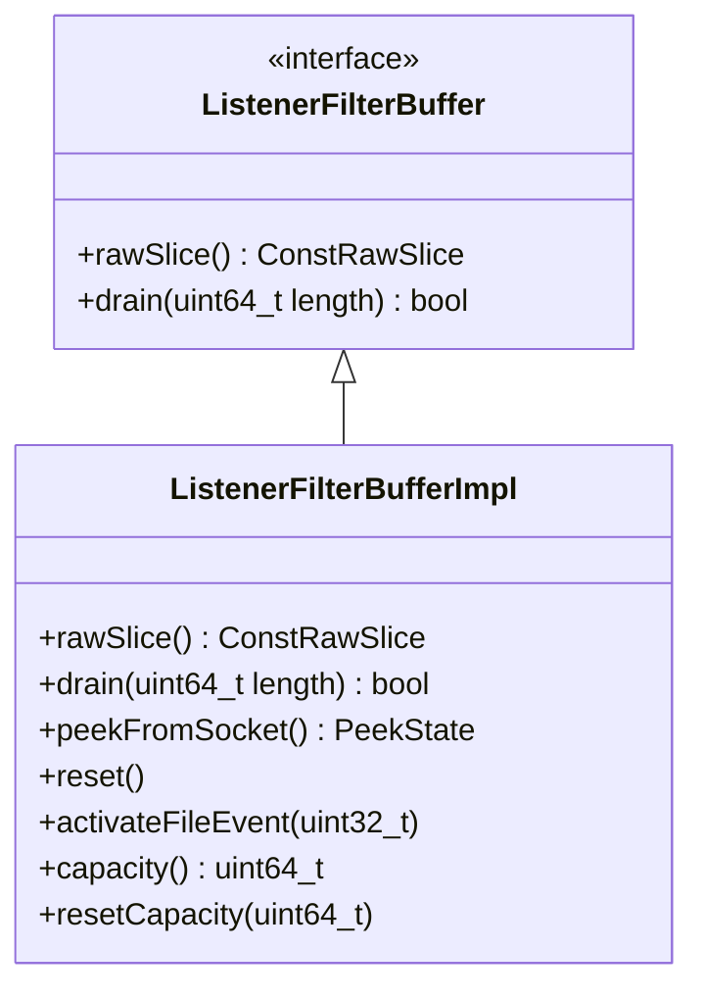

# Part 8: ListenerFilterBuffer and ListenerFilterBufferImpl

**File:** `envoy/network/listener_filter_buffer.h`, `source/common/network/listener_filter_buffer_impl.h`  
**Namespace:** `Envoy::Network`

## Summary

`ListenerFilterBuffer` provides a read-only view of data peeked from the socket for listener filters. `ListenerFilterBufferImpl` implements it with a fixed buffer, peeking from IoHandle and draining consumed bytes.

## UML Diagram

## ListenerFilterBuffer

| Function | One-line description |
|----------|----------------------|
| `rawSlice()` | Returns const raw slice of buffered data. |
| `drain(uint64_t length)` | Drains length bytes from start; returns success. |

## ListenerFilterBufferImpl

| Function | One-line description |
|----------|----------------------|
| `peekFromSocket()` | Reads data from socket into buffer; returns PeekState. |
| `activateFileEvent(uint32_t)` | Registers for read events when more data needed. |
| `reset()` | Clears file events. |
| `capacity()` | Max buffer size. |
| `resetCapacity(uint64_t)` | Resizes buffer (e.g. when maxReadBytes increases). |

## PeekState

| Value | Description |
|-------|-------------|
| `Done` | Peek succeeded. |
| `Again` | Need to retry (EAGAIN). |
| `Error` | Peek failed. |
| `RemoteClose` | Remote closed connection. |
