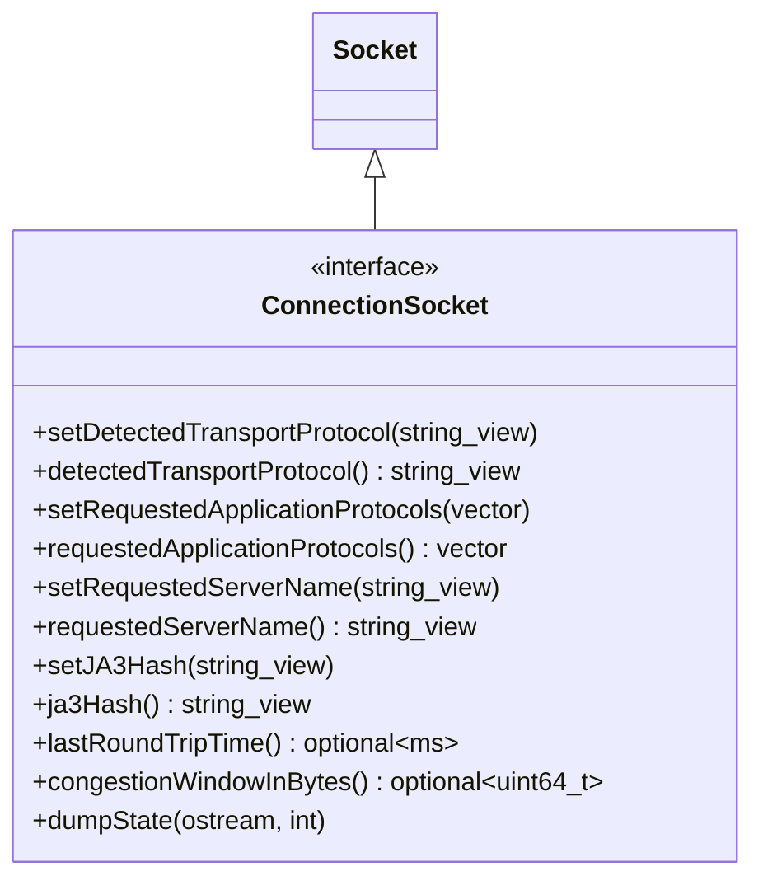

# Part 9: ConnectionSocket

**File:** `envoy/network/listen_socket.h`  
**Namespace:** `Envoy::Network`

## Summary

`ConnectionSocket` extends `Socket` for connections. It holds transport/app protocol info (TLS, ALPN, SNI), JA3/JA4 hashes, and optional RTT/cwnd. Used for accepted server sockets and client connections.

## UML Diagram

## Important Functions

| Function | One-line description |
|----------|----------------------|
| `setDetectedTransportProtocol(protocol)` | Sets transport (e.g. RAW_BUFFER, TLS). |
| `detectedTransportProtocol()` | Returns detected transport protocol. |
| `setRequestedApplicationProtocols(protocols)` | Sets ALPN protocols from TLS. |
| `requestedApplicationProtocols()` | Returns requested ALPN list. |
| `setRequestedServerName(name)` | Sets SNI from TLS handshake. |
| `requestedServerName()` | Returns SNI. |
| `lastRoundTripTime()` | Optional RTT if platform supports. |
| `congestionWindowInBytes()` | Optional cwnd in bytes. |
| `dumpState(ostream, indent)` | Debug dump for fatal errors. |

## Usage

Listener filters (e.g. TLS inspector) call setters; ConnectionImpl reads these for routing and metrics.
