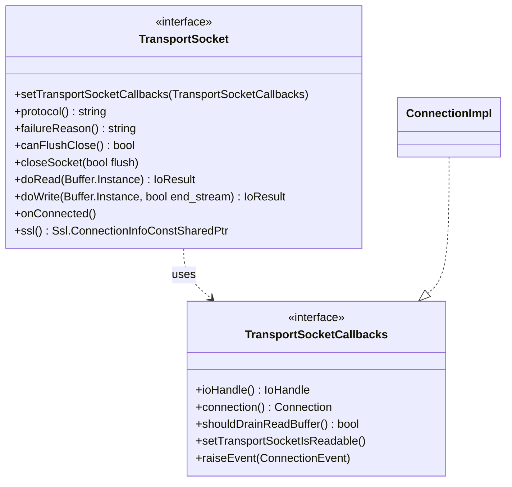

# Part 10: TransportSocket and TransportSocketCallbacks

**File:** `envoy/network/transport_socket.h`  
**Namespace:** `Envoy::Network`

## Summary

`TransportSocket` wraps raw I/O with transport-layer logic (e.g. TLS). It sits between the connection and the IoHandle. `TransportSocketCallbacks` lets the transport socket access IoHandle, Connection, and control read draining.

## UML Diagram

## TransportSocket

| Function | One-line description |
|----------|----------------------|
| `setTransportSocketCallbacks(callbacks)` | Injects callbacks for IoHandle/Connection access. |
| `protocol()` | Returns protocol name (e.g. tls, raw_buffer). |
| `failureReason()` | Returns error string on failure. |
| `doRead(Buffer&)` | Reads from transport; returns IoResult. |
| `doWrite(Buffer&, bool end_stream)` | Writes to transport; returns IoResult. |
| `onConnected()` | Called when connection established. |
| `ssl()` | Returns SSL connection info if TLS. |

## TransportSocketCallbacks

| Function | One-line description |
|----------|----------------------|
| `ioHandle()` | Returns IoHandle for raw I/O. |
| `connection()` | Returns Connection interface. |
| `shouldDrainReadBuffer()` | Whether to drain read buffer (yielding). |
| `setTransportSocketIsReadable()` | Marks transport readable for next event loop. |
| `raiseEvent(ConnectionEvent)` | Notifies connection of events. |
