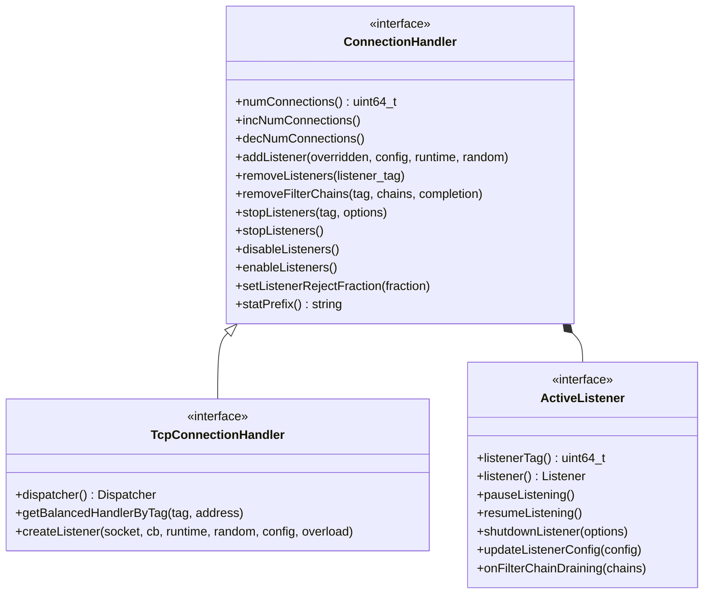

# Part 11: ConnectionHandler

**File:** `envoy/network/connection_handler.h`  
**Namespace:** `Envoy::Network`

## Summary

`ConnectionHandler` manages listeners and connections per worker. It adds/removes listeners, stops/enables them, and tracks connection counts. `TcpConnectionHandler` extends it with `createListener` and connection balancing. `ConnectionHandlerImpl` is the implementation.

## UML Diagram

## ConnectionHandler

| Function | One-line description |
|----------|----------------------|
| `numConnections()` | Returns active connection count. |
| `addListener(...)` | Adds listener; optionally replaces existing. |
| `removeListeners(tag)` | Removes listeners and closes their connections. |
| `removeFilterChains(tag, chains, completion)` | Removes filter chains; completion when connections gone. |
| `stopListeners(tag, options)` | Stops accepting (drain). |
| `disableListeners()` | Temporarily stops all listeners. |
| `enableListeners()` | Re-enables listeners. |
| `setListenerRejectFraction(fraction)` | Fraction of connections to reject (0–1). |

## TcpConnectionHandler

| Function | One-line description |
|----------|----------------------|
| `createListener(...)` | Creates TCP listener on socket. |
| `getBalancedHandlerByTag(tag, address)` | Returns connection balancer for listener. |
