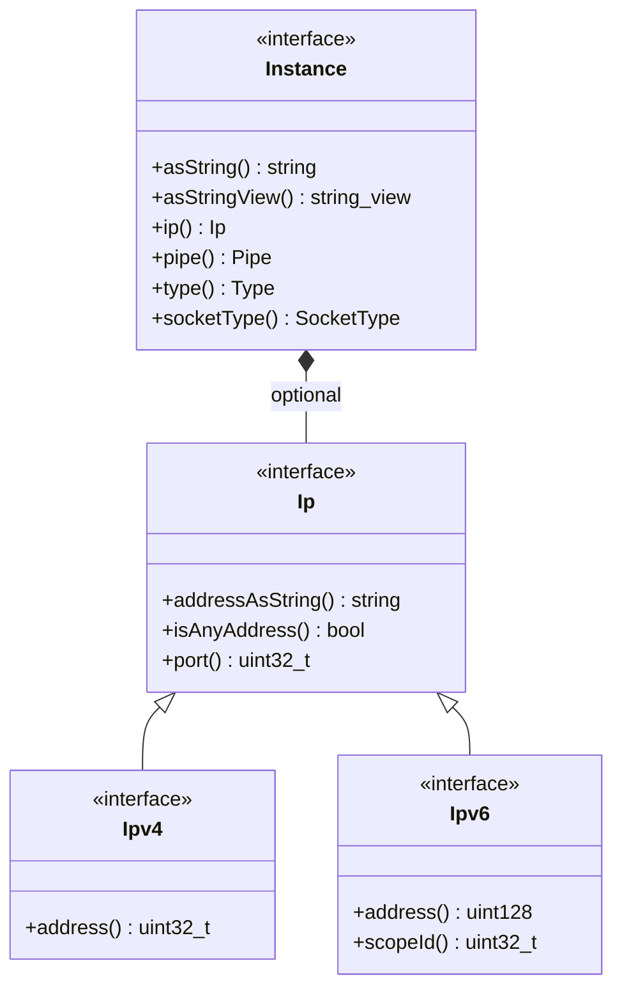

# Part 12: Address and Instance

**File:** `envoy/network/address.h`  
**Namespace:** `Envoy::Network::Address`

## Summary

`Address::Instance` is the interface for network addresses (IP, pipe, etc.). `Ipv4` and `Ipv6` provide IP-specific access. `SocketAddress` (InstanceConstSharedPtr + port) is used for listen/connect addresses.

## UML Diagram

## Instance

| Function | One-line description |
|----------|----------------------|
| `asString()` | Full address string (e.g. 1.2.3.4:8080). |
| `asStringView()` | String view for hashing/comparison. |
| `ip()` | Returns Ip* for IP addresses. |
| `pipe()` | Returns Pipe* for pipe addresses. |
| `type()` | Type enum (Ip, Pipe, EnvoyInternal). |
| `socketType()` | Stream or Datagram. |

## Ip

| Function | One-line description |
|----------|----------------------|
| `addressAsString()` | IP string without port. |
| `isAnyAddress()` | True for 0.0.0.0. |
| `port()` | Port number. |

## Type

| Value | Description |
|-------|-------------|
| `Ip` | IP address. |
| `Pipe` | Unix pipe. |
| `EnvoyInternal` | Internal Envoy address. |
