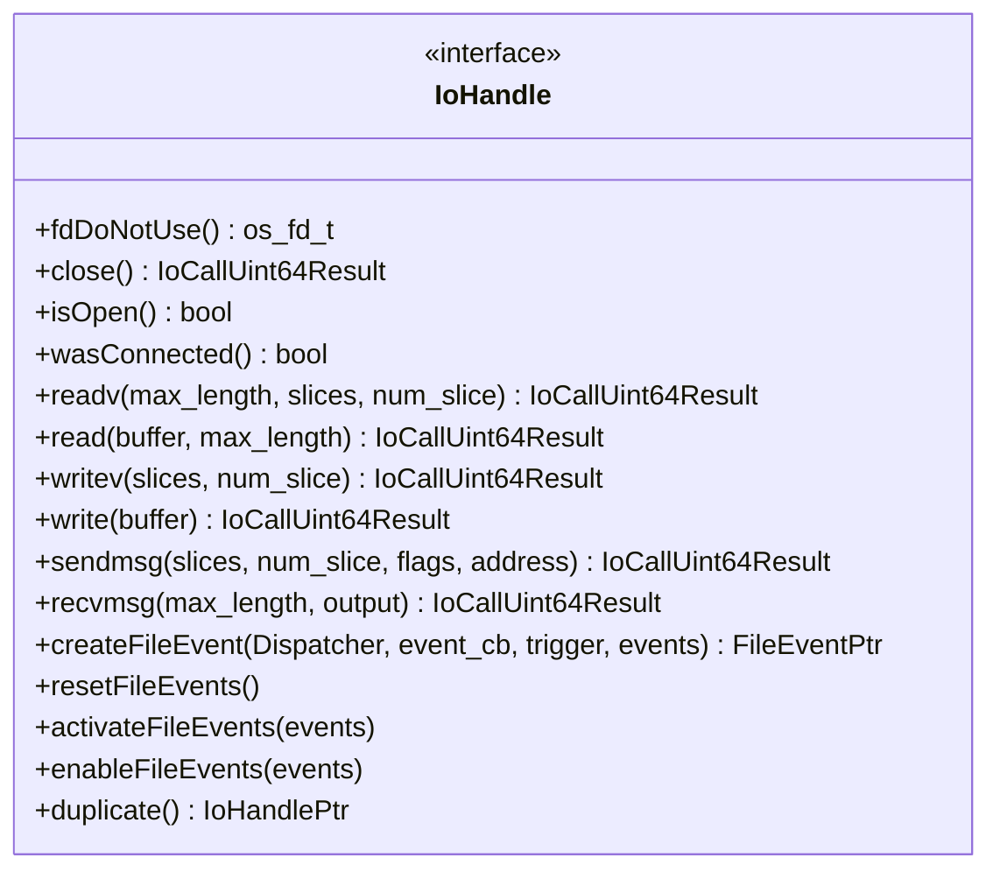

# Part 13: IoHandle

**File:** `envoy/network/io_handle.h`  
**Namespace:** `Envoy::Network`

## Summary

`IoHandle` is the abstraction for I/O operations (read, write, connect, etc.). It wraps file descriptors or platform-specific handles. Used by ConnectionImpl, TransportSocket, and ListenerFilterBufferImpl for socket I/O.

## UML Diagram

## Important Functions

| Function | One-line description |
|----------|----------------------|
| `fdDoNotUse()` | Raw fd; avoid for new code. |
| `close()` | Closes handle; returns result. |
| `isOpen()` | True if not closed. |
| `readv(max_length, slices, num_slice)` | Scatter read. |
| `read(buffer, max_length)` | Read into Buffer. |
| `writev(slices, num_slice)` | Gather write. |
| `write(buffer)` | Write from Buffer. |
| `createFileEvent(dispatcher, cb, trigger, events)` | Registers for I/O events. |
| `resetFileEvents()` | Clears file events. |
| `activateFileEvents(events)` | Enables events. |
| `duplicate()` | Duplicates handle. |
