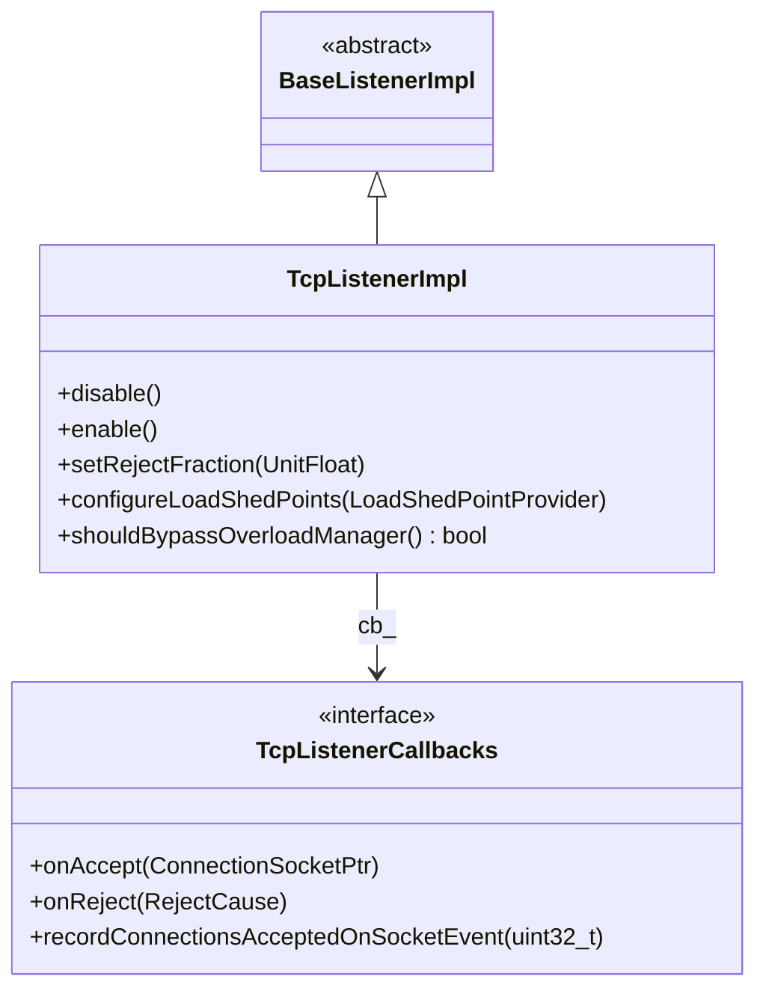

# Part 14: TcpListenerCallbacks and TcpListenerImpl

**File:** `envoy/network/listener.h`, `source/common/network/tcp_listener_impl.h`  
**Namespace:** `Envoy::Network`

## Summary

`TcpListenerCallbacks` is the interface for TCP listener events: `onAccept`, `onReject`, and `recordConnectionsAcceptedOnSocketEvent`. `TcpListenerImpl` extends `BaseListenerImpl` and implements the libevent-based TCP accept loop with load shedding and connection limits.

## UML Diagram

## TcpListenerCallbacks

| Function | One-line description |
|----------|----------------------|
| `onAccept(ConnectionSocketPtr&&)` | Called when connection accepted; socket moved to callee. |
| `onReject(RejectCause)` | Called when connection rejected (GlobalCxLimit, OverloadAction). |
| `recordConnectionsAcceptedOnSocketEvent(count)` | Stats callback after accept batch. |

## TcpListenerImpl

| Function | One-line description |
|----------|----------------------|
| `disable()` | Stops accepting. |
| `enable()` | Resumes accepting. |
| `setRejectFraction(fraction)` | Fraction of connections to randomly reject. |
| `configureLoadShedPoints(provider)` | Configures overload load shed points. |
| `shouldBypassOverloadManager()` | Whether to bypass overload manager. |

## RejectCause

| Value | Description |
|-------|-------------|
| `GlobalCxLimit` | Global connection limit reached. |
| `OverloadAction` | Overload action triggered. |
