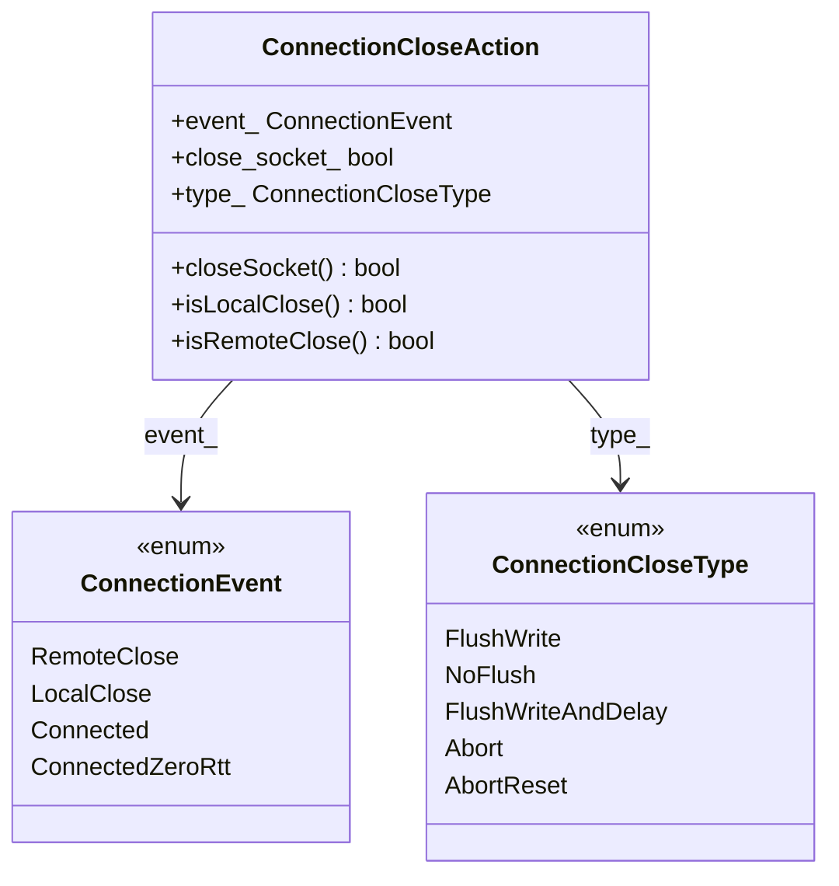

# Part 15: ConnectionEvent and ConnectionCloseType

**File:** `envoy/network/connection.h`  
**Namespace:** `Envoy::Network`

## Summary

`ConnectionEvent` and `ConnectionCloseType` define connection lifecycle events and close semantics. Used by Connection, ConnectionCallbacks, and FilterManager for consistent close handling and event propagation.

## UML Diagram

## ConnectionEvent

| Value | Description |
|-------|-------------|
| `RemoteClose` | Remote peer closed connection. |
| `LocalClose` | Local side initiated close. |
| `Connected` | Connection established. |
| `ConnectedZeroRtt` | QUIC 0-RTT connection. |

## ConnectionCloseType

| Value | Description |
|-------|-------------|
| `FlushWrite` | Flush pending data before close. |
| `NoFlush` | Close without flushing. |
| `FlushWriteAndDelay` | Flush then delay close. |
| `Abort` | Immediate close, no flush. |
| `AbortReset` | Close with RST. |

## ConnectionCloseAction

| Field | Description |
|-------|-------------|
| `event_` | LocalClose or RemoteClose. |
| `close_socket_` | Whether to close underlying socket. |
| `type_` | Flush/Abort semantics. |
| `closeSocket()` | Returns close_socket_. |
| `isLocalClose()` | True if event_ == LocalClose. |
| `isRemoteClose()` | True if event_ == RemoteClose. |
