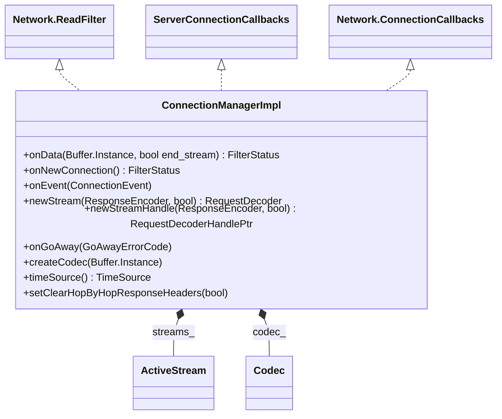

# Part 16: ConnectionManagerImpl

**File:** `source/common/http/conn_manager_impl.h`  
**Namespace:** `Envoy::Http`

## Summary

`ConnectionManagerImpl` is the HTTP connection manager. It implements `Network::ReadFilter`, `ServerConnectionCallbacks`, and `Network::ConnectionCallbacks`. It owns the HTTP codec, creates `ActiveStream` per request, and drives the HTTP filter chain. It handles H1/H2/H3 connections and request lifecycle.

## UML Diagram

## Important Functions

| Function | One-line description |
|----------|----------------------|
| `onData(Buffer&, bool end_stream)` | Passes data to codec; creates codec lazily for H1/H2. |
| `onNewConnection()` | Initializes as ReadFilter; returns Continue. |
| `newStream(ResponseEncoder&, bool)` | Creates new request stream; returns RequestDecoder. |
| `newStreamHandle(...)` | Same but returns handle for decoder lifetime. |
| `onGoAway(GoAwayErrorCode)` | Handles HTTP/2 GOAWAY. |
| `onEvent(ConnectionEvent)` | Handles connection close; propagates to streams. |
| `createCodec(Buffer&)` | Manually creates codec (e.g. ApiListener). |
| `timeSource()` | Time source for stream timing. |

## Internal: ActiveStream

Wraps a single request/response. Implements RequestDecoder, StreamCallbacks, FilterManagerCallbacks. Owned by ConnectionManagerImpl.
