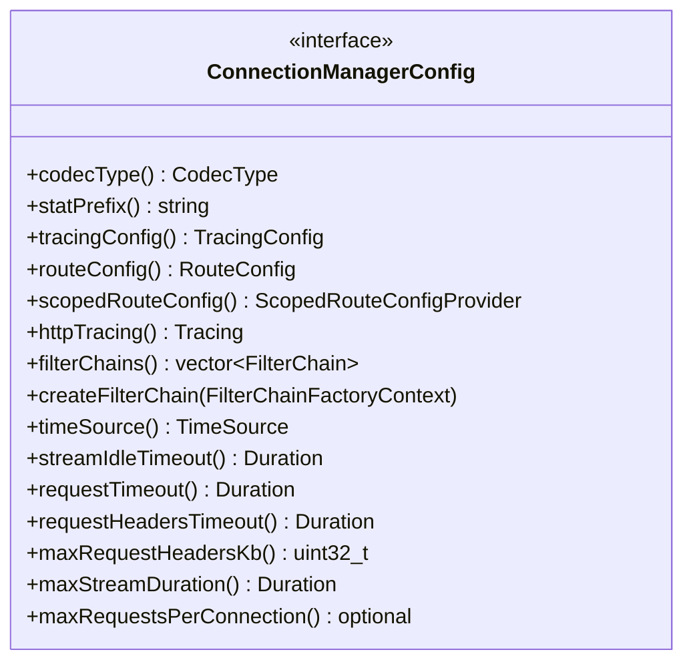

# Part 17: ConnectionManagerConfig

**File:** `source/common/http/conn_manager_config.h`  
**Namespace:** `Envoy::Http`

## Summary

`ConnectionManagerConfig` is the configuration interface for the HTTP connection manager. It provides stats, tracing, route config, filter chain config, and various HCM settings (timeouts, max requests, etc.). Implemented by `ConnectionManagerConfigImpl`.

## UML Diagram

## Important Functions (Typical)

| Function | One-line description |
|----------|----------------------|
| `codecType()` | HTTP/1, HTTP/2, or HTTP/3. |
| `statPrefix()` | Stats prefix for HCM. |
| `routeConfig()` | Route configuration provider. |
| `filterChains()` | HTTP filter chain configs. |
| `createFilterChain(context)` | Creates filter chain for new stream. |
| `streamIdleTimeout()` | Idle timeout for stream. |
| `requestTimeout()` | Total request timeout. |
| `requestHeadersTimeout()` | Timeout for receiving headers. |
| `maxRequestHeadersKb()` | Max size of request headers. |
| `maxRequestsPerConnection()` | Max requests per connection. |
