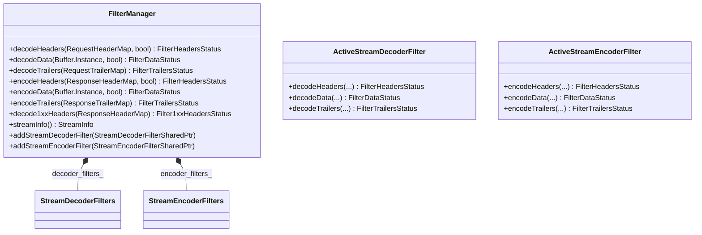

# Part 18: HTTP FilterManager

**File:** `source/common/http/filter_manager.h`  
**Namespace:** `Envoy::Http`

## Summary

`FilterManager` drives the HTTP filter chain for a stream. It owns `ActiveStreamDecoderFilter` and `ActiveStreamEncoderFilter` wrappers. Decoder filters run in config order; encoder filters run in reverse. It handles iteration, buffering, and filter callbacks.

## UML Diagram

## Important Functions

| Function | One-line description |
|----------|----------------------|
| `decodeHeaders(headers, end_stream)` | Iterates decoder filters with request headers. |
| `decodeData(buffer, end_stream)` | Iterates decoder filters with request body. |
| `decodeTrailers(trailers)` | Iterates decoder filters with request trailers. |
| `encodeHeaders(headers, end_stream)` | Iterates encoder filters (reverse) with response headers. |
| `encodeData(buffer, end_stream)` | Iterates encoder filters with response body. |
| `encodeTrailers(trailers)` | Iterates encoder filters with response trailers. |
| `decode1xxHeaders(headers)` | Handles 1xx response headers. |
| `addStreamDecoderFilter(filter)` | Appends decoder filter. |
| `addStreamEncoderFilter(filter)` | Prepends encoder filter. |
