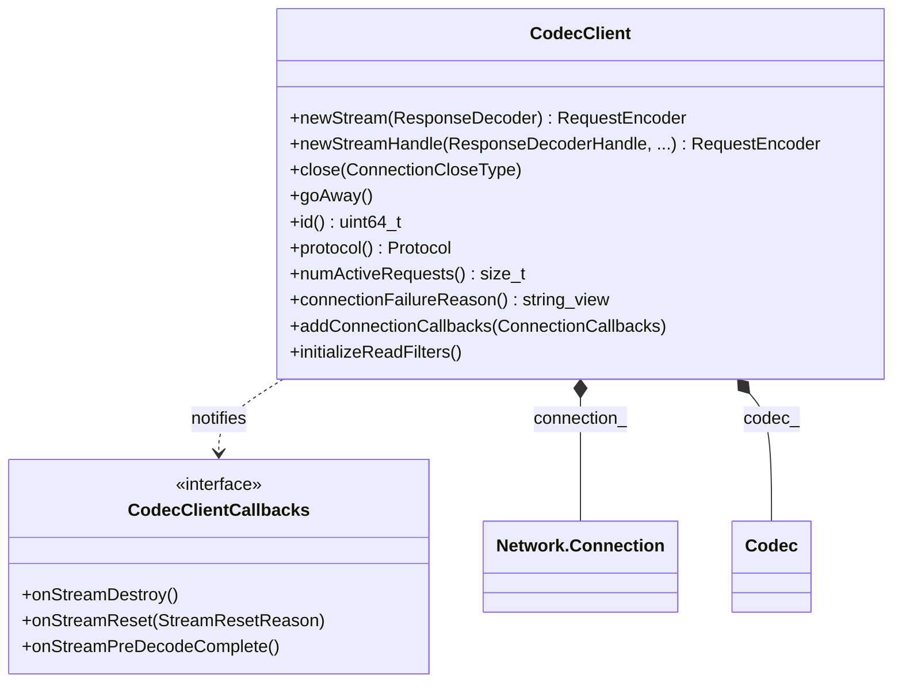

# Part 19: CodecClient

**File:** `source/common/http/codec_client.h`  
**Namespace:** `Envoy::Http`

## Summary

`CodecClient` is an HTTP client that manages a network connection and HTTP codec. It creates streams via `newStream`, encodes requests, and decodes responses. Used by connection pools for upstream HTTP. Implements `Http::ConnectionCallbacks` and `Network::ConnectionCallbacks`.

## UML Diagram

## Important Functions

| Function | One-line description |
|----------|----------------------|
| `newStream(ResponseDecoder&)` | Creates stream; returns RequestEncoder for encoding. |
| `newStreamHandle(...)` | Same with decoder handle for lifetime. |
| `close(ConnectionCloseType)` | Closes underlying connection. |
| `goAway()` | Sends codec-level GOAWAY. |
| `id()` | Underlying connection ID. |
| `protocol()` | HTTP/1, HTTP/2, or HTTP/3. |
| `numActiveRequests()` | Outstanding request count. |
| `connectionFailureReason()` | Transport failure reason. |
| `initializeReadFilters()` | Initializes L4 read filters. |
