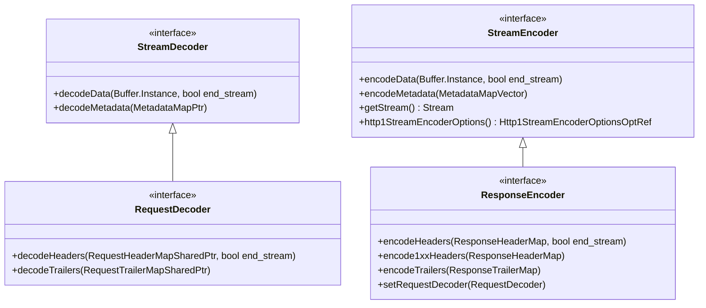

# Part 20: StreamDecoder and StreamEncoder

**File:** `envoy/http/codec.h`  
**Namespace:** `Envoy::Http`

## Summary

`StreamDecoder` receives decoded HTTP data (data, metadata). `StreamEncoder` sends encoded HTTP data. `RequestDecoder`/`ResponseEncoder` extend them for request/response paths. Used by codecs and ConnectionManagerImpl.

## UML Diagram

## StreamDecoder

| Function | One-line description |
|----------|----------------------|
| `decodeData(Buffer&, bool end_stream)` | Receives decoded data frame. |
| `decodeMetadata(MetadataMapPtr&&)` | Receives decoded METADATA. |

## StreamEncoder

| Function | One-line description |
|----------|----------------------|
| `encodeData(Buffer&, bool end_stream)` | Encodes data frame. |
| `encodeMetadata(MetadataMapVector)` | Encodes METADATA. |
| `getStream()` | Returns backing Stream. |

## RequestDecoder

| Function | One-line description |
|----------|----------------------|
| `decodeHeaders(RequestHeaderMapSharedPtr, bool)` | Receives decoded request headers. |
| `decodeTrailers(RequestTrailerMapSharedPtr)` | Receives decoded request trailers. |

## ResponseEncoder

| Function | One-line description |
|----------|----------------------|
| `encodeHeaders(ResponseHeaderMap&, bool)` | Encodes response headers. |
| `encode1xxHeaders(ResponseHeaderMap&)` | Encodes 1xx headers. |
| `encodeTrailers(ResponseTrailerMap&)` | Encodes response trailers. |
| `setRequestDecoder(RequestDecoder&)` | For internal redirect. |
