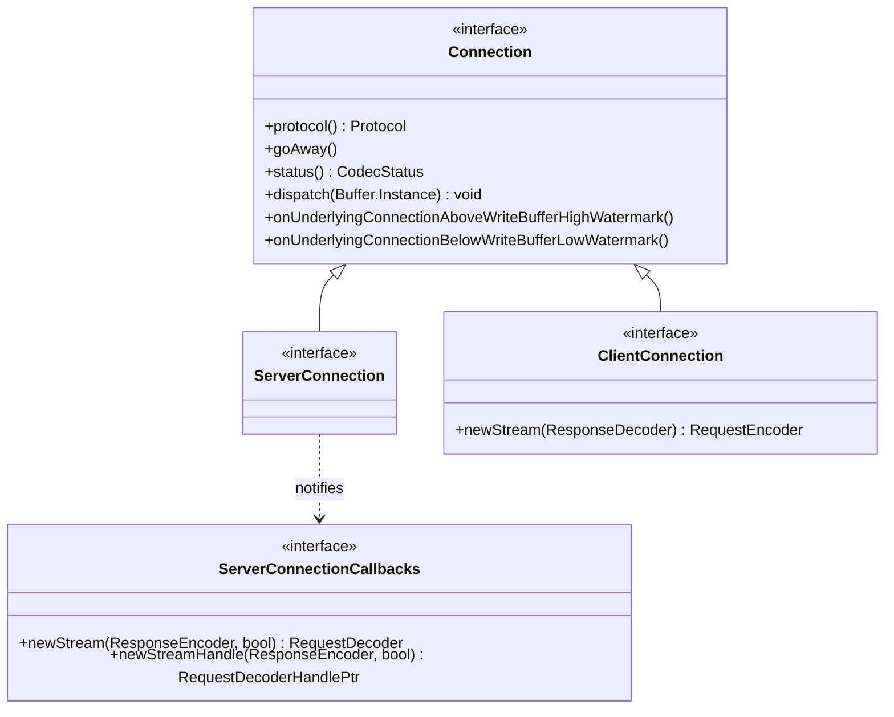

# Part 21: Codec, ServerConnection, ClientConnection

**File:** `envoy/http/codec.h`  
**Namespace:** `Envoy::Http`

## Summary

`Connection` is the base interface for HTTP codec connections. `ServerConnection` is for server-side (downstream); `ClientConnection` for client-side (upstream). They provide `newStream`, `protocol`, `goAway`, and stream lifecycle. `ServerConnectionCallbacks` is used when new streams arrive on server connections.

## UML Diagram

## Connection

| Function | One-line description |
|----------|----------------------|
| `protocol()` | Returns HTTP/1, HTTP/2, or HTTP/3. |
| `goAway()` | Sends GOAWAY. |
| `status()` | Returns codec status. |
| `dispatch(Buffer&)` | Dispatches data to codec. |
| `onUnderlyingConnectionAboveWriteBufferHighWatermark()` | Write buffer high watermark. |
| `onUnderlyingConnectionBelowWriteBufferLowWatermark()` | Write buffer low watermark. |

## ClientConnection

| Function | One-line description |
|----------|----------------------|
| `newStream(ResponseDecoder&)` | Creates new request stream; returns RequestEncoder. |
