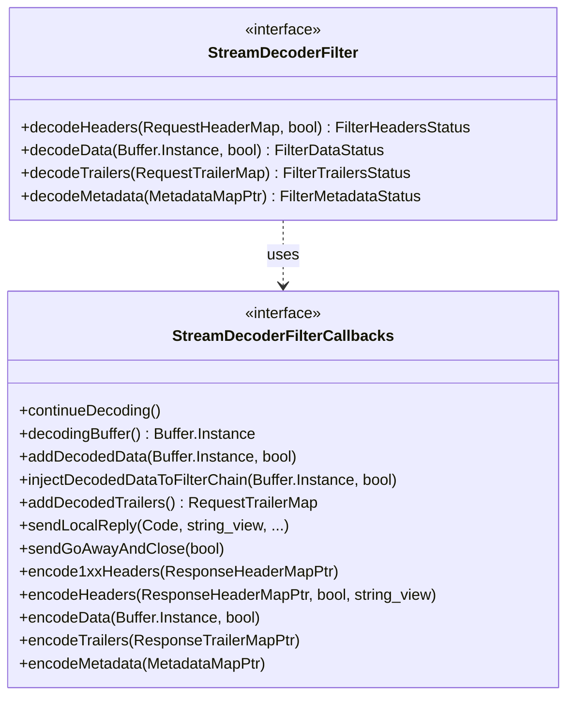

# Part 22: StreamDecoderFilter

**File:** `envoy/http/filter.h`  
**Namespace:** `Envoy::Http`

## Summary

`StreamDecoderFilter` is the interface for HTTP decoder filters. It processes request headers, data, and trailers. It receives `StreamDecoderFilterCallbacks` for `continueDecoding`, `sendLocalReply`, etc. Used by router, rate limit, and other decoder filters.

## UML Diagram

## StreamDecoderFilter

| Function | One-line description |
|----------|----------------------|
| `decodeHeaders(RequestHeaderMap&, bool)` | Processes request headers. |
| `decodeData(Buffer&, bool)` | Processes request body. |
| `decodeTrailers(RequestTrailerMap&)` | Processes request trailers. |
| `decodeMetadata(MetadataMapPtr)` | Processes METADATA. |

## StreamDecoderFilterCallbacks (Key)

| Function | One-line description |
|----------|----------------------|
| `continueDecoding()` | Resumes filter chain after StopIteration. |
| `decodingBuffer()` | Returns buffered data. |
| `addDecodedData(data, streaming)` | Adds body to buffer. |
| `injectDecodedDataToFilterChain(data, end_stream)` | Injects data bypassing buffering. |
| `sendLocalReply(code, body, ...)` | Sends local reply. |
| `sendGoAwayAndClose(graceful)` | Sends GOAWAY and closes. |
| `encodeHeaders/Data/Trailers(...)` | Encodes response to downstream. |
