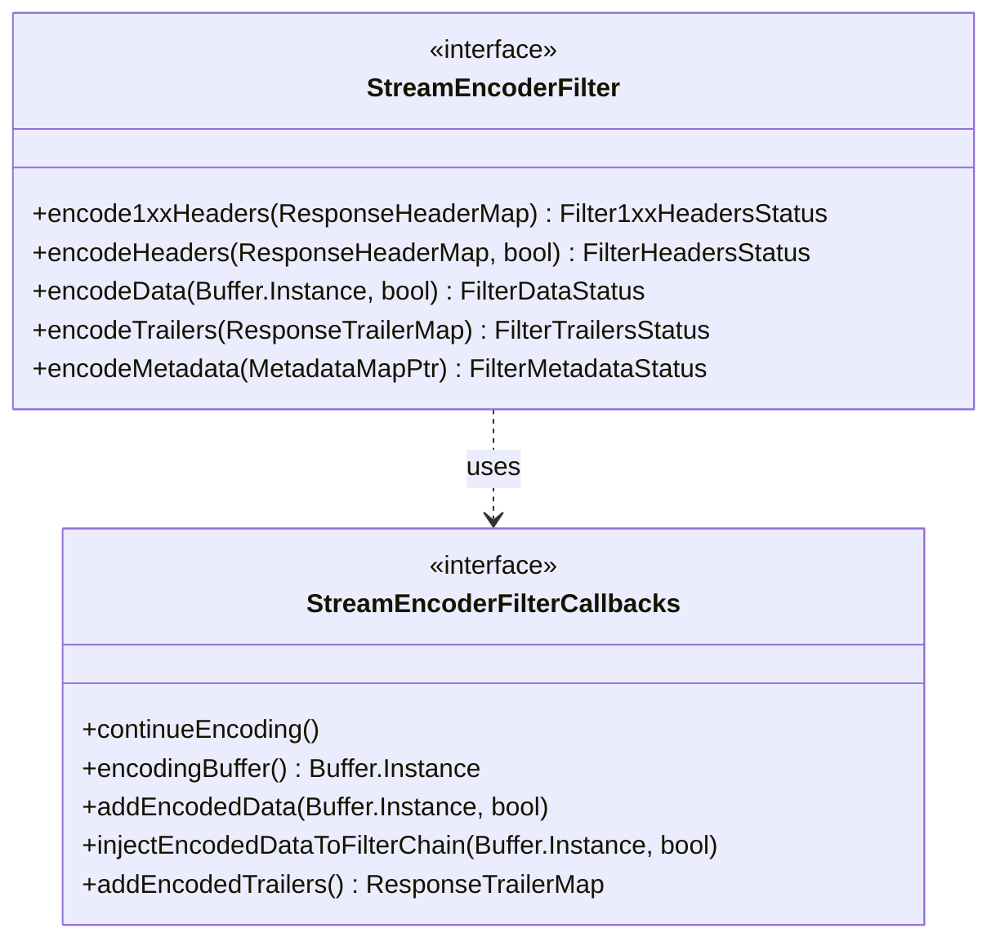

# Part 23: StreamEncoderFilter

**File:** `envoy/http/filter.h`  
**Namespace:** `Envoy::Http`

## Summary

`StreamEncoderFilter` is the interface for HTTP encoder filters. It processes response headers, data, and trailers. It receives `StreamEncoderFilterCallbacks` for `continueEncoding`, `addEncodedData`, etc. Encoder filters run in reverse order of config.

## UML Diagram

## StreamEncoderFilter

| Function | One-line description |
|----------|----------------------|
| `encode1xxHeaders(ResponseHeaderMap&)` | Processes 1xx headers. |
| `encodeHeaders(ResponseHeaderMap&, bool)` | Processes response headers. |
| `encodeData(Buffer&, bool)` | Processes response body. |
| `encodeTrailers(ResponseTrailerMap&)` | Processes response trailers. |
| `encodeMetadata(MetadataMapPtr)` | Processes METADATA. |

## StreamEncoderFilterCallbacks (Key)

| Function | One-line description |
|----------|----------------------|
| `continueEncoding()` | Resumes encoder filter chain. |
| `encodingBuffer()` | Returns buffered response data. |
| `addEncodedData(data, streaming)` | Adds data to response buffer. |
| `injectEncodedDataToFilterChain(data, end_stream)` | Injects data bypassing buffering. |
| `addEncodedTrailers()` | Adds response trailers. |
