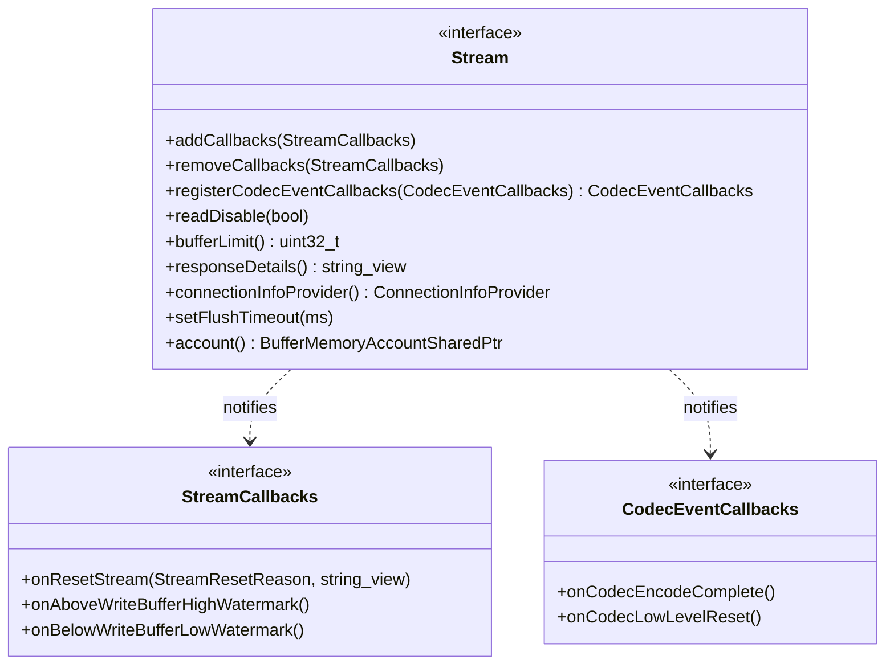

# Part 24: Stream and StreamCallbacks

**File:** `envoy/http/codec.h`  
**Namespace:** `Envoy::Http`

## Summary

`Stream` represents an HTTP stream (request/response). It provides `addCallbacks`, `readDisable`, `bufferLimit`, and `connectionInfoProvider`. `StreamCallbacks` is the interface for stream events: reset, high/low watermark, etc.

## UML Diagram

## Stream

| Function | One-line description |
|----------|----------------------|
| `addCallbacks(StreamCallbacks&)` | Registers stream callbacks. |
| `removeCallbacks(StreamCallbacks&)` | Unregisters callbacks. |
| `readDisable(bool)` | Enables/disables reads (ref-counted). |
| `bufferLimit()` | Stream buffer limit. |
| `connectionInfoProvider()` | Address provider for connection. |
| `setFlushTimeout(ms)` | Flush timeout for stream. |
| `account()` | Buffer memory account. |

## StreamCallbacks

| Function | One-line description |
|----------|----------------------|
| `onResetStream(reason, transport_failure_reason)` | Stream reset. |
| `onAboveWriteBufferHighWatermark()` | Write buffer over high watermark. |
| `onBelowWriteBufferLowWatermark()` | Write buffer under low watermark. |
