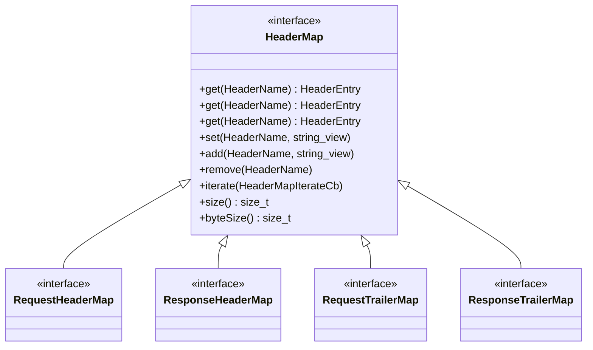

# Part 25: HeaderMap

**File:** `envoy/http/header_map.h`  
**Namespace:** `Envoy::Http`

## Summary

`HeaderMap` is the interface for HTTP headers. `RequestHeaderMap`, `ResponseHeaderMap`, `RequestTrailerMap`, `ResponseTrailerMap` are typed variants. Headers are immutable and use inline storage for common headers. Used by codecs and filters.

## UML Diagram

## HeaderMap (Common)

| Function | One-line description |
|----------|----------------------|
| `get(HeaderName)` | Returns header entry or empty. |
| `set(HeaderName, value)` | Sets header (replaces). |
| `add(HeaderName, value)` | Appends header. |
| `remove(HeaderName)` | Removes header. |
| `iterate(callback)` | Iterates all headers. |
| `size()` | Number of headers. |
| `byteSize()` | Bytes used. |

## Typed Maps

- **RequestHeaderMap:** :method, :path, :scheme, :authority, host, etc.
- **ResponseHeaderMap:** :status, etc.
- **RequestTrailerMap:** Request trailers.
- **ResponseTrailerMap:** Response trailers.
