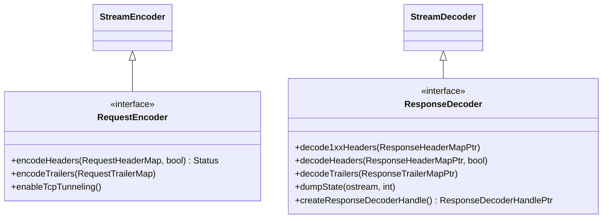

# Part 26: RequestEncoder and ResponseDecoder

**File:** `envoy/http/codec.h`  
**Namespace:** `Envoy::Http`

## Summary

`RequestEncoder` encodes HTTP requests (client→server). `ResponseDecoder` decodes HTTP responses (server→client). Used by CodecClient for upstream requests. RequestEncoder extends StreamEncoder; ResponseDecoder extends StreamDecoder.

## UML Diagram

## RequestEncoder

| Function | One-line description |
|----------|----------------------|
| `encodeHeaders(RequestHeaderMap&, bool)` | Encodes request headers; returns Status. |
| `encodeTrailers(RequestTrailerMap&)` | Encodes request trailers. |
| `enableTcpTunneling()` | Enables TCP tunneling. |

## ResponseDecoder

| Function | One-line description |
|----------|----------------------|
| `decode1xxHeaders(ResponseHeaderMapPtr)` | Receives 1xx headers. |
| `decodeHeaders(ResponseHeaderMapPtr, bool)` | Receives response headers. |
| `decodeTrailers(ResponseTrailerMapPtr)` | Receives response trailers. |
| `createResponseDecoderHandle()` | Returns handle for decoder lifetime. |
