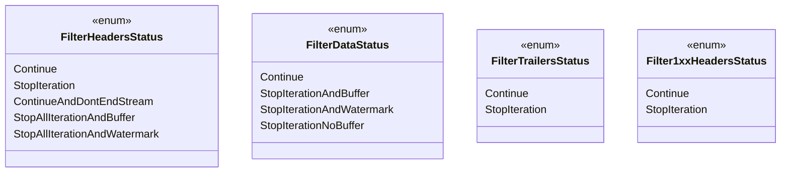

# Part 27: Filter Status Enums

**File:** `envoy/http/filter.h`  
**Namespace:** `Envoy::Http`

## Summary

HTTP filter status enums control filter chain iteration. `FilterHeadersStatus`, `FilterDataStatus`, `FilterTrailersStatus`, `Filter1xxHeadersStatus`, and `FilterMetadataStatus` determine whether to continue, stop and buffer, or stop and watermark.

## UML Diagram

## FilterHeadersStatus

| Value | Description |
|-------|-------------|
| `Continue` | Continue to next filter. |
| `StopIteration` | Stop; call continueDecoding/continueEncoding to resume. |
| `ContinueAndDontEndStream` | Continue but delay end_stream. |
| `StopAllIterationAndBuffer` | Stop and buffer; resume with continueDecoding. |
| `StopAllIterationAndWatermark` | Stop and watermark; resume with continueDecoding. |

## FilterDataStatus

| Value | Description |
|-------|-------------|
| `Continue` | Continue iteration. |
| `StopIterationAndBuffer` | Stop and buffer data. |
| `StopIterationAndWatermark` | Stop and apply watermark. |
| `StopIterationNoBuffer` | Stop without buffering. |

## FilterTrailersStatus / Filter1xxHeadersStatus

| Value | Description |
|-------|-------------|
| `Continue` | Continue. |
| `StopIteration` | Stop iteration. |
