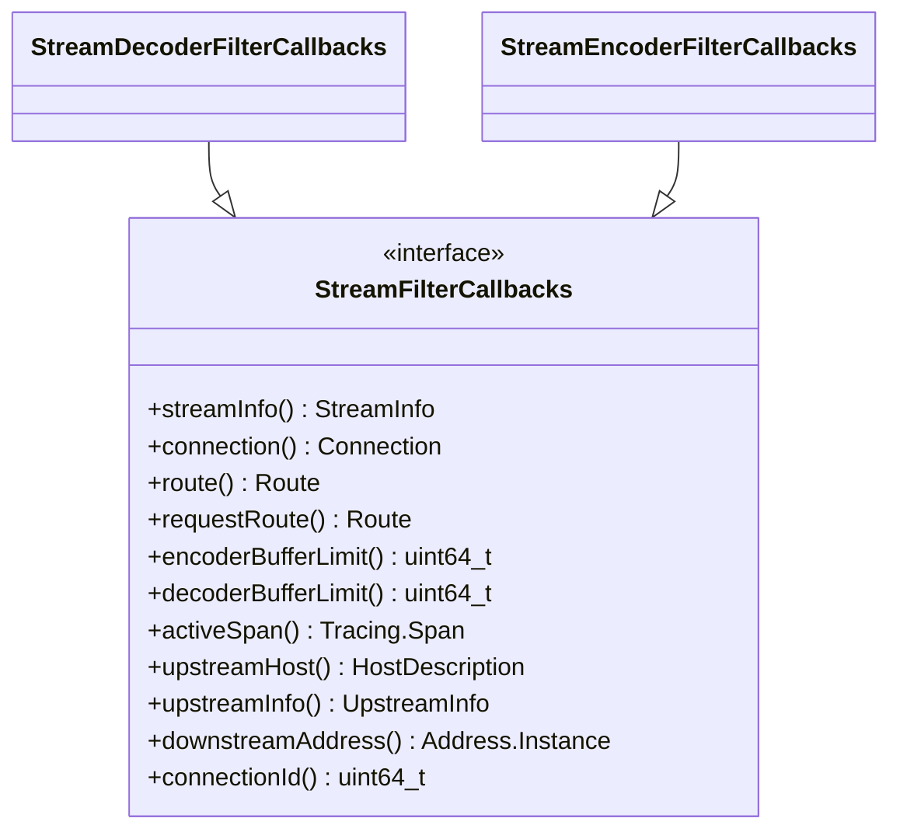

# Part 28: StreamFilterCallbacks

**File:** `envoy/http/filter.h`  
**Namespace:** `Envoy::Http`

## Summary

`StreamFilterCallbacks` is the base interface for HTTP filter callbacks. It provides `streamInfo`, `connection`, `route`, `requestRoute`, `encoderBufferLimit`, `decoderBufferLimit`, and `activeSpan`. Extended by StreamDecoderFilterCallbacks and StreamEncoderFilterCallbacks.

## UML Diagram

## Important Functions

| Function | One-line description |
|----------|----------------------|
| `streamInfo()` | Returns StreamInfo for this request. |
| `connection()` | Returns Network::Connection. |
| `route()` | Returns route for request. |
| `requestRoute()` | Returns route (may differ after redirect). |
| `encoderBufferLimit()` | Encoder buffer limit. |
| `decoderBufferLimit()` | Decoder buffer limit. |
| `activeSpan()` | Current tracing span. |
| `upstreamHost()` | Selected upstream host. |
| `upstreamInfo()` | Upstream connection info. |
| `connectionId()` | Connection ID. |
