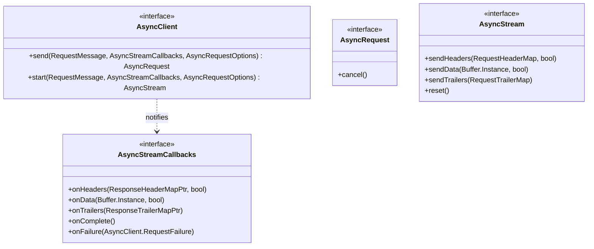

# Part 29: AsyncClient

**File:** `envoy/http/async_client.h`  
**Namespace:** `Envoy::Http`

## Summary

`AsyncClient` provides asynchronous HTTP client API. It sends requests via `send` and returns `AsyncRequest` for cancellation. `AsyncStreamCallbacks` receives response headers, data, and trailers. Used for out-of-band HTTP (e.g. ext_authz, rate limit).

## UML Diagram

## AsyncClient

| Function | One-line description |
|----------|----------------------|
| `send(RequestMessage, callbacks, options)` | Sends request; returns AsyncRequest for cancel. |
| `start(RequestMessage, callbacks, options)` | Starts stream; returns AsyncStream for send. |

## AsyncRequest

| Function | One-line description |
|----------|----------------------|
| `cancel()` | Cancels in-flight request. |

## AsyncStreamCallbacks

| Function | One-line description |
|----------|----------------------|
| `onHeaders(ResponseHeaderMapPtr, bool)` | Response headers received. |
| `onData(Buffer&, bool)` | Response body received. |
| `onTrailers(ResponseTrailerMapPtr)` | Response trailers received. |
| `onComplete()` | Request completed successfully. |
| `onFailure(RequestFailure)` | Request failed. |
