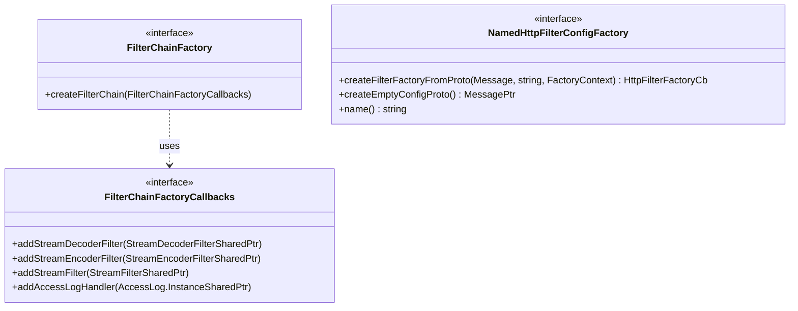

# Part 30: FilterChainFactory

**File:** `envoy/http/filter_factory.h`  
**Namespace:** `Envoy::Http`

## Summary

`FilterChainFactory` creates HTTP filter chains from config. `FilterChainFactoryCallbacks` is used by filter factories to register filters. Filters are created at config load time; filter chains are built per stream.

## UML Diagram

## FilterChainFactory

| Function | One-line description |
|----------|----------------------|
| `createFilterChain(FilterChainFactoryCallbacks&)` | Creates filter chain; registers filters via callbacks. |

## FilterChainFactoryCallbacks

| Function | One-line description |
|----------|----------------------|
| `addStreamDecoderFilter(filter)` | Adds decoder filter. |
| `addStreamEncoderFilter(filter)` | Adds encoder filter. |
| `addStreamFilter(filter)` | Adds combined decoder+encoder filter. |
| `addAccessLogHandler(handler)` | Adds access log handler. |
