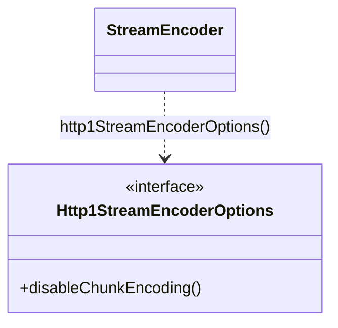

# Part 31: Http1StreamEncoderOptions

**File:** `envoy/http/codec.h`  
**Namespace:** `Envoy::Http`

## Summary

`Http1StreamEncoderOptions` provides HTTP/1-specific encoder options. `disableChunkEncoding()` forces HTTP/1.0 behavior (no chunked encoding; connection close indicates end). Used when encoding responses without content-length.

## UML Diagram

## Important Functions

| Function | One-line description |
|----------|----------------------|
| `disableChunkEncoding()` | Disables chunked encoding; connection close for end. |
