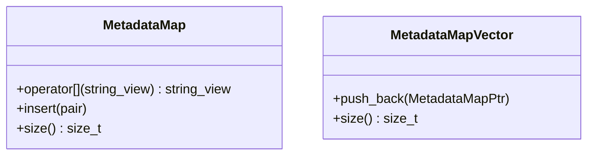

# Part 32: MetadataMap and MetadataMapVector

**File:** `envoy/http/metadata_interface.h`  
**Namespace:** `Envoy::Http`

## Summary

`MetadataMap` holds key-value metadata (e.g. for HTTP/2 METADATA frames). `MetadataMapVector` is a vector of metadata maps. Used by codecs for METADATA encode/decode and gRPC metadata.

## UML Diagram

## Usage

- `StreamDecoder::decodeMetadata(MetadataMapPtr)` receives decoded METADATA.
- `StreamEncoder::encodeMetadata(MetadataMapVector)` encodes METADATA.
- Filters use `addDecodedMetadata()` / `encodeMetadata()` for metadata injection.
