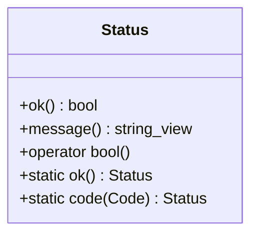

# Part 33: Http::Status

**File:** `source/common/http/status.h`  
**Namespace:** `Envoy::Http`

## Summary

`Status` is a result type for HTTP operations (e.g. `RequestEncoder::encodeHeaders`). Contains ok/error and optional message. Replaces bool returns for richer error handling and diagnostics.

## UML Diagram

## Important Functions

| Function | One-line description |
|----------|----------------------|
| `ok()` | True if success. |
| `message()` | Error message if failure. |
| `Status::ok()` | Creates success status. |
| `Status::code(Code)` | Creates failure status with HTTP code. |
