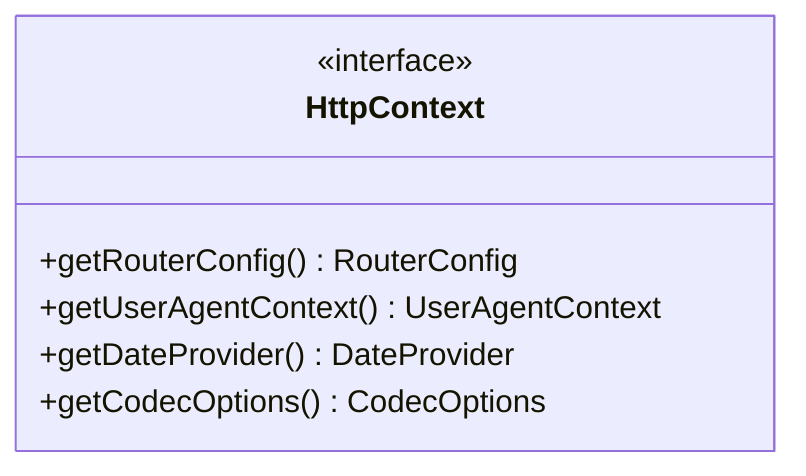

# Part 34: Http::Context

**File:** `envoy/http/context.h`  
**Namespace:** `Envoy::Http`

## Summary

`Http::Context` provides HTTP-level utilities: codec options, user-agent parser, date provider, router config. Passed to ConnectionManagerImpl and codecs. Implemented by `HttpContextImpl`.

## UML Diagram

## Important Functions

| Function | One-line description |
|----------|----------------------|
| `getRouterConfig()` | Router configuration. |
| `getUserAgentContext()` | User-agent parsing context. |
| `getDateProvider()` | Date provider for headers. |
| `getCodecOptions()` | Codec-level options. |
