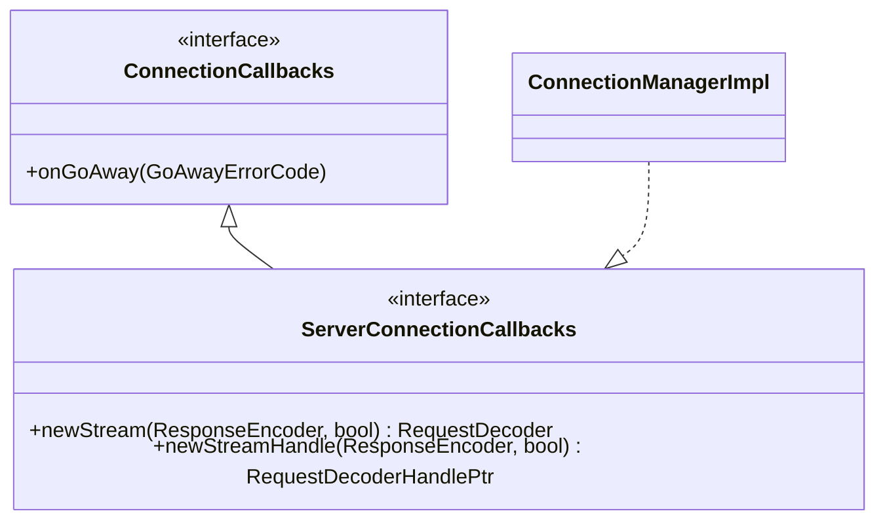

# Part 35: Http::ConnectionCallbacks

**File:** `envoy/http/codec.h`  
**Namespace:** `Envoy::Http`

## Summary

`ConnectionCallbacks` is the interface for HTTP connection-level events. `onGoAway(GoAwayErrorCode)` is called when GOAWAY is received. Used by ConnectionManagerImpl (implements it) and CodecClient (implements it). Base for ServerConnectionCallbacks.

## UML Diagram

## ConnectionCallbacks

| Function | One-line description |
|----------|----------------------|
| `onGoAway(GoAwayErrorCode)` | Called when GOAWAY received. |

## GoAwayErrorCode

| Value | Description |
|-------|-------------|
| `NoError` | Normal shutdown. |
| `Other` | Other error. |
