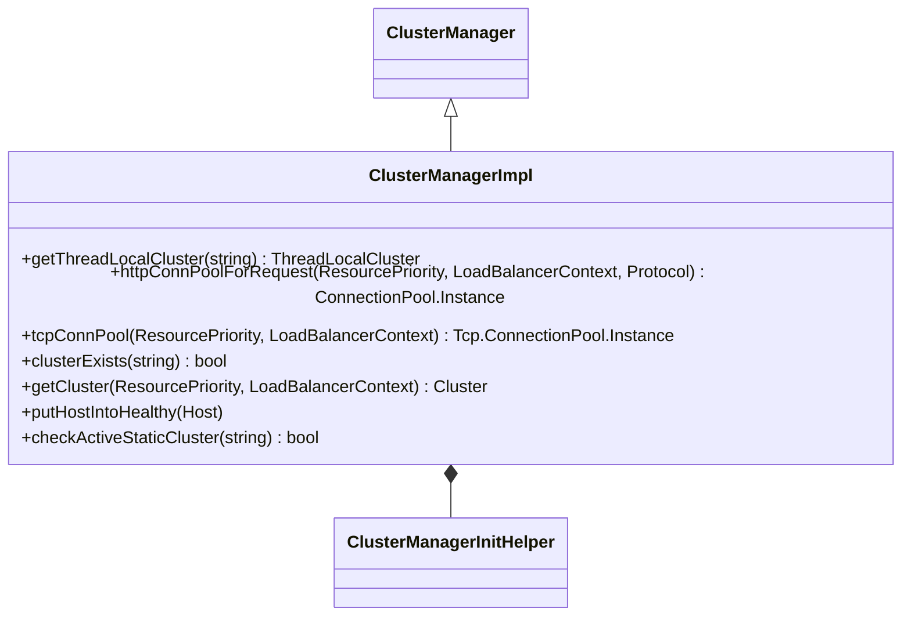

# Part 36: ClusterManagerImpl

**File:** `source/common/upstream/cluster_manager_impl.h`  
**Namespace:** `Envoy::Upstream`

## Summary

`ClusterManagerImpl` is the production implementation of `ClusterManager`. It manages clusters, hosts, connection pools, and CDS. It provides `getThreadLocalCluster`, `httpConnPoolForRequest`, `tcpConnPool`, and cluster lifecycle. Used by router and other components for upstream selection.

## UML Diagram

## Important Functions

| Function | One-line description |
|----------|----------------------|
| `getThreadLocalCluster(name)` | Returns thread-local cluster by name. |
| `httpConnPoolForRequest(priority, context, protocol)` | Gets HTTP connection pool for request. |
| `tcpConnPool(priority, context)` | Gets TCP connection pool. |
| `clusterExists(name)` | True if cluster exists. |
| `getCluster(priority, context)` | Gets cluster for load balancing. |
| `putHostIntoHealthy(host)` | Marks host healthy. |
| `checkActiveStaticCluster(name)` | Validates static cluster exists. |
