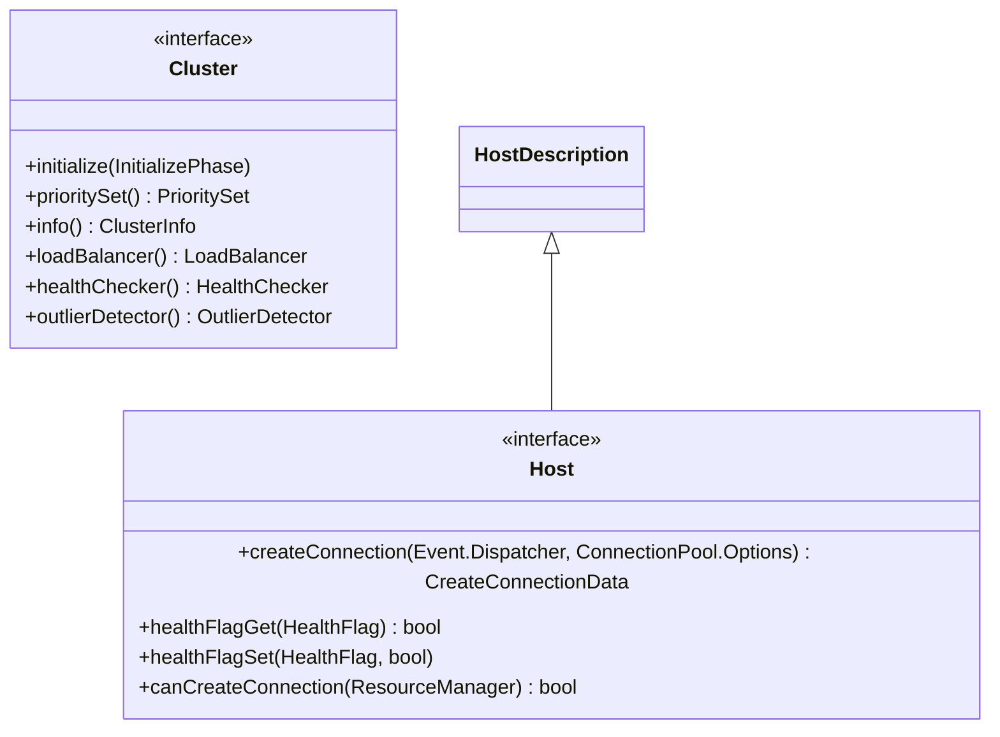

# Part 37: Cluster and Host

**File:** `envoy/upstream/upstream.h`  
**Namespace:** `Envoy::Upstream`

## Summary

`Cluster` is the interface for an upstream cluster. It provides `loadBalancer`, `info`, `prioritySet`, and `initialize`. `Host` extends `HostDescription` with `createConnection`, health flags, and connection creation. Used for upstream host selection and connection creation.

## UML Diagram

## Cluster

| Function | One-line description |
|----------|----------------------|
| `initialize(InitializePhase)` | Initializes cluster (e.g. DNS, EDS). |
| `prioritySet()` | Returns PrioritySet (hosts by priority). |
| `info()` | Returns ClusterInfo. |
| `loadBalancer()` | Returns LoadBalancer. |
| `healthChecker()` | Returns HealthChecker. |
| `outlierDetector()` | Returns OutlierDetector. |

## Host

| Function | One-line description |
|----------|----------------------|
| `createConnection(dispatcher, options)` | Creates connection to host. |
| `healthFlagGet(flag)` | Returns health flag value. |
| `healthFlagSet(flag, value)` | Sets health flag. |
| `canCreateConnection(resource_manager)` | True if can create connection. |
