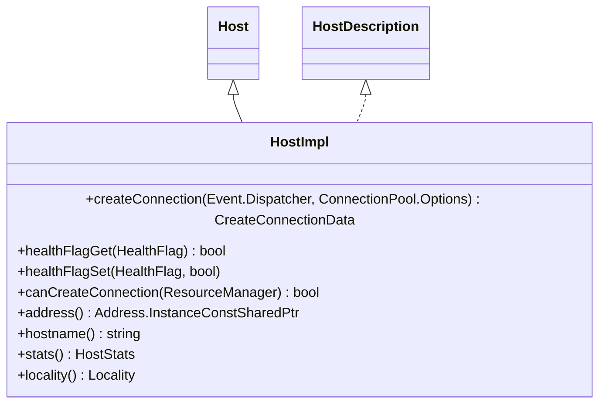

# Part 38: HostImpl

**File:** `source/common/upstream/upstream_impl.h`  
**Namespace:** `Envoy::Upstream`

## Summary

`HostImpl` is the concrete implementation of `Host`. It holds address, hostname, metadata, health flags, stats, and locality. Used by ClusterImplBase and load balancers for host selection and connection creation.

## UML Diagram

## Important Functions

| Function | One-line description |
|----------|----------------------|
| `createConnection(dispatcher, options)` | Creates Network::ClientConnection to host. |
| `healthFlagGet(flag)` | Returns health flag. |
| `healthFlagSet(flag, value)` | Sets health flag. |
| `address()` | Host address. |
| `hostname()` | Host hostname. |
| `stats()` | Per-host stats (cx_total, rq_success, etc.). |
| `locality()` | Locality for zone-aware LB. |
